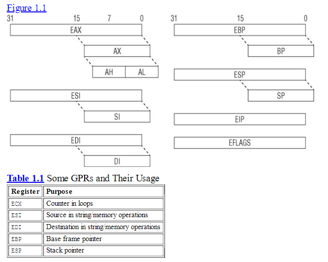
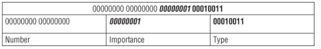
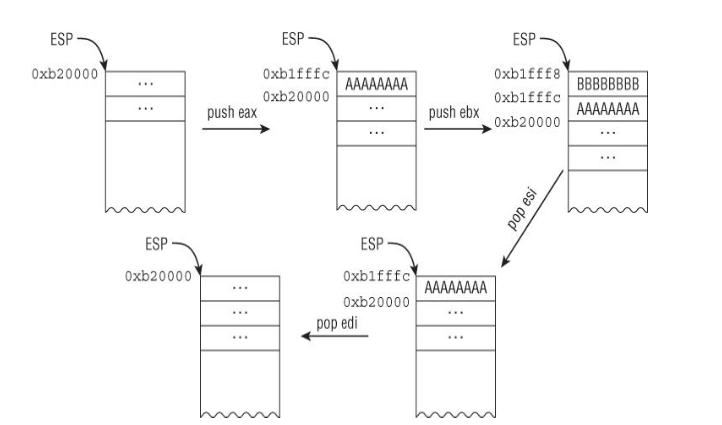
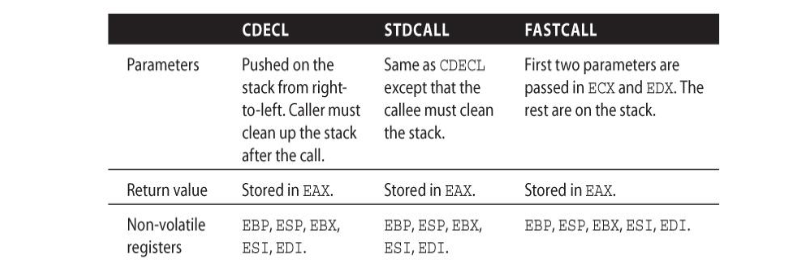
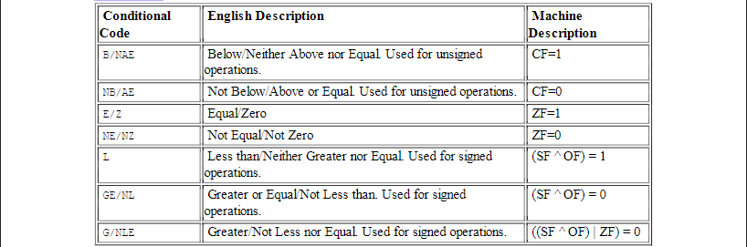

# Register Set and Data Types

Khi hệ điều hành trong *Protected mode*, kiến trúc x86 có 8 thanh ghi 32 bit đa mục đích hay còn gọi là *General Purpose Register*:

**EAX, EBX, ECX, EDX, EDI, ESI, EBP và ESP**

## EAX (Accumulator Register)

Thanh ghi này thường lưu trữ giá trị trả về của các hàm hay kết quả của các phép toán.

```asm
MOV EAX, 10   ; lưu 10 vào eax
MOV EBX, 5    ; lưu 5 vào ebx
ADD EAX, EBX  ; cộng giá trị của eax với ebx và lưu vào eax --> eax = 15
```

## EBX (Base Register)

Thanh ghi này thường được sử dụng như giá trị cơ sở trong các phép toán truy cập bộ nhớ, chẳng hạn như truy cập một phần tử trong một mảng hay một ký tự của một chuỗi.


## ECX 

Thanh gi này thường được sủ dụng để làm bộ đếm trong các phép toán vòng lặp  ví dụ *for(int i = 0 ; i < 10 )* và các phép toán chuỗi. 

### Ví dụ về ECX VÀ EBX 

```asm 


; Chương trình đơn giản để in mảng
section .data
    ; Mảng các số nguyên
    numbers dd 10, 20, 30, 40, 50
    array_size equ 5
    
    ; Ký tự xuống dòng
    newline db 10

section .bss
    buffer resb 12     ; Buffer để lưu số dưới dạng chuỗi

section .text
    global _start

_start:
    xor ecx, ecx       ; Khởi tạo ECX = 0 (index)

print_loop:
    ; Kiểm tra nếu đã in hết các phần tử
    cmp ecx, array_size
    jge exit_program
    
    ; Lấy phần tử hiện tại
    mov eax, [numbers + ecx*4]
    
    ; Chuyển số thành chuỗi
    push ecx
    call int_to_string
    pop ecx
    
    ; In số
    mov eax, 4          ; sys_write
    mov ebx, 1          ; stdout
    mov ecx, buffer     ; chuỗi cần in
    mov edx, eax        ; độ dài chuỗi (từ int_to_string)
    int 0x80
    
    ; In xuống dòng
    mov eax, 4          ; sys_write
    mov ebx, 1          ; stdout
    mov ecx, newline    ; ký tự xuống dòng
    mov edx, 1          ; độ dài 1 byte
    int 0x80
    
    ; Tăng index và lặp lại
    inc ecx
    jmp print_loop

exit_program:
    ; Thoát chương trình
    mov eax, 1          ; sys_exit
    xor ebx, ebx        ; exit code 0
    int 0x80

; Hàm đơn giản chuyển số trong EAX thành chuỗi
; Đầu ra: buffer chứa chuỗi, EAX chứa độ dài chuỗi
int_to_string:
    push ebx
    push ecx
    push edx
    push edi
    
    mov edi, buffer     ; Trỏ đến buffer
    mov ebx, 10         ; Cơ số 10
    xor ecx, ecx        ; Đếm số chữ số
    
    ; Xử lý trường hợp đặc biệt nếu số = 0
    test eax, eax
    jnz not_zero
    mov byte [edi], '0'
    mov eax, 1          ; Độ dài = 1
    jmp end_conversion
    
not_zero:
    ; Lưu stack hiện tại
    mov edx, edi
    
    ; Chuyển đổi từng chữ số
digit_loop:
    xor edx, edx        ; Xóa edx cho phép chia
    div ebx             ; eax = eax / 10, edx = eax % 10
    add dl, '0'         ; Chuyển thành ký tự ASCII
    push edx            ; Lưu chữ số vào stack
    inc ecx             ; Tăng số đếm chữ số
    test eax, eax       ; Kiểm tra nếu eax = 0
    jnz digit_loop
    
    ; Pop các chữ số từ stack vào buffer (theo thứ tự ngược lại)
    mov eax, ecx        ; Lưu độ dài vào eax
reverse_loop:
    pop edx
    mov [edi], dl
    inc edi
    loop reverse_loop
    
end_conversion:
    ; Thêm null terminator
    mov byte [edi], 0
    
    pop edi
    pop edx
    pop ecx
    pop ebx
    ret
``` 

## EDX (Data Register)
Thanh gi được sử dụng để lưu các giá trị phụ trong các phép toán số học đặc biệt là chia hoặc nhân. 

```asm 
; Trong phép nhân 32-bit, khi nhân hai số lớn, kết quả có thể vượt quá 32-bit.
; Khi đó, EAX chứa phần thấp của kết quả và EDX chứa phần cao.
section .text
    global _start
    
_start:
    mov eax , 500000 ; 
    mov ecx , 300000 ; 
    imul ecx  ; nhân eax với ecx nhưng vif kết quả vượt quá 32 bit nên. 
              ; edx sẽ giữ phần cao của kết quả và eax sẽ giữ phần thấp 
            
    
    mov eax ,1 ; sys_exit 
    xor ebx , ebx 
    int 0x80

```

## EDI (Destination Index Register)
EDI được sử dụng làm chỉ mục đích (destination index) trong các phép toán chuỗi và các phép toán di chuyển bộ nhớ.

## ESI (Source Index Register)
ESI được sử dụng làm chỉ mục nguồn (source index) trong các phép toán chuỗi và các phép toán di chuyển bộ nhớ.

### Ví dụ về EDI , ESI 
```asm 
section .data 
   src db "hello" , 0 
   des times 5 db 0 
   src_len equ 5 
section .text
    global_start

_start 
    mov esi , src ; 
    mov edi , des ; 
    mov ecx , src_len ; 
    
    ; ld: Xóa cờ hướng, đảm bảo ESI và EDI tăng lên trong quá trình sao chép.
    cld; 
    rep movsb  ; Lặp lại lệnh movsb (move string byte) ECX lần. Lệnh movsb sao chép một byte từ địa chỉ được trỏ bởi ESI đến địa chỉ được trỏ bởi EDI, sau đó tăng ESI và EDI.
_exit 
    mov eax ,1 
    xor ebx , ebx ;  Thoát khỏi chương trình với mã thoát 0.
    int 0x80
``` 

## EBP (Base Pointer Register)
EBP được sử dụng để lưu trữ con trỏ cơ sở của ngăn xếp (stack frame) trong các hàm. Nó giữ vị trí của ngăn xếp hiện tại, giúp quản lý tham số hàm và giá trị trả về.

## ESP (Stack Pointer Register)
ESP là con trỏ ngăn xếp, nó trỏ đến vị trí hiện tại trên ngăn xếp. ESP sẽ thay đổi khi có các thao tác push và pop trong quá trình thực thi chương trình.

### Ví dụ về ESP và EBP 
```asm 

section .text
    global_start

_start: 
    ; gọi hàm sum(10,20)
    push 20; 
    push 10; 
    call sum; 
    add esp, 8; dọn dẹp stack 2 int 4 byte mỗi cái 

_end: 
    mov eax ,1; 
    xor ebx , ebx; 
    int 0x80; 

sum: 
    push ebp; lưu lại giá trị ebp của hàm trước 
    mov ebp, esp ; đặp esp làm stack frame hiện tại 

    mov eax , [ebp + 8]  ; truy cập tham số thứ 1 , truy cập tham số sẽ them + offset 
                         ; đối với biến trong hàm thì - offset 
    add eax , [ebp + 12] ; cộng eax với tham số thứ 2 lưu vào eax

    pop ebp ; khôi phục ebp của hàm trc 
    ret ;kết  thúc hàm sum trả về eax 


; Địa chỉ Stack	Giá trị	Mô tả
; ESP+12 b = 20	Tham số thứ 2
; ESP+8	a = 10	Tham số thứ 1
; ESP+4	Return Address	Địa chỉ trả về sau khi RET
; ESP (EBP)	EBP cũ	Lưu giá trị EBP trước đó
```


Một vài thanh ghi có thể chia thành các phần nhỏ hơn 8 bit hay 16 bit bao gồm 
**EAX, EBX , ESI , ESP, EIP, EDI , EFLAGS..** 


Những kiểu dữ liệu phổ bién trong x86 bao gồm : 
* Bytes : 8 bit ví dụ al, bl ,cl. 
* Word  : 16 bit - 2 byte ví dụ : ax, bx, cx. 
* DWord : 32 bit - 4 byte ví dụ : eax , ebx , ecx. 
* Qword : 64 bit - 8 byte nhưng x86 k có thanh ghi 64 bit nhưng giá trị này có thể được lưu bằng cách kết hợp edx và eax như trong ví dụ về edx trên. 


Thanh ghi 32 bit *EFLAGS* được sử dụng để lưu trạng thái của các phép toán số học và các trạng thái thực thi khác. Chủ yếu dùng có braching. 

Ví dụ: Nếu thực hiện phép **cộng (ADD)** mà kết quả bằng **0**, thì **ZF (Zero Flag) = 1** → Dùng để kiểm tra kết quả của phép toán và thực hiện rẽ nhánh nếu cần.  

### Các cờ quan trọng trong EFLAGS:
| Cờ (Flag) | Bit | Chức năng |
|-----------|-----|----------|
| **ZF** (Zero Flag) | 6 | Bật nếu kết quả phép toán là 0 |
| **CF** (Carry Flag) | 0 | Bật nếu có bit nhớ (carry) trong phép toán |
| **OF** (Overflow Flag) | 11 | Bật nếu xảy ra tràn số học |
| **SF** (Sign Flag) | 7 | Bật nếu kết quả là số âm |
| **PF** (Parity Flag) | 2 | Bật nếu số bit 1 trong kết quả là số chẵn |

```asm 

section .text
    global _start

_start:
    ; Đưa giá trị vào thanh ghi EAX
    MOV EAX, 5       ; EAX = 5
    AND EAX, 0       ; EAX = 5 AND 0 => Kết quả là 0 => ZF được bật (ZF = 1)

    ; Kiểm tra giá trị của Zero Flag (ZF)
    JZ zero_flag_set ; Nếu ZF = 1, nhảy đến zero_flag_set

    MOV EAX, 1       ; Nếu ZF = 0, lưu 1 vào EAX (không nhảy)

exit:
    MOV EAX, 60      ; syscall exit
    XOR EDI, EDI     ; exit code = 0
    SYSCALL          ; Thoát chương trình

zero_flag_set:
    MOV EAX, 2       ; Nếu ZF = 1, lưu 2 vào EAX
    JMP exit         ; Thoát chương trình


```

## Thanh ghi hệ thống quan trọng**
Ngoài các thanh ghi tổng quát (EAX, EBX, ...), **CPU còn có các thanh ghi đặc biệt** để kiểm soát các cơ chế hệ thống như bộ nhớ ảo, ngắt, và debug.


### Các thanh ghi debug (DR0 - DR7)
Chức năng: Dùng để thiết lập breakpoints (điểm dừng) cho việc debug.

Hạn chế: Hệ thống chỉ cho phép thiết lập 4 điểm dừng bộ nhớ (DR0 - DR3), còn DR4 - DR7 chỉ lưu trạng thái.

### Thanh ghi Model-Specific Registers (MSRs)
Đây là các thanh ghi đặc biệt tùy thuộc vào từng CPU (Intel/AMD).

Chỉ có thể truy cập trong ring 0 (kernel mode) bằng lệnh RDMSR (đọc) và WRMSR (ghi).

Dùng để lưu bộ đếm hiệu suất (performance counters), cài đặt chế độ hệ thống, và hỗ trợ lệnh đặc biệt như SYSENTER.

Ví dụ:
IA32_SYSENTER_EIP (0x176): Lưu địa chỉ handler cho system call của hệ điều hành (khi dùng lệnh SYSENTER).


# Instruction Set 
Kiến trúc x86 có tâp lệnh lớn hỗ trợ linh hoạt di chuyển dữ liệu giữa bộ nhớ và thanh ghi. Nhưng mov có thể được chia thành 5 loại mov. 
* Immediate to register
* Register to register
* Immediate to memory
* Register to memory and vice versa
* Memory to memory

4 cái đầu tiên được hỗ trợ bởi các kiến trúc hiện đại, và cái cuối được hỗ trợ bởi x86. 
NNhững kiến trúc RISC cổ điển như ARM chỉ có thể đọc ghi data từ bộ nhớ vơi lệnh *LDR và STR*. Điều này giúp kiến trúc RISC đơn giản hơn, nhưng đôi khi yêu cầu nhiều lệnh hơn.
Mất 3 lệnh để tăng giá trị một biến trong bộ nhớ.
1. đọc dữ liệu tù bộ nhớ vào 1 thanh ghi 
2. cộng 1 giá trị vào thanh ghi 
3. lưu thanh ghi lại vào vùng nhớ trước đó 

__ARM__
```asm 
    LDR R1,[0X100] ; tải giá trị tại 0x100 vào r1 ví dụ 123
    ADD R1 , R1 , 1 ; cộng thêm 1 
    STR R1, [0X100] 

```


Đối với x86 ta chỉ cần 1 lệnh.

__X86__
```asm 
    INC DWORD [0x100]

```

### Lưu ý về Sytax 

Khi viết hoặc đọc mã assembly x86, có **hai kiểu cú pháp phổ biến**:  
1. **Cú pháp Intel** (dùng trên Windows, IDA Pro, OllyDbg, MASM, NASM, v.v.)  
2. **Cú pháp AT&T** (dùng trên Unix/Linux, GCC, GDB, v.v.)  

Mặc dù cả hai cú pháp đều biểu diễn cùng một tập lệnh, nhưng cách viết của chúng **khác nhau đáng kể**.  

---

#### **Ví dụ về sự khác biệt**
| **Intel Syntax** | **AT&T Syntax** | **Giải thích** |
|-----------------|---------------|----------------|
| `mov ecx, AABBCCDDh` | `movl $0xAABBCCDD, %ecx` | Gán giá trị ngay (`Immediate`) vào thanh ghi |
| `mov ecx, [eax]` | `movl (%eax), %ecx` | Gán giá trị từ địa chỉ trong `eax` vào `ecx` |
| `mov ecx, eax` | `movl %eax, %ecx` | Gán giá trị từ `eax` vào `ecx` |

---

#### **So sánh chi tiết Intel vs. AT&T**
| **Khác biệt** | **Intel** | **AT&T** |
|-------------|---------|---------|
| **Ký hiệu thanh ghi** | `ecx` | `%ecx` |
| **Ký hiệu giá trị ngay (Immediate value)** | `1234h` | `$0x1234` |
| **Cách viết lệnh** | `mov đích, nguồn` | `movl nguồn, đích` |
| **Ký hiệu địa chỉ bộ nhớ** | `[eax]` | `(%eax)` |
| **Ghi chú về độ rộng toán hạng** | Không cần hậu tố | Có hậu tố (`b`, `w`, `l`) |
| **Trình biên dịch/Disassembler sử dụng** | Windows (MASM, NASM, OllyDbg, IDA Pro) | Unix/Linux (GCC, GDB) |

Ví dụ, trong AT&T:
- `movb` (byte - 8 bit)
- `movw` (word - 16 bit)
- `movl` (long - 32 bit)

---

#### **Tóm tắt**
- **Intel Syntax**: Dễ đọc hơn, phổ biến trên Windows.
- **AT&T Syntax**: Dùng nhiều trên Unix/Linux, có hậu tố chỉ kích thước.

Trong thực tế, **Intel notation phổ biến hơn**, đặc biệt trong **phân tích mã máy, dịch ngược (reverse engineering), lập trình Windows**.


### Data Movement.
Lệnh phổ biến nhất để di chuyển data đó chính là *mov*.

#### ví dụ : 

```asm 
    BE  3F  00  0F  00      mov      esi,  0F003Fh  ;  set  ESI  = 0xF003
    8B F1                   mov      esi, ecx     ; set ESI = ECX

   ; BE dành cho lệnh MOV với giá trị trực tiếp (immediate).
    ;8B dành cho lệnh MOV giữa hai thanh ghi.
```

Tiếp theo là di chuyển data từ bộ nhớ. sử dung '[]' để biệu thị truy cập bộ nhớ. 

```asm 
   C7 00 01 00 00+  mov   dword ptr [eax], 1
   8B 08            mov   ecx, [eax]
   89 18            mov  [eax], ebx 
   89 46 34         mov  [esi + 34h] , eax ; set the memory address at (ESI+34 )to EAX
   8B 46 34         mov   eax, [esi+34h]
   8B 14 01         mov   edx, [ecx+eax]

```
Pseudo C

```asm
    01: *eax = 1;
    02: ecx = *eax;
    03: *eax = ebx;
    04: *(esi+34) = eax;
    05: eax = *(esi+34);
    06: edx = *(ecx+eax)
```
Ngoại lệ: Lệnh LEA
Một ngoại lệ quan trọng đối với việc sử dụng dấu ngoặc vuông là lệnh LEA (Load Effective Address). Mặc dù lệnh này cũng sử dụng dấu ngoặc vuông, nhưng nó không thực sự tham chiếu đến bộ nhớ, mà thay vào đó chỉ tính toán và lưu trữ địa chỉ hiệu quả vào thanh ghi đích.

Ví dụ với LEA:
```asm
LEA EAX, [EBX+4]    ; Tính toán địa chỉ EBX + 4 và lưu vào EAX
```
Những ví dụ này mô tả việc truy cập bộ nhớ thông qua base register  and offset .
đây là 1 dạng thươngf được dùng để truy cập các thành viên của 1 structure hay 1 bộ đêm data tại 1 ví trị được tính toán tại thời điểm run time. 
#### ví dụ ECX trỏ đến 1 structue KDPC với layout này : 


KDPC trong hệ thống Windows (có thể là từ kernel debugging). Cấu trúc này được định nghĩa như sau (dựa trên output của lệnh dt nt!_KDPC). 

```asm 

kd> dt nt!_KDPC
   +0x000 Type             : UChar         (1 byte)
   +0x001 Importance       : UChar         (1 byte)
   +0x002 Number           : Uint2B        (2 byte)
   +0x004 DpcListEntry     : _LIST_ENTRY   (8 byte)
   +0x00c DeferredRoutine  : Ptr32         (4 byte)
   +0x010 DeferredContext  : Ptr32         (4 byte)
   +0x014 SystemArgument1  : Ptr32         (4 byte)
   +0x018 SystemArgument2  : Ptr32         (4 byte)
   +0x01c DpcData          : Ptr32         (4 byte)

```
ECX là thanh ghi cơ sở (base register), trỏ đến địa chỉ bắt đầu của cấu trúc KDPC.
Các offset (0x000, 0x001, 0x002, v.v.)là khoảng cách từ địa chỉ cơ sở để truy cập từng trường (field) trong cấu trúc.

__ASM__
```asm 

    8B 45 0C         mov   eax, [ebp+0Ch] ; Lấy giá trị từ stack (tại địa chỉ [ebp+0Ch]) và lưu vào thanh ghi EAX. Giá trị này sau đó sẽ được gán cho trường DeferredRoutine (offset 0x00C)
    83 61 1C 00      and   dword ptr [ecx+1Ch], 0 ; Xóa trường DpcData (offset 0x01C) bằng cách thực hiện phép AND với 0, tức là gán DpcData = NULL.
    89 41 0C         mov   [ecx+0Ch], eax ; Gán giá trị trong EAX (từ dòng 1) vào trường DeferredRoutine (offset 0x00C).
    8B 45 10         mov   eax, [ebp+10h] ; Lấy một giá trị khác từ stack (tại [ebp+10h]) và lưu vào EAX. Giá trị này sẽ được gán cho trường DeferredContext (offset 0x010).
    C7 01 13 01 00+  mov   dword ptr [ecx], 113h ; Ghi giá trị 0x113 (dạng double-word, tức 4 byte) vào địa chỉ bắt đầu của cấu trúc (offset 0x000).
    89 41 10         mov   [ecx+10h], eax ; Gán giá trị trong EAX (từ dòng 4) vào trường DeferredContext (offset 0x010).
    ; Vậy tại sao lại ghi 4 byte (double-word) vào offset 0x000, trong khi Type chỉ là 1 byte
    ; vvệc ghi 4 byte sẽ ảnh hưởng đến cả 3 trường Type, Importance, và Number cùng lúc. Đây là một kỹ thuật tối ưu hóa của trình biên dịch (compiler optimization)

```
Đây là 113h khi chuyển thành binary.



Nếu k tối ưu code có thẻ được viết lại như sau.

```asm 
    01: 8B 45 0C         mov   eax, [ebp+0Ch]
    02: 83 61 1C 00      and   dword ptr [ecx+1Ch], 0
    03: 89 41 0C         mov   [ecx+0Ch], eax
    04: 8B 45 10         mov   eax, [ebp+10h]
    05: C6 01 13         mov   byte ptr [ecx],13h
    06: C6 41 01 01      mov   byte ptr [ecx+1],1
    07: 66 C7 41 02 00+  mov   word ptr [ecx+2],0
    08: 89 41 10         mov   [ecx+10h], eax
```

__Pseudo C__
```asm
    KDPC *p = ...;                // ECX trỏ đến cấu trúc KDPC
    p->DpcData = NULL;           // Dòng 2
    p->DeferredRoutine = ...;    // Dòng 1 + 3
    *(int *)p = 0x113;           // Dòng 5
    p->DeferredContext = ...;    // Dòng 4 + 6

```

Tiếp theo là kiểu thường được dùng cho truy cập phần tử của 1 array-type object. Thông thường nó có dạng  [BaseAdrr + index*scale] , scale ở đây là kích thước giá trị mỗi phần tử ví dụ mảng int thì sẽ là 4 byte --> scale = 4. 


```asm 
   
    89 04 F7         mov   [edi+esi*8], eax
    ; EDI: Địa chỉ cơ sở của mảng.
    ; ESI: Chỉ số của phần tử.
    ; *8: Scale là 8, nghĩa là mỗi phần tử có kích thước 8 byte (kiểu long long hoặc QWORD).
    ; Lệnh này ghi giá trị trong `EAX Ascending/descending giá trị của EFLAGS.
    ; Lệnh này lưu giá trị của EAX vào địa chỉ [EDI + ESI*8].


```

Trong thực tế , đay là dạng thường xuát hiện trong truy cập mảng 

__Pseudo C__
```asm 
    typedef struct _FOO {
        DWORD size;        // +0x00
        DWORD array[...];  // +0x04
    } FOO, *PFOO;
    PFOO bar = ...;
    for (i = ...; i < bar->size; i++) {
        if (bar->array[i] != 0) {
            ...
        }
    }

```
__ASM__
```asm 
    ; EDI: Trỏ đến một cấu trúc có trường size tại offset +0x00 và mảng array tại offset +0x04.

    loop_start : 
        move eax ,[edi + 4] ; Lấy địa chỉ cơ sở của mảng ([EDI+4]) vào EAX.
        mov eax , [eax +ebp*4] ; Truy cập phần tử array[ebx] ([EAX+EBX*4]) và lưu vào EAX.
        test  eax, eax
        jz    short loc_7F627F
        ... ; vài lệnh có thể viết ở đaya đẻ bỏ qua khi nhảy 
    loc_7F627F:
        inc ebx
        cmp ebx, [edi]
        jl    short loop_start

``` 

Các lệnh MOVSB/MOVSW/MOVSD. Các lệnh này di chuyển dữ liệu giữa hai địa chỉ bộ nhớ với độ chi tiết 1, 2, hoặc 4.
* Nguồn: ESI.
* Đích: EDI.
* Cập nhật: Tăng/giảm ESI và EDI dựa trên cờ DF (0: tăng, 1: giảm).

__Pseudo C__

```asm 
    /* a GUID is 16-byte structure */
    GUID RamDiskBootDiskGuid = ...; // global
    ...
    GUID foo;
    memcpy(&foo, &RamdiskBootDiskGuid, sizeof(GUID))


```


__ASM__ 

```asm
    mov   esi, offset _RamdiskBootDiskGuid
    lea   edi, [ebp-0C0h]
    movsd    ; Sao chép 4 byte
    movsd    ; Sao chép 4 byte
    movsd    ; Sao chép 4 byte
    movsd    ; Sao chép 4 byte
```

Ý nghĩa: Sao chép 16 byte (4 lần MOVSD) từ _RamdiskBootDiskGuid đến [EBP-0C0h] sử dụng Tăng/giảm ESI và EDI dựa trên cờ DF (0: tăng, 1: giảm).

SCAS (Scan String) là một lệnh trong assembly x86 dùng để so sánh một giá trị trong thanh ghi AL, AX, hoặc EAX với dữ liệu tại địa chỉ bộ nhớ được trỏ bởi thanh ghi EDI
SCAS trong assembly x86, cách nó hoạt động ngầm (implicitly), và cách nó được sử dụng trong ví dụ cụ thể để triển khai hàm strlen() trong C.

Nguồn so sánh: Giá trị trong AL (1 byte), AX (2 byte), hoặc EAX (4 byte), tùy vào biến thể của lệnh (SCASB, SCASW, SCASD).
Đích so sánh: Dữ liệu tại địa chỉ bộ nhớ [EDI].
Kết quả: Lệnh này không lưu kết quả so sánh mà chỉ cập nhật các cờ trạng thái trong thanh ghi EFLAGS (như ZF - Zero Flag, SF - Sign Flag, v.v.).
Tự động cập nhật EDI: Sau mỗi lần so sánh, EDI sẽ được tăng hoặc giảm dựa trên cờ hướng DF (Direction Flag) trong EFLAGS:
Nếu DF = 0: EDI tăng (quét tiến lên).
Nếu DF = 1: EDI giảm (quét ngược lại).
Các biến thể:
SCASB: So sánh 1 byte (AL với [EDI]).
SCASW: So sánh 2 byte (AX với [EDI]).
SCASD: So sánh 4 byte (EAX với [EDI]).

"Implicitly" (ngầm): Nghĩa là lệnh SCAS không yêu cầu bạn chỉ định rõ ràng nguồn và đích trong cú pháp. Nó tự động (ngầm) sử dụng:
Nguồn: AL/AX/EAX.
Đích: [EDI]

Ví dụ: Bạn không cần viết cmp al, [edi] như với lệnh CMP. Thay vào đó, chỉ cần gọi SCASB, và nó tự động thực hiện so sánh.
Kết quả: Sau khi so sánh, các cờ trong EFLAGS được cập nhật:
Nếu AL == [EDI]: ZF = 1 (Zero Flag bật).
Nếu AL != [EDI]: ZF = 0.

*Sử dụng với tiền tố REP*
REP và các biến thể: SCAS thường được kết hợp với tiền tố REP (Repeat) để lặp lại thao tác so sánh nhiều lần:
REPNE (Repeat while Not Equal): Lặp lại cho đến khi tìm thấy giá trị khớp (ZF = 1) hoặc ECX = 0.
REPE (Repeat while Equal): Lặp lại cho đến khi không còn khớp (ZF = 0) hoặc ECX = 0.
Ứng dụng: Dùng để quét một buffer (mảng byte/word/dword) để tìm một giá trị cụ thể, ví dụ như tìm ký tự NUL (\0) trong chuỗi.

#### Ví dụ triển khai strlen() với SCAS : 

__Pseudo C__
```asm 
    size_t strlen(const char *str) {
        const char *start = str;       // EBX = EDI
        while (*str != 0) {            // REPNE SCASB
            str++;
        }
        return str - start;            // EDI - EBX
}

```

__ASM__


```asm
    xor al, al ; xor reg, reg là cách phổ biến để đặt thanh ghi về 0 vì nó nhanh và ngắn hơn mov reg, 0.
    mov ebx , edi ; Lưu lại địa chỉ ban đầu của chuỗi (được trỏ bởi EDI) để sau này tính độ dài. EDI sẽ thay đổi trong quá trình quét, nên cần một bản sao.
    repne scasb; edi liên tục tăng đén khi nào tìm đc phần tử bằng với al 
    sub edi , ebx; tính length


```

Định nghĩa: STOS (Store String) là một lệnh trong assembly x86 dùng để ghi giá trị từ thanh ghi AL, AX, hoặc EAX vào địa chỉ bộ nhớ được trỏ bởi thanh ghi EDI.
So sánh với SCAS:
Điểm giống nhau:
Cả hai đều hoạt động ngầm (implicitly) với EDI làm địa chỉ đích.
Cả hai tự động tăng hoặc giảm EDI sau mỗi lần thực thi, dựa trên cờ hướng DF trong EFLAGS:
DF = 0: EDI tăng (hướng tiến).
DF = 1: EDI giảm (hướng ngược).
Có các biến thể cho 1, 2, hoặc 4 byte: STOSB (byte), STOSW (word), STOSD (dword).
Điểm khác nhau:
SCAS: So sánh giá trị tại [EDI] với AL/AX/EAX và cập nhật cờ trạng thái (EFLAGS), không thay đổi dữ liệu tại [EDI].
STOS: Ghi giá trị từ AL/AX/EAX trực tiếp vào [EDI], thay đổi dữ liệu tại đó.
Các biến thể:
STOSB: Ghi 1 byte từ AL vào [EDI].
STOSW: Ghi 2 byte từ AX vào [EDI].
STOSD: Ghi 4 byte từ EAX vào [EDI].

Ứng dụng của STOS
Mục đích chính: STOS thường được dùng để khởi tạo hoặc điền một buffer (mảng byte) bằng một giá trị cố định, ví dụ như đặt tất cả các byte thành 0 (tương tự hàm memset() trong C).
Kết hợp với REP: Khi dùng tiền tố REP (Repeat), STOS lặp lại việc ghi dữ liệu vào các vị trí liên tiếp trong bộ nhớ, với số lần lặp được xác định bởi thanh ghi ECX.


__Pseudo C__

```asm 
    memset(edi, 0, 36);  // Điền 36 byte giá trị 0 vào buffer tại EDI
```

__ASM__

```asm 

    xor eax , eax ; đặt eax = 0; 
    mov ecx , 9; 
    mov edi , esi ; vì stos thao tác với edi nhưng tôi muôn ghi vào esi 
    rep stosd     ; ghi dwrod tưc là 4 byte vào edi và giản edi đến khi vào ecx = 0 
    ; tổng cộng 9 lần --> 36byte được ghi vào esi; 


``` 


## Exercise1. This function uses a combination SCAS and STOS to do its work. First,
explain what is the type of the [EBP+8] and [EBP+C] in line 1 and 8,
respectively. Next, explain what this snippet does.
```asm 
    01: 8B 7D 08         mov   edi, [ebp+8]
    02: 8B D7            mov   edx, edi
    03: 33 C0            xor   eax, eax
    04: 83 C9 FF         or    ecx, 0FFFFFFFFh
    05: F2 AE            repne scasb
    06: 83 C1 02         add   ecx, 2
    07: F7 D9            neg   ecx
    08: 8A 45 0C         mov   al, [ebp+0Ch]
    09: 8B FA            mov   edi, edx
    10: F3 AA            rep stosb
    11: 8B C2            mov   eax, edx

```

Đoạn code này thực hiện một tác vụ tương tự hàm `memset()` trong C, nhưng với bước tính độ dài chuỗi trước đó. Cụ thể, nó:
1. Tính độ dài của chuỗi null-terminated tại địa chỉ được truyền qua `[EBP+8]`.
2. Điền toàn bộ chuỗi đó bằng một ký tự được truyền qua `[EBP+0C]`.

#### Phân tích từng dòng:
```asm
01: 8B 7D 08         mov   edi, [ebp+8]    ; EDI = con trỏ đến chuỗi
```
- Gán địa chỉ của chuỗi (tham số đầu tiên) vào `EDI`. `EDI` sẽ là điểm bắt đầu để quét chuỗi bằng `SCASB`.

```asm
02: 8B D7            mov   edx, edi        ; EDX = EDI (lưu địa chỉ gốc)
```
- Sao chép địa chỉ gốc của chuỗi từ `EDI` vào `EDX` để sử dụng sau này (vì `EDI` sẽ thay đổi trong quá trình quét).

```asm
03: 33 C0            xor   eax, eax        ; EAX = 0 (AL = 0)
```
- Đặt `EAX` (và do đó `AL`) về 0. `AL = 0` sẽ được dùng để tìm ký tự `NUL` (`\0`) trong chuỗi bằng `SCASB`.

```asm
04: 83 C9 FF         or    ecx, 0FFFFFFFFh ; ECX = 0xFFFFFFFF
```
- Đặt `ECX = -1` (dạng hex: `0xFFFFFFFF`). 
- `ECX` là bộ đếm cho `REPNE SCASB`. Giá trị `-1` (tối đa 32-bit) đảm bảo quét toàn bộ chuỗi cho đến khi tìm thấy `NUL`, trừ khi chuỗi dài hơn 4 tỷ byte (không thực tế).

```asm
05: F2 AE            repne scasb           ; Quét để tìm NUL
```
- **Ý nghĩa**: 
  - `SCASB`: So sánh `AL` (0) với byte tại `[EDI]`, tăng `EDI` lên 1.
  - `REPNE`: Lặp lại `SCASB` cho đến khi `AL == [EDI]` (`ZF = 1`, tức gặp `NUL`) hoặc `ECX = 0`.
- **Kết quả**: 
  - `EDI` trỏ đến byte sau `NUL`.
  - `ECX` giảm từ `0xFFFFFFFF` xuống còn `-n-1`, trong đó `n` là độ dài chuỗi (bao gồm `NUL`).

```asm
06: 83 C1 02         add   ecx, 2          ; Điều chỉnh ECX
```
- **Ý nghĩa**: Thêm 2 vào `ECX`.
- **Mục đích**: 
  - Sau `REPNE SCASB`, nếu chuỗi dài `n` ký tự (không tính `NUL`), `ECX` ban đầu giảm từ `0xFFFFFFFF` xuống `0xFFFFFFFF - n - 1`.
  - Thêm 2 để bù lại: 
    - `+1` cho byte `NUL`.
    - `+1` để chuyển từ giá trị âm sang độ dài thực tế khi đảo dấu ở bước sau.

```asm
07: F7 D9            neg   ecx             ; ECX = độ dài chuỗi
```
- **Ý nghĩa**: Đảo dấu `ECX` (negate: `-ECX`).
- **Mục đích**: 
  - Sau `add ecx, 2`, `ECX = -(n + 1) + 2 = -n + 1`.
  - `neg ecx` biến nó thành `n - 1 + 1 = n`, tức là độ dài chuỗi không tính `NUL`.
- **Kết quả**: `ECX` bây giờ chứa độ dài chuỗi (số byte sẽ được điền).

```asm
08: 8A 45 0C         mov   al, [ebp+0Ch]   ; AL = ký tự cần điền
```
- Gán giá trị byte từ `[EBP+0C]` (tham số thứ hai) vào `AL`. Đây là ký tự sẽ được dùng để điền vào buffer bằng `STOSB`.

```asm
09: 8B FA            mov   edi, edx        ; Khôi phục EDI
```
- Khôi phục `EDI` về địa chỉ gốc của chuỗi (lưu trong `EDX`), vì `EDI` đã bị thay đổi bởi `SCASB`.

```asm
10: F3 AA            rep stosb             ; Điền chuỗi bằng ký tự
```
- **Ý nghĩa**: 
  - `STOSB`: Ghi `AL` vào `[EDI]`, tăng `EDI` lên 1.
  - `REP`: Lặp lại `STOSB` `ECX` lần.
- **Kết quả**: Điền `n` byte (độ dài chuỗi) tại địa chỉ gốc bằng ký tự trong `AL`.

```asm
11: 8B C2            mov   eax, edx        ; Trả về con trỏ gốc
```
- Gán `EDX` (địa chỉ gốc của chuỗi) vào `EAX`. `EAX` thường là giá trị trả về của hàm trong chuẩn gọi hàm C.

---

### 3. Chức năng tổng thể
- **Input**:
  - `[EBP+8]`: Con trỏ đến chuỗi null-terminated (ví dụ: `"hello"`).
  - `[EBP+0C]`: Ký tự để điền (ví dụ: `'x'`).
- **Output**: 
  - Chuỗi tại `[EBP+8]` được ghi đè bằng ký tự từ `[EBP+0C]` trong suốt độ dài của chuỗi ban đầu.
  - `EAX` trả về con trỏ đến chuỗi đã sửa đổi.
- **Ví dụ**:
  - Input: `[EBP+8] = "hello"` (địa chỉ `0x1000`), `[EBP+0C] = 'x'`.
  - Sau thực thi: `[0x1000]` trở thành `"xxxxx"`, `EAX = 0x1000`.

#### Pseudo C:
```c
char* fill_string(char* str, char fill_char) {
    char* original = str;           // Dòng 2: EDX = EDI
    size_t len = strlen(str);       // Dòng 1-7: Tính độ dài
    memset(str, fill_char, len);    // Dòng 8-10: Điền ký tự
    return original;                // Dòng 11: Trả về con trỏ
}
```

---

### 4. Minh họa thực thi
- Giả sử: `[EBP+8] = 0x1000` (chuỗi `"hi"`), `[EBP+0C] = 'x'`.
  - `[0x1000] = 'h', [0x1001] = 'i', [0x1002] = 0`.
- **Dòng 1-2**: `EDI = EDX = 0x1000`.
- **Dòng 3-4**: `AL = 0`, `ECX = 0xFFFFFFFF`.
- **Dòng 5**: `REPNE SCASB` quét `'h', 'i', 0`, dừng tại `EDI = 0x1003`, `ECX = 0xFFFFFFFD` (-3).
- **Dòng 6**: `ECX = -3 + 2 = -1`.
- **Dòng 7**: `ECX = -(-1) = 1`.
- **Dòng 8**: `AL = 'x'`.
- **Dòng 9**: `EDI = 0x1000`.
- **Dòng 10**: `REP STOSB` ghi `'x'` vào `[0x1000]`, chuỗi thành `"x"` (độ dài 1).
- **Dòng 11**: `EAX = 0x1000`.

**Lưu ý**: Code này chỉ điền `len` byte (không tính `NUL`), nên kết quả phụ thuộc độ dài tính được.

---

## Arithmetic Operations 

Các toán tử số học cơ bản như cộng , trừ , nhân , chia và các phép dịch bit , AND OR XOR NOT cũng được hỗ trợ với các lệnh tương ứng. Ngoại trừ nhân và chia thì cũng phép toán còn lại dễ sử dung. 

### Ví dụ 


```asm 
    add esp , 14h ; cộng esp thêm 0x14 và lưu vào esp 
    sub ecx , eax ; ecx = ecx - eax 
    sub esp , 0ch ; esp = esp - 0xC
    inc ecx       ; tăng ecx thêm 1 
    dec edi       ; giảm edi 1 
    or  eax , 0FFFFFFFF ; phép or giữa eax và 0XFFFFFFFF
    and ecx , 7  ; phep and 
    xor eax , eax ; phép xor
    not edi       ; edi = ~edi 
    shl cl , 4    ; cd = cl << 4 
    shr ecx ,1    ; ecx = ecx >> 1 ;
    rol al , 3    ; xoay tròn al sang trái 3 bit 
    ror al , 1    ; xoay tròn sang phỉa 1 bit 


``` 
Các lênh shl hay shr thường tháy trong các mã nguồn thực tế vì nó được dùng đẻ tối uư các phep toán nhân chia , khi các số nhân và chia là các số mũ của 2. loại tối ưu này thường được gòi là *Streng reduction*  vì nó thay thế một phép toán tốn kém tính toán bằng một phép toán nhanh hơn.

Các phép phân k đấu và có dấu được thưc hiên  thông qua các lệnh *MUL* và  *IMUL* tương ứng. 

__MUL__ 
Lệnh MUL được sử dụng để thực hiện phép nhân không dấu (unsigned multiplication).
format :  *MUL reg/memory*

Tức là phép nhân này chỉ có thể thực hiện trên giá trị trong thanh ghi hoặc bộ nhớ.
Lệnh MUL nhân giá trị trong thanh ghi với giá trị trong AL, AX, hoặc EAX và lưu kết quả vào các thanh ghi AX, DX:AX, hoặc EDX:EAX, tùy vào độ rộng của toán hạng. 

### Dưới đây là các ví dụ:
    ```asm 
    mul ecx   ; đây là phép nhân giưuax eax và ecx kết quả sẽ được lưu vào EDX:EAX
              ; tức nếu phép toán vượt quá 32 bit eax phần cao sẽ được lưu vào EDX , và phần thấp sẽ lưu và EAX. 
    mul dword ptr [esi + 4] ; tương tự trên EDX:EAX = EAX * 4 byte tại đia chỉ [esp +4]

    mul dx   ; DX:AX = AX*DX ; dx và cl đều 16 bit nên dùng các thanh ghi 16 bit để trữ tính toán. 
    mul cl   ; AX = AL * CL 

    ```       


__IMUL__ 

Lệnh **IMUL** được sử dụng để thực hiện phép nhân có dấu (signed multiplication). **IMUL** có ba dạng cơ bản:

1. **IMUL reg/mem**: Tương tự như lệnh `MUL`, phép nhân này thực hiện giữa giá trị trong thanh ghi `EAX` và giá trị trong thanh ghi hoặc bộ nhớ. Kết quả được lưu vào `EDX:EAX`.
   - Ví dụ: `F7 E9` → `imul ecx` → `EDX:EAX = EAX * ECX`

2. **IMUL reg1, reg2/mem**: Phép nhân giữa `reg1` và `reg2/mem`. Kết quả sẽ được lưu vào `reg1`.
   - Ví dụ: `69 F6 A0 01 00+` → `imul esi, 1A0h` → `ESI = ESI * 0x1A0`

3. **IMUL reg1, reg2/mem, imm**: Phép nhân giữa `reg2/mem` và một giá trị ngay lập tức (immediate value). Kết quả được lưu vào `reg1`.
   - Ví dụ: `0F AF CE` → `imul ecx, esi` → `ECX = ECX * ESI`

Trong Assembly, phép chia có dấu và không dấu được thực hiện thông qua các lệnh DIV và IDIV. Dưới đây là cách giải thích chi tiết về các lệnh này và cách chúng hoạt động.


__DIV__
DIV được sử dụng để thực hiện phép chia không dấu (unsigned division). Khi thực hiện phép chia không dấu, các toán hạng được coi là các số không âm (unsigned), tức là không có dấu và mọi phép chia diễn ra trên các số không dấu.

format : `DIV reg/mem`  . 

### ví dụ : 

```asm 
     div ecx      ; Chia EDX:EAX cho ECX, kết quả (quotient) lưu vào EAX, phần dư (remainder) lưu vào EDX.
     div cl       ; Chia AX cho CL, kết quả (quotient) lưu vào AL, phần dư (remainder) lưu vào AH.
     div dword ptr [esi+24h]  ; Chia EDX:EAX cho giá trị tại [ESI+24], kết quả lưu vào EAX và phần dư vào EDX.
```


__IDIV__

IDIV được sử dụng để thực hiện phép chia có dấu (signed division), tức là phép chia giữa các số có dấu (cả số âm và dương).

format : `IDIV reg/mem`  .

```asm 
    ; Giả sử EAX chứa -100 (0xFFFFFF9C), và ECX chứa 3
    mov eax, 0FFFFFF9Ch   ; EAX = -100 (số bị chia)
    mov ecx, 3            ; ECX = 3 (mẫu số)

    ; IDIV thực hiện phép chia EDX:EAX cho ECX
    idiv ecx              ; Chia EDX:EAX cho ECX

    ; Kết quả:
    ; EAX (quotient) = -33 (0xFFFFFFD7)
    ; EDX (remainder) = 1 (0x01)


```


# Stack Operations and Function Invocation
Ngăn xếp (stack) là một cấu trúc dữ liệu cơ bản trong lập trình và hệ điều hành. Nó được sử dụng để quản lý dữ liệu theo cách "vào sau, ra trước" (Last-In, First-Out - LIFO). Nghĩa là, phần tử nào được thêm vào cuối cùng sẽ được lấy ra đầu tiên.

Ví dụ thực tế: Trong ngôn ngữ C, các biến cục bộ (local variables) của một hàm được lưu trữ trong không gian ngăn xếp của hàm đó. Khi hệ điều hành chuyển từ chế độ người dùng (ring 3) sang chế độ hạt nhân (ring 0), nó cũng lưu thông tin trạng thái (state information) lên ngăn xếp.

Ngăn xếp hỗ trợ hai thao tác chính:

Push: Đặt một phần tử lên đỉnh ngăn xếp.
Pop: Lấy phần tử ở đỉnh ngăn xếp ra. 

#### Ngăn xếp trong kiến trúc x86
Trong kiến trúc x86 (một loại kiến trúc bộ xử lý), ngăn xếp là một vùng bộ nhớ liền kề được quản lý bởi thanh ghi ESP (Stack Pointer - Con trỏ ngăn xếp).
Ngăn xếp trong x86 phát triển ngược xuống dưới (grows downwards), nghĩa là khi thêm dữ liệu, địa chỉ bộ nhớ giảm dần.
Các lệnh PUSH và POP được sử dụng để thực hiện thao tác push/pop, và chúng tự động thay đổi giá trị của ESP:
PUSH: Giảm ESP trước, rồi ghi dữ liệu vào vị trí mà ESP trỏ tới.
POP: Đọc dữ liệu từ vị trí ESP trỏ tới, rồi tăng ESP lên.


##### Chi tiết kỹ thuật
Giá trị mặc định mà ESP tăng/giảm sau mỗi lệnh PUSH hoặc POP là 4 byte (vì hệ điều hành thường yêu cầu ngăn xếp được căn chỉnh theo double-word, tức là 4 byte).
Tuy nhiên, giá trị này có thể được thay đổi thành 1 hoặc 2 byte bằng cách sử dụng tiền tố (prefix override), nhưng trong thực tế, hầu như luôn là 4 byte để đảm bảo căn chỉnh.

```asm 
    mov eax, 0xAAAAAAAA ; Gán giá trị 0xAAAAAAAA vào thanh ghi eax.
    mov ebx, 0xBBBBBBBB;
    mov ecx, 0xCCCCCCCC 
    mov edx, 0xDDDDDDDD
    push eax            ; Đẩy giá trị của eax (0xAAAAAAAA) lên ngăn xếp.
                        ; ESP giảm 4 byte: 0xb20000 - 4 = 0xb1fffc.
                        ; Giá trị 0xAAAAAAAA được ghi vào địa chỉ 0xb1fffc.
                        ; ESP bây giờ là 0xb1fffc, và ngăn xếp chứa 0xAAAAAAAA tại 0xb1fffc.
    push ebx            ; Đẩy giá trị của ebx (0xBBBBBBBB) lên ngăn xếp.
                        ; ESP giảm 4 byte: 0xb1fffc - 4 = 0xb1fff8.
                        ;Giá trị 0xBBBBBBBB được ghi vào địa chỉ 0xb1fff8.
    pop esi             ; Lấy giá trị ở đỉnh ngăn xếp (tại 0xb1fff8) ra và gán vào thanh ghi esi.  
                        ; Đọc giá trị 0xBBBBBBBB từ 0xb1fff8.
                        ; ESP tăng 4 byte: 0xb1fff8 + 4 = 0xb1fffc.
```



Thanh ghi ESP (Stack Pointer) không chỉ bị thay đổi bởi các lệnh PUSH và POP, mà còn có thể được điều chỉnh trực tiếp bởi các lệnh khác như ADD (cộng) và SUB (trừ). Điều này cho phép linh hoạt trong việc quản lý ngăn xếp.


##### Hàm trong ngôn ngữ cấp cao và mức máy
Trong các ngôn ngữ lập trình cấp cao (như C), khái niệm "hàm" (function) bao gồm việc gọi hàm và trả về kết quả là một abstraction (trừu tượng hóa). Tuy nhiên, ở mức bộ xử lý (processor), không có khái niệm hàm như vậy.
Bộ xử lý chỉ làm việc với các đối tượng cụ thể như thanh ghi (registers) hoặc dữ liệu trong bộ nhớ (memory). Vậy làm thế nào để thực hiện các hàm ở mức máy? Câu trả lời là: sử dụng ngăn xếp (stack).

Khi một hàm được gọi, ngăn xếp được sử dụng để:
Lưu trữ các tham số (arguments) của hàm.
Lưu trữ địa chỉ trả về (return address).
Quản lý các biến cục bộ và trạng thái của hàm.
Các lệnh assembly như CALL, RETN, cùng với việc thao tác trên ngăn xếp, giúp thực hiện việc này.

__Hàm trong C__
```c

    int __cdecl addme(short a, short b)
    {
        return a + b;
    }
```
Đây là một hàm đơn giản nhận hai tham số kiểu short (2 byte mỗi tham số) và trả về tổng của chúng.
__cdecl là quy ước gọi hàm (calling convention), trong đó:
Tham số được đẩy lên ngăn xếp từ phải sang trái (b trước, rồi a).
Người gọi hàm (caller) chịu trách nhiệm dọn dẹp ngăn xếp sau khi hàm hoàn tất.


Mã Assembly của hàm addme:

```asm
    01: 004113A0 55           push   ebp  ; Đẩy giá trị của thanh ghi ebp (Base Pointer) lên ngăn xếp để lưu trạng thái của nó. ebp thường được dùng để tham chiếu các tham số và biến cục bộ trong hàm.
    02: 004113A1 8B EC        mov    ebp, esp  ; Gán giá trị của esp (Stack Pointer) vào ebp. Điều này thiết lập một "frame pointer" mới cho hàm, giúp truy cập các tham số trên ngăn xếp một cách dễ dàng.
    03: ...
    04: 004113BE 0F BF 45 08  movsx  eax, word ptr [ebp+8]  ; Lấy giá trị của tham số a từ ngăn xếp (tại vị trí ebp + 8) và gán vào eax.
                                                            ; movsx (move with sign-extension) chuyển đổi giá trị 2 byte (short) thành 4 byte (dấu được mở rộng để phù hợp với thanh ghi 32-bit).
    05: 004113C2 0F BF 4D 0C  movsx  ecx, word ptr [ebp+0Ch] ; Lấy giá trị của tham số b từ ngăn xếp (tại vị trí ebp + 0xC, tức là ebp + 12) và gán vào ecx. Tương tự, giá trị 2 byte được mở rộng thành 4 byte.
    06: 004113C6 03 C1        add   eax, ecx ; cộng giá trị trong ecx (b) vào eax (a). Kết quả tổng được lưu trong eax, đây cũng là giá trị trả về của hàm (theo quy ước __cdecl).
    07: ...
    08: 004113CB 8B E5        mov    esp, ebp ; Khôi phục giá trị của esp về vị trí ban đầu (bằng cách sao chép từ ebp). Điều này dọn dẹp bất kỳ biến cục bộ nào trên ngăn xếp (trong trường hợp này không có).
    09: 004113CD 5D           pop    ebp  ; Lấy giá trị ebp cũ từ ngăn xếp và khôi phục nó, đưa chương trình về trạng thái trước khi gọi hàm.
    10: 004113CE C3           retn      ; Lệnh "return" . Nó lấy địa chỉ trả về từ đỉnh ngăn xếp (được đẩy bởi lệnh CALL) và nhảy về đó.

```


Lệnh CALL:
Đây là lệnh dùng để gọi một hàm hoặc nhảy đến một địa chỉ cụ thể trong mã máy. Khi được thực thi, nó thực hiện hai thao tác:
Đẩy địa chỉ trả về lên ngăn xếp: Địa chỉ trả về là địa chỉ của lệnh ngay sau lệnh CALL (trong ví dụ là 004129FE). Điều này đảm bảo chương trình biết nơi để quay lại sau khi hàm hoàn tất.
Thay đổi thanh ghi EIP: Thanh ghi EIP (Instruction Pointer) được cập nhật để trỏ đến địa chỉ của hàm được gọi (trong ví dụ là addme tại 004113A0). Điều này chuyển quyền điều khiển sang hàm đích.
Lệnh RET (Return):
Lệnh này kết thúc hàm và trả quyền điều khiển về nơi gọi hàm. Nó thực hiện một thao tác:
Lấy địa chỉ ở đỉnh ngăn xếp (được đẩy bởi CALL) và gán vào EIP, sau đó nhảy đến địa chỉ đó.
Về mặt khái niệm, RET giống như một lệnh "POP EIP", nhưng không có chuỗi lệnh như vậy trong x86, vì EIP không thể được thao tác trực tiếp như các thanh ghi khác.

##### Ví dụ minh họa:

```asm 
01: 68 78 56 34 12   push  0x12345678
02: C3               ret
```

Dòng 1: Đẩy địa chỉ 0x12345678 lên ngăn xếp.
Dòng 2: RET lấy địa chỉ này từ đỉnh ngăn xếp và gán vào EIP, khiến chương trình nhảy đến 0x12345678 để tiếp tục thực thi. Đây là một cách "thủ công" để điều khiển luồng chương trình.


Tôi sẽ định dạng lại giải thích của đoạn văn trước, tách riêng phần mã (code) và phần giải thích (explanation) để rõ ràng hơn. Dưới đây là phiên bản được tổ chức lại:

---

### Phần 1: Lệnh CALL và RET

#### Code:
```
; Ví dụ minh họa nhảy đến địa chỉ 0x12345678
01: 68 78 56 34 12   push  0x12345678
02: C3               ret
```

#### Giải thích:
- **Lệnh `CALL`**:
  - Thực hiện hai thao tác:
    1. Đẩy địa chỉ trả về (địa chỉ của lệnh ngay sau `CALL`) lên ngăn xếp.
    2. Thay đổi thanh ghi `EIP` (Instruction Pointer) thành địa chỉ của hàm được gọi, chuyển điều khiển đến đó.
- **Lệnh `RET`**:
  - Lấy địa chỉ từ đỉnh ngăn xếp (do `CALL` đẩy lên) và gán vào `EIP`, rồi nhảy về địa chỉ đó.
  - Không có lệnh “POP EIP” trực tiếp trong x86, nên `RET` thay thế cho việc này.
- **Ví dụ trên**:
  - `push 0x12345678`: Đẩy địa chỉ `0x12345678` lên ngăn xếp.
  - `ret`: Lấy địa chỉ này từ ngăn xếp, gán vào `EIP`, và nhảy đến `0x12345678`.

---

### Phần 2: Quy ước gọi hàm (Calling Convention)

#### Giải thích:
- **Định nghĩa**: Quy ước gọi hàm là tập hợp quy tắc xác định cách hàm được gọi và xử lý ở mức máy, được quy định bởi **Application Binary Interface (ABI)** của hệ thống.
- **Các yếu tố quy định**:
  - Tham số được truyền qua ngăn xếp, thanh ghi, hay cả hai?
  - Thứ tự truyền tham số: từ trái sang phải hay từ phải sang trái?
  - Giá trị trả về được lưu ở đâu: ngăn xếp, thanh ghi, hay cả hai?
- **Các quy ước phổ biến**:
  - **`CDECL`**: Tham số đẩy lên ngăn xếp từ phải sang trái, caller dọn dẹp ngăn xếp.
  - **`STDCALL`**: Tương tự CDECL, nhưng callee dọn dẹp ngăn xếp.
  - **`THISCALL`**: Dùng trong C++, tham số `this` thường truyền qua thanh ghi.
  - **`FASTCALL`**: Một số tham số truyền qua thanh ghi để tăng tốc.
- **Tùy chỉnh**: Trình biên dịch có thể tạo quy ước riêng.

---



### Exercises

1.Given what you learned about CALL and RET, explain how you wouldread the value of EIP? Why can't you just do MOV EAX, EIP?
EIP là gì?:

EIP (Instruction Pointer) là thanh ghi trong kiến trúc x86, chứa địa chỉ của lệnh tiếp theo sẽ được thực thi. Nó được cập nhật tự động sau mỗi lệnh.

Tại sao không thể dùng MOV EAX, EIP?:

Trong x86, EIP không phải là thanh ghi có thể truy cập trực tiếp bằng lệnh MOV. Nó được thiết kế để chỉ điều khiển luồng thực thi, không cho phép đọc hoặc ghi trực tiếp từ các lệnh thông thường.


Lý do: Nếu có thể ghi trực tiếp vào EIP, chương trình có thể dễ dàng bị lỗi hoặc bị tấn công (ví dụ: thay đổi luồng thực thi một cách không kiểm soát). Thay vào đó, x86 cung cấp các lệnh gián tiếp như CALL, RET, JMP để thay đổi EIP.

Cách đọc giá trị của EIP:

Để đọc EIP, ta phải sử dụng lệnh CALL để đẩy giá trị của nó lên ngăn xếp, sau đó lấy ra từ đó. 
Ví dụ:
Gọi một nhãn (label) ngay sau lệnh CALL, rồi lấy địa chỉ trả về từ ngăn xếp.


```asm 
    ; Giả sử đây là cách đọc EIP
    01: CALL get_eip
    02: get_eip:
    03: POP EAX    ; EAX chứa giá trị của EIP tại dòng 02

; Dòng 01: CALL get_eip đẩy địa chỉ của lệnh tiếp theo (dòng 02) lên ngăn xếp và nhảy đến nhãn get_eip.
; Dòng 03: POP EAX lấy địa chỉ trả về (giá trị của EIP tại dòng 02) từ đỉnh ngăn xếp và lưu vào EAX.
``` 
- 
2.Come  up  with  at  least  two  code  sequences  to  set  EIP  to 0xAABBCCDD.

Vì không thể ghi trực tiếp vào EIP bằng MOV, ta phải dùng các lệnh điều khiển luồng như JMP, CALL, hoặc RET. Dưới đây là hai cách:

Cách 1: Sử dụng JMP


```asm
    jmp 0xAABBCCDD
```

Cách hoạt động: Lệnh JMP đặt EIP thành 0xAABBCCDD, khiến CPU nhảy đến địa chỉ đó và thực thi lệnh tiếp theo tại đó.
Yêu cầu: Địa chỉ 0xAABBCCDD phải hợp lệ và chứa mã có thể thực thi.

Cách 2: Sử dụng PUSH và RET
```asm
    push 0xAABBCCDD
    ret
```
Cách hoạt động:

PUSH 0xAABBCCDD đặt giá trị 0xAABBCCDD lên đỉnh ngăn xếp.
RET lấy giá trị này từ ngăn xếp và gán vào EIP, khiến chương trình nhảy đến 0xAABBCCDD

3.In the example function, addme, what would happen if the stack pointer
were not properly restored before executing RET?

Trong một hàm assembly, con trỏ ngăn xếp (ESP) thường được điều chỉnh để cấp phát không gian cho biến cục bộ, và cần được khôi phục trước khi trả về. Ví dụ về hàm điển hình:
```asm
addme:
    push ebp
    mov ebp, esp    ; Lưu frame ngăn xếp
    sub esp, 8      ; Cấp phát 8 byte cho biến cục bộ
    ; Thân hàm...
    mov esp, ebp    ; Khôi phục ESP
    pop ebp
    ret 
```
Vai trò của MOV ESP, EBP: Khôi phục ESP về vị trí ban đầu, nơi chứa địa chỉ trả về (được đẩy bởi lệnh CALL gọi hàm).

Nếu không khôi phục ESP:
ESP sẽ trỏ đến vị trí sai (ví dụ, vùng biến cục bộ).
Khi RET thực thi, nó lấy giá trị tại ESP hiện tại (có thể là dữ liệu rác hoặc biến cục bộ) và gán vào EIP.

Hậu quả:

Chương trình nhảy đến địa chỉ không đúng, có thể gây lỗi phân đoạn (segfault) hoặc hành vi không xác định.

4.In all of the calling conventions explained, the return value is stored in a 32-bit register (EAX). What happens when the return value does not fit
in a 32-bit register? Write a program to experiment and evaluate your
answer. Does the mechanism change from compiler to compiler?

Trong các quy ước gọi hàm x86 (như __cdecl, __stdcall), giá trị trả về thường được lưu trong EAX (32-bit). Nhưng nếu giá trị lớn hơn 32-bit (ví dụ: 64-bit hoặc cấu trúc lớn), cách xử lý phụ thuộc vào trình biên dịch. 

Trong lập trình assembly x86, các quy ước gọi hàm phổ biến như __cdecl hoặc __stdcall quy định rằng:

Giá trị trả về của các kiểu dữ liệu nhỏ (như int, char, hoặc con trỏ) được lưu trong thanh ghi EAX.
Vì EAX là thanh ghi 32-bit, nó chỉ có thể chứa tối đa 32 bit dữ liệu.

Ví dụ: Nếu một hàm trả về số nguyên int (32-bit), giá trị đó sẽ được đặt trong EAX sau khi hàm hoàn tất.

Khi giá trị trả về lớn hơn 32-bit
Khi hàm trả về một giá trị lớn hơn 32-bit, như:

Số nguyên 64-bit (long long trong C).

Cấu trúc (struct) có kích thước lớn hơn 32-bit.

Thanh ghi EAX không đủ dung lượng để chứa toàn bộ giá trị. Do đó, các cơ chế khác được sử dụng. Dưới đây là hai trường hợp chính:

a. Số nguyên 64-bit

Trong x86, giá trị 64-bit thường được chia thành hai phần:
32-bit thấp: Lưu trong EAX.

32-bit cao: Lưu trong EDX.

Đây là cách phổ biến để xử lý các kiểu dữ liệu như long long hoặc int64_t.

#### Ví dụ minh họa:
Nếu hàm trả về số 0x123456789ABCDEF0 (64-bit):

EAX chứa 0x9ABCDEF0 (phần thấp).

EDX chứa 0x12345678 (phần cao).

b. Cấu trúc hoặc dữ liệu lớn hơn 32-bit

Đối với các kiểu dữ liệu phức tạp như struct có kích thước lớn hơn 32-bit, cách xử lý phổ biến là:

Người gọi (caller) cấp phát một vùng nhớ tạm thời trên ngăn xếp để lưu trữ giá trị trả về.

Một con trỏ ẩn trỏ đến vùng nhớ này được truyền vào hàm như một tham số bổ sung.

Hàm được gọi (callee) ghi giá trị trả về vào vùng nhớ được trỏ bởi con trỏ ẩn.

Sau khi hàm hoàn tất, người gọi truy cập giá trị từ vùng nhớ đó.

#### Ví dụ minh họa:
Nếu hàm trả về một cấu trúc 8 byte (64-bit), trình biên dịch sẽ:

Cấp phát 8 byte trên ngăn xếp trong hàm gọi.
Truyền địa chỉ của vùng nhớ này cho hàm được gọi.
Hàm được gọi ghi dữ liệu trực tiếp vào vùng nhớ đó.

```c 
    #include <stdio.h>

    struct Large {
        int a;  // 4 byte
        int b;  // 4 byte
    };          // Tổng: 8 byte (64-bit)

    struct Large func() {
        struct Large result = {1, 2};
        return result;
    }

    int main() {
        struct Large val = func();
        printf("a = %d, b = %d\n", val.a, val.b);
        return 0;
    }
```
Giải thích chương trình:

struct Large có kích thước 8 byte (64-bit), vượt quá 32-bit của EAX.

Khi gọi func():

Trình biên dịch cấp phát 8 byte trên ngăn xếp trong main() để lưu val.

Một con trỏ ẩn đến vùng nhớ này được truyền vào func().

Trong func(), giá trị {1, 2} được ghi vào vùng nhớ được trỏ bởi con trỏ ẩn.
Sau khi func() trả về, main() truy cập val và in ra a = 1, b = 2.

Assembly tương ứng (giản lược):

```
    func:
        ; Giả sử con trỏ ẩn được truyền qua ECX
        mov [ecx], 1        ; Ghi a = 1
        mov [ecx + 4], 2    ; Ghi b = 2
        ret
```
Giá trị trả về không được lưu trong EAX mà được ghi trực tiếp vào bộ nhớ.

#### Sự khác biệt giữa các trình biên dịch
Cơ chế xử lý giá trị trả về lớn hơn 32-bit có thể thay đổi tùy thuộc vào trình biên dịch và hệ điều hành:

GCC (Linux, 32-bit):

Số nguyên 64-bit: Dùng EAX (phần thấp) và EDX (phần cao).

Cấu trúc lớn: Dùng con trỏ ẩn để ghi vào bộ nhớ.

MSVC (Windows, 32-bit):

Số nguyên 64-bit: 
Thường dùng EAX:EDX tương tự GCC.

Cấu trúc: Luôn dùng con trỏ ẩn, ngay cả với cấu trúc nhỏ nếu không tối ưu hóa.

Khác biệt: Một số trình biên dịch có thể tối ưu hóa bằng cách trả về cấu trúc nhỏ trong EAX nếu vừa, nhưng với cấu trúc lớn hoặc số 64-bit, cách dùng EAX:EDX hoặc con trỏ ẩn là phổ biến. Điều này phụ thuộc vào quy ước gọi hàm và thiết kế của trình biên dịch.


# Control Flow
Phần này mô tả về cách thực hiện các kiểu thực thi có điều kiện như các cấu trúc bậc cao như * if/else ,  swicht/case  hay while/for * những cái này đều được thực hiện thông qua các lệnh *CMP , TEST , JMP và JCC*
và kết hợp với *EFLAGS* register. 

Một số các EFLAG phổ biến : 

- ZF/ Zero flag : đặt thành 1 nếu kết quả của phép toán trước đó bằng 0 
- SF/ Sign flag : Được đặt bằng giá trị của bit cao nhất (most significant bit - MSB) của kết quả. Trong số học có dấu (signed), bit này biểu thị dấu: 0 là dương, 1 là âm.
- CF / Carry Flag : Được đặt khi kết quả của phép toán vượt quá phạm vi của số không dấu (unsigned). Nó biểu thị có "carry" (tràn số) từ bit cao nhất
- OF / Overflow Flag : Được đặt nếu kết quả của phép toán vượt quá kích thước tối đa của số có dấu (signed), gây tràn số.

Các lệnh số học (như ADD, SUB, CMP, v.v.) tự động cập nhật các cờ trong EFLAGS dựa trên kết quả của phép toán.

Lệnh SUB EAX, EAX:

Thực hiện: EAX - EAX = 0.

Kết quả là 0, nên:

ZF = 1 (vì kết quả bằng 0).

SF = 0 (vì MSB của 0 là 0, không âm).

CF = 0 (không có tràn không dấu).

OF = 0 (không có tràn có dấu).

## Lệnh Jcc (Jump if Condition Code)

Format : J + mã điều kiện 

Ý nghĩa: Đây là nhóm lệnh nhảy có điều kiện (conditional jump) trong x86, ví dụ: JZ (Jump if Zero), JS (Jump if Sign), JC (Jump if Carry), JO (Jump if Overflow).

Cách hoạt động: Chúng kiểm tra trạng thái của các cờ trong EFLAGS và quyết định có nhảy đến một địa chỉ khác hay không.

##### ví dụ 

```asm 
    mov eax, 5
    sub eax, eax  ; EAX = 5 - 5 = 0
    jz zero       ; Nhảy nếu ZF = 1
    ; Không nhảy qua đây nếu ZF = 0
    zero:
    ; Thực thi khi kết quả là 0

    ; ví dụ khác 
    mov eax, 0x7FFFFFFF  ; Giá trị lớn nhất của signed 32-bit (2147483647)
    add eax, 1           ; EAX = 0x7FFFFFFF + 1
    jo overflow          ; Nhảy nếu OF = 1
    ; Không nhảy qua đây nếu không tràn
    overflow:
    ; Thực thi khi có tràn số
```

Có tới 16 mã đièu kiênj nhưng đây là những cái phổ biến nhất. 



Trong các ngôn ngữ lập trình cấp cao như C, bạn có thể khai báo kiểu dữ liệu rõ ràng (ví dụ: int cho số có dấu, unsigned int cho số không dấu). Tuy nhiên, trong assembly, không có khái niệm kiểu dữ liệu cố định; mọi thứ chỉ là các bit trong thanh ghi hoặc bộ nhớ.
Để phân biệt cách diễn giải các số (có dấu hay không dấu), assembly dựa vào các cờ trong thanh ghi EFLAGS (như ZF, SF, CF, OF) và các lệnh nhảy có điều kiện (Jcc) tương ứng.

Ví dụ:

Với số không dấu: Dùng CF (Carry Flag) để kiểm tra tràn.

Với số có dấu: Dùng OF (Overflow Flag) để kiểm tra tràn. 


## IF/ELSE

if else là 1 cấu trúc khá đơn giản để nhận biết vi chúng liên quan tới so sánh và test sử dụng bởi JCC. 

ví dụ :

__ASM__

```nasm 
     mov  esi , [ebp + 8]
     mov  edx , [esi]
     test edx , edx 
     jz   short loc_4E3F9
     mov  ecx , offset _FsRtlFastMutexLookasideList
     call  _ExFreeToNPagedLookasideList@8
     and   dword ptr [esi], 0 
     lea   eax, [esi+4]
     push  eax 
     call  _FsRtlUninitializeBaseMcb@4
   loc_4E31F9:
     pop   esi
     pop   ebp
     retn  4 
     _FsRtlUninitializeLargeMcb@4 end

     
```

__Pseudo C__

```c
    if (*esi == 0) {
    return;
    }
    ExFreeToNPagedLookasideList(...);
    *esi = 0;
    ...
    return;

    OR

    if (*esi != 0) {
    ...
    ExFreeToNPagedLookasideList(...);
    *esi = 0;
    ...
    }
    return

```
Dòng 03: test edx, edx

Giải thích: Thực hiện phép AND logic giữa EDX và chính nó. Kết quả không được lưu, nhưng các cờ trong EFLAGS được cập nhật.

Cờ ảnh hưởng:

Nếu EDX = 0, phép AND cho kết quả 0, nên ZF = 1 (Zero Flag được đặt).

Nếu EDX ≠ 0, ZF = 0.

Ý nghĩa: Đây là cách phổ biến để kiểm tra xem một thanh ghi có bằng 0 hay không.

Dòng 04: jz short loc_4E31F9

Giải thích: Nhảy đến nhãn loc_4E31F9 (dòng 11) nếu ZF = 1 (tức EDX = 0).

Ý nghĩa: Nếu *esi == 0, chương trình bỏ qua phần thân của "if" và nhảy thẳng đến phần trả về.


## Switch-Case

Switch-Case cũng là 1 khối mã đièu kiện tuần tự của if/else. 

#### Ví du : 


```c 
    //Switch-Case
    switch(ch) {
        case 'c':
            handle_C();
            break;
        case 'h':
            handle_H();
            break;
        default:
            break;
    }
    domore();
    
    ...
    // If-Else
    if (ch == 'c') {
        handle_C();
    } else
    if (ch == 'h') {
        handle_H();
    }
    domore();
```

__ASM__


```asm 
    ; hàm unsigned char switchme(int a)
    push ebp; 
    mov  ebp , esp 
    mov  eax , [ebp + 8]
    sub  eax, 41h
    je  short loc_caseA 
    dec  eax; 
    je  short loc_caseB 
    dec  eax; 
    je   short loc_caseC
    mov al. 5ah 
    movzx eax, al 
    pop  ebp; 
    retn 
   loc_caseC:
    mov al, 43h; 
    movzx eax, al 
    pop  ebp; 
    retn 

   loc_caseB : 
    mov al, 42h; 
    movzx eax, al 
    pop  ebp; 
    retn 


   loc_caseA :
    mov al, 41h;   
    movzx eax, al    
    pop ebp
    retn

```


__C__
```c
    unsigned char switchme(int a)
    {
        unsigned char res;
        switch(a) {
        case 0x41:
            res = 'A';
            break;
        case 0x42:
            res = 'B';
            break;
        case 0x43:
            res = 'C';
            break;
        default:
            res = 'Z';
            break;
        }
        return res;
    }
```

Trong ngôn ngữ lập trình cấp cao như C, câu lệnh switch-case cho phép chương trình chọn một nhánh thực thi dựa trên giá trị của một biến. Nếu triển khai đơn giản (như dùng nhiều if-else), chương trình sẽ phải thực hiện nhiều phép so sánh (CMP) và nhảy có điều kiện (Jcc), dẫn đến hiệu suất thấp khi số lượng trường hợp (case) lớn.
Để tối ưu, trình biên dịch thường tạo ra một jump table (bảng nhảy) thay vì kiểm tra từng trường hợp. Điều này giúp giảm số lần so sánh và nhảy, tăng tốc độ thực thi.

Jump table: Là một cấu trúc dữ liệu dạng mảng, trong đó mỗi phần tử là một địa chỉ bộ nhớ (pointer) trỏ đến đoạn mã xử lý cho một trường hợp (case) trong switch.
Khi chương trình chạy, thay vì so sánh giá trị của biến switch với từng trường hợp, nó chỉ cần tính toán chỉ số (index) trong bảng nhảy dựa trên giá trị đó, sau đó nhảy trực tiếp đến địa chỉ tương ứng.


```asm 
    section .data
    jump_table:
        dd case_0         ; Địa chỉ xử lý case 0
        dd case_1         ; Địa chỉ xử lý case 1
        dd case_2         ; Địa chỉ xử lý case 2
        dd case_3         ; Địa chỉ xử lý case 3
        dd default_case   ; Địa chỉ xử lý default (nếu ngoài phạm vi)

    section .text
        mov eax, [value]      ; Lấy giá trị của biến value
        cmp eax, 3            ; Kiểm tra nếu value > 3
        ja default_case       ; Nhảy đến default nếu ngoài phạm vi (0-3)
        jmp [jump_table + eax * 4]  ; Nhảy đến địa chỉ trong bảng dựa trên value

    case_0:
        ; Xử lý case 0 (in "Zero")
        jmp end_switch
    case_1:
        ; Xử lý case 1 (in "One")
        jmp end_switch
    case_2:
        ; Xử lý case 2 (in "Two")
        jmp end_switch
    case_3:
        ; Xử lý case 3 (in "Three")
        jmp end_switch
    default_case:
        ; Xử lý default (in "Default")
    end_switch:`
```

## Loops 

Ở cấp độ máy (machine level), các vòng lặp trong lập trình bậc cao (như for, while) được triển khai bằng cách sử dụng các lệnh nhảy có điều kiện (Jcc) và nhảy vô điều kiện (JMP). Về bản chất, chúng tương đương với việc sử dụng các cấu trúc if/else để kiểm tra điều kiện và goto để quay lại điểm bắt đầu của vòng lặp. Để hiểu rõ hơn, ta có thể "dịch ngược" một vòng lặp for thành dạng if/else và goto, rồi xem cách nó được biên dịch thành mã máy (assembly).

``` c
    for (int i=0; i<10; i++) {
        printf("%d\n", i);
    }
    printf("done!\n")

   //  or 

        int i = 0;
    loop_start:
        if (i < 10) {
            printf("%d\n", i);
            i++;
            goto loop_start;
        }
    printf("done!n");

```
Khi cả hai phiên bản trên được biên dịch, chúng tạo ra mã máy giống nhau. 

```asm 

    mov    edi, ds:__imp__printf
    xor    esi, esi
    lea    ebx, [ebx+0]
   loc_401010:
    push   esi
    push   offset Format                 ; "%d\n"
    call   edi ; __imp__printf
    inc    esi
    add    esp, 8
    cmp    esi, 0Ah
    jl     short loc_401010
    push   offset aDone                  ; "done!\n"
    call   edi ; __imp__printf
    add    esp, 4

```


# WALK THROUGH 

1.Repeat the walk-through by yourself. Draw the stack layout, including
parameters and local variables.

```asm 
    01:    ; BOOL __stdcall DllMain(HINSTANCE hinstDLL, DWORD fdwReason,
           ; LPVOID lpvReserved)
    02:                _DllMain@12 proc near
    03: 55               push    ebp ; lưu lại ebp của hàm trc đó đẻ khôi phục 
    04: 8B EC            mov     ebp, esp ; cập nhật ebp 
    05: 81 EC 30 01 00+  sub     esp, 130h  ; thiết lập stack frame = cách - esp đi 0x130 
    06: 57               push    edi ; lưu lại edi 
    07: 0F 01 4D F8      sidt    fword ptr [ebp-8]  ; thực thi lệnh sidt nó sẽ ghi 6 byte của thanh ghi IDT register vào vùng nhớ [ebp - 8]
    08: 8B 45 FA         mov     eax, [ebp-6] ; lấy 4 byte đầu của idt vào eax đẻ kiểm tra sau , 4 byte là địa chỉ cơ sở (base address) của bảng IDT, 2 byte là giới hạn (limit).
    09: 3D 00 F4 03 80   cmp     eax, 8003F400h ; so sánh địa chỉ cơ sở của idt với 0x8003F400
    10: 76 10            jbe     short loc_10001C88 (line 18)   ; nếu nhỏ hơn hoặc bằng thì nhảy tới line 18
    11: 3D 00 74 04 80   cmp     eax, 80047400h  ; so sánh địa chỉ cơ sỏ với 0x80047400  
    12: 73 09            jnb     short loc_10001C88 (line 18)  ; nếu lớn hơn hoặc bằng cũng nhảy tới line 18  , mục địch ở đây là kiểm tra sem 
    ; địa chỉ cơ sỏ của idt có nằm trong khoảng 0x8003F400 tới  0x80047400 không. 
    ; Khoảng này đặc trưng cho Windows XP trên CPU lõi 0, vì vậy đây có thể là cách kiểm tra xem hệ thống có đang chạy trong môi trường ảo hóa hay không.

    13: 33 C0            xor     eax, eax ; xóa giá trị tài eax thành 0 để trả về false
    14: 5F               pop     edi     ; lấy lại edi 
    15: 8B E5            mov     esp, ebp ; cập nhật lại esp ; 
    16: 5D               pop     ebp ; cập nhật lại ebp 
    17: C2 0C 00         retn    0Ch ; dọn dẹp stack frame  12 byte do 3 tham số của DllMain
    18:                loc_10001C88:   ; ở đây sẽ tiếp tục thực thi gì đó bên dưới 
    19: 33 C0            xor     eax, eax  ; đặt eax = 0
    20: B9 49 00 00 00   mov     ecx, 49h  ; đặt 0x49 vào ecx 
    21: 8D BD D4 FE FF+  lea     edi, [ebp-12Ch] ; lưu edi vào [ebp - 0x12c]
    22: C7 85 D0 FE FF+  mov     dword ptr [ebp-130h], 0  ; lưu 0 vào [ebp -0x130]
    23: 50               push    eax ; lưu lại eax = 0 vào stack 
    24: 6A 02            push    2   ; đẩy 2 vào stack 
    25: F3 AB            rep stosd   ; ;iên tục ghi  0 vào vùng nhớ edi lưu 
    26: E8 2D 2F 00 00   call    CreateToolhelp32Snapshot ;  Gọi CreateToolhelp32Snapshot(2, 0), một hàm Win32 API để lấy danh sách tất cả các tiến trình đang chạy trên hệ thống. Tham số 2 (TH32CS_SNAPPROCESS) yêu cầu thông tin tiến trình, và 0 nghĩa là không lọc theo ID tiến trình cụ thể.
    27: 8B F8            mov     edi, eax  ; lưu giá trị trả vè tuừ CreateToolhelp32Snapshot sem có phải là 0FFFFFFFFh tưc IN VALID hay k. 
    28: 83 FF FF         cmp     edi, 0FFFFFFFFh ; so sánh sem có phải là invalidinvalid
    29: 75 09            jnz     short loc_10001CB9 (line 35)  ; nếu k phải thfi nhảy tới line 35 
    30: 33 C0            xor     eax, eax ; phải thì đặt eax = 0 đẻ return false

    31: 5F               pop     edi ; khôi phục edi 
    32: 8B E5            mov     esp, ebp ; khôi phục và dọn dẹp stack fame 31 -34 
    33: 5D               pop     ebp
    34: C2 0C 00         retn    0Ch
    35:                loc_10001CB9:  ; ở đầy chươn trình tiếp tục làm gì đó 
    36: 8D 85 D0 FE FF+  lea     eax, [ebp-130h] ; đặt giá trị trả về từ CreateToolhelp32Snapshot, Đặt eax trỏ đến cấu trúc PROCESSENTRY32 tại [ebp-130h]
    37: 56               push    esi  ; đẩy các 
    38: 50               push    eax  ; tham số vào  
    39: 57               push    edi  ; stack
    40: C7 85 D0 FE FF+  mov     dword ptr [ebp-130h], 128h ; Đặt trường dwSize của cấu trúc thành 0x128 (kích thước của PROCESSENTRY32).
    41: E8 FF 2E 00 00   call    Process32First ; ggọi Process32First để lấy thông tin tiến trình đầu tiên từ snapshot.
    42: 85 C0            test    eax, eax  ; Kiểm tra giá trị trả về của Process32First. Nếu là 0, nhảy đến dòng 70. 
    43: 74 4F            jz      short loc_10001D24 (line 70)
    44: 8B 35 C0 50 00+  mov     esi, ds:_stricmp ; đặt đỉa chỉ hàm so sánh vào esi 
    45: 8D 8D F4 FE FF+  lea     ecx, [ebp-10Ch] ; đặt giá trị tại ... vào ecx 
    46: 68 50 7C 00 10   push    10007C50h  ; thám số thứ 2 
    47: 51               push    ecx        ;  thám số thứ 1 
    48: FF D6            call    esi ; _stricmp ; gọi hàm so sanhs với 2 tham số 
    49: 83 C4 08         add     esp, 8  ; Dòng 49-51: Dọn stack và kiểm tra kết quả. 
    50: 85 C0            test    eax, eax
    51: 74 26            jz      short loc_10001D16 (line 66)  ; Nếu stricmp trả về 0 (chuỗi khớp), nhảy đến dòng 66.
    52:                loc_10001CF0: ; nếu  không khớp Dòng 52-65: Lặp qua các tiến trình bằng Process32Next
    53: 8D 95 D0 FE FF+  lea     edx, [ebp-130h] ; 
    54: 52               push    edx
    55: 57               push    edi
    56: E8 CD 2E 00 00   call    Process32Next ; Gọi Process32Next để lấy tiến trình tiếp theo
    57: 85 C0            test    eax, eax ; Nếu trả về 0 (hết tiến trình), nhảy đến dòng 70.
    58: 74 23            jz      short loc_10001D24 (line 70) ; 
    59: 8D 85 F4 FE FF+  lea     eax, [ebp-10Ch]
    60: 68 50 7C 00 10   push    10007C50h
    61: 50               push    eax
    62: FF D6            call    esi ; _stricmp ; So sánh tên tiến trình với "explorer.exe".
    63: 83 C4 08         add     esp, 8
    64: 85 C0            test    eax, eax ;  Nếu khớp, thoát vòng lặp (dòng 66); nếu không, quay lại dòng 52.
    65: 75 DA            jnz     short loc_10001CF0 (line 52) ; loop 

    66:                loc_10001D16:  ; Dòng 66-68: Nếu tìm thấy "explorer.exe", lấy th32ParentProcessID (ID tiến trình cha) và th32ProcessID (ID tiến trình) từ cấu trúc.
    67: 8B 85 E8 FE FF+  mov     eax, [ebp-118h] ; th32ParentProcessID 
    68: 8B 8D D8 FE FF+  mov     ecx, [ebp-128h] ; th32ProcessID
    69: EB 06            jmp     short loc_10001D2A (line 73) ; nhảy tới line 73 
    70:                loc_10001D24: ; Nếu không tìm thấy, lấy giá trị tham số fdwReason của DllMain (tại [ebp+0Ch]).
    71: 8B 45 0C         mov     eax, [ebp+0Ch]
    72: 8B 4D 0C         mov     ecx, [ebp+0Ch]
    73:                loc_10001D2A:
    74: 3B C1            cmp     eax, ecx ; So sánh eax và ecx.
    75: 5E               pop     esi  
    76: 75 09            jnz     short loc_10001D38 (line 82) ; nêú k bằng nhảy line 82 
    77: 33 C0            xor     eax, eax ;: Nếu eax == ecx, trả về 0 (FALSE)
    78: 5F               pop     edi
    79: 8B E5            mov     esp, ebp
    80: 5D               pop     ebp
    81: C2 0C 00         retn    0Ch
    82:                loc_10001D38:
    83: 8B 45 0C         mov     eax, [ebp+0Ch] ; lấy giá trị tham số fdwReason của DllMain (tại [ebp+0Ch]).
    84: 48               dec     eax ; giảm eax đi 1 
    85: 75 15            jnz     short loc_10001D53 (line 93) ; k bằng 1 nhảy tới line 93
    ; Nếu fdwReason == 1 (DLL_PROCESS_ATTACH), gọi CreateThread để tạo một thread mới với địa chỉ bắt đầu là 100032D0h.
    86: 6A 00            push    0
    87: 6A 00            push    0
    88: 6A 00            push    0
    89: 68 D0 32 00 10   push    100032D0h
    90: 6A 00            push    0
    91: 6A 00            push    0
    92: FF 15 20 50 00+  call    ds:CreateThread ; gọi CreateThread để tạo một thread mới với địa chỉ bắt đầu là 100032D0h.
    93:                loc_10001D53:
    94: B8 01 00 00 00   mov     eax, 1   ; lưuu 1 vào eax đẻ trả vê true làm gì đó 
    95: 5F               pop     edi  ; khôi phục edi 
    96: 8B E5            mov     esp, ebp  ; kp esp 
    97: 5D               pop     ebp ; kp ebp 
    98: C2 0C 00         retn    0Ch ; dọn dẹp stack frame và đưa chỉ chỉ lệnh tiếp vào rip 
    99:                _DllMain@12 endp

```

Hàm DllMain này:

Kiểm tra xem địa chỉ IDT có nằm trong khoảng đặc trưng của Windows XP không. Nếu không, thoát ngay (có thể để phát hiện ảo hóa).

Nếu IDT hợp lệ, duyệt qua tất cả các tiến trình để tìm "explorer.exe".

Dựa trên tham số fdwReason:

Nếu là DLL_PROCESS_ATTACH (1), tạo một thread mới.

Nếu là DLL_PROCESS_DETACH (0), trả về FALSE.

Các trường hợp khác trả về TRUE.

2.In the example walk-through, we did a nearly one-to-one translation of
the  assembly  code  to  C.  As  an  exercise,  re-decompile  this  whole
function  so  that  it  looks  more  natural.  What  can  you  say  about  the
developer's skill level/experience? Explain your reasons. Can you do a
better job?
```c
    typedef struct _IDTR {
        DWORD base;
        SHORT limit;
    } IDTR;

    BOOL __stdcall DllMain(HINSTANCE hinstDLL, DWORD fdwReason, LPVOID lpvReserved) {
        IDTR idtr;
        __sidt(&idtr);
        if (idtr.base <= 0x8003F400 || idtr.base >= 0x80047400) {
            return FALSE;
        }

        HANDLE h = CreateToolhelp32Snapshot(TH32CS_SNAPPROCESS, 0);
        if (h == INVALID_HANDLE_VALUE) return FALSE;

        PROCESSENTRY32 pe = {0};
        pe.dwSize = sizeof(pe);
        if (!Process32First(h, &pe)) return FALSE;

        while (Process32Next(h, &pe)) {
            if (stricmp(pe.szExeFile, "explorer.exe") == 0) {
                break;
            }
        }

        if (fdwReason == DLL_PROCESS_ATTACH) {
            CreateThread(NULL, 0, (LPTHREAD_START_ROUTINE)0x100032D0, NULL, 0, NULL);
            return TRUE;
        }
        return (fdwReason != DLL_PROCESS_DETACH);
    }
```

3.In  some  of  the  assembly  listings,  the  function  name  has  a  @  prefix
followed by a number. Explain when and why this decoration exists. 

Trong lập trình, đặc biệt khi làm việc với assembly được tạo ra từ mã C hoặc C++ trên các hệ thống Windows (như khi sử dụng Microsoft Visual Studio), bạn có thể thấy tên hàm được "trang trí" (decorated) với ký hiệu @ theo sau là một số, ví dụ như function@8 hoặc myFunc@12. Đây là một phần của quy ước gọi hàm (calling convention) và liên quan đến cách trình biên dịch quản lý các hàm và ngăn xếp (stack).

Khi nào điều này xảy ra?

Ký hiệu này thường xuất hiện trong các chương trình được biên dịch với quy ước gọi hàm __stdcall (standard call), một quy ước phổ biến trong lập trình Windows API. Nó ít phổ biến hơn trong các quy ước khác như __cdecl (quy ước mặc định của C) hoặc __fastcall.

Tại sao ký hiệu @ và số xuất hiện?

Quy ước gọi hàm __stdcall:

Trong __stdcall, các tham số được đẩy lên ngăn xếp từ phải sang trái, và hàm được gọi chịu trách nhiệm dọn sạch ngăn xếp (khác với __cdecl, nơi mã gọi hàm dọn sạch ngăn xếp).
Để đảm bảo tính tương thích và tránh xung đột khi liên kết (linking), trình biên dịch thêm thông tin về kích thước ngăn xếp vào tên hàm. Số sau ký hiệu @ biểu thị tổng số byte mà các tham số chiếm trên ngăn xếp.

Ví dụ:

Nếu bạn thấy myFunction@8, điều đó có nghĩa là hàm myFunction sử dụng 8 byte tham số trên ngăn xếp (ví dụ: hai tham số kiểu int, mỗi cái 4 byte trên hệ thống 32-bit).

Tên được trang trí này được gọi là "mangled name" hoặc "decorated name", giúp trình liên kết (linker) phân biệt các hàm dựa trên chữ ký của chúng.

Lý do tồn tại:

Ngăn ngừa xung đột tên: Nếu có nhiều hàm trùng tên nhưng khác số lượng hoặc kiểu tham số (function overloading), việc trang trí tên giúp trình liên kết phân biệt chúng.
Tương thích với hệ thống: Windows sử dụng __stdcall cho nhiều API của nó, vì vậy việc trang trí này đảm bảo mã của bạn khớp với các hàm trong thư viện hệ thống.

Khi nào bạn không thấy ký hiệu này?

Trong quy ước __cdecl, tên hàm thường không được trang trí với @ và số, mà giữ nguyên tên gốc (hoặc chỉ được trang trí theo cách khác nếu có overloading trong C++).
Trên các nền tảng không phải Windows (như Linux với GCC), quy ước gọi hàm và cách trang trí tên có thể khác, thường dựa trên chuẩn System V ABI và không sử dụng ký hiệu @.

4.Implement the following functions in x86 assembly: strlen, strchr,
memcpy, memset, strcmp, strset