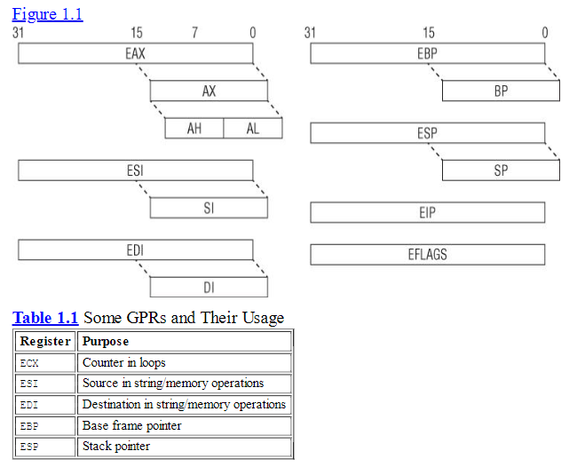

# Register Set and Data Types

Khi hệ điều hành trong *Protected mode*, kiến trúc x86 có 8 thanh ghi 32 bit đa mục đích hay còn gọi là *General Purpose Register*:

**EAX, EBX, ECX, EDX, EDI, ESI, EBP và ESP**

## EAX (Accumulator Register)

Thanh ghi này thường lưu trữ giá trị trả về của các hàm hay kết quả của các phép toán.

```asm
MOV EAX, 10   ; lưu 10 vào eax
MOV EBX, 5    ; lưu 5 vào ebx
ADD EAX, EBX  ; cộng giá trị của eax với ebx và lưu vào eax --> eax = 15
```

## EBX (Base Register)

Thanh ghi này thường được sử dụng như giá trị cơ sở trong các phép toán truy cập bộ nhớ, chẳng hạn như truy cập một phần tử trong một mảng hay một ký tự của một chuỗi.


## ECX 

Thanh gi này thường được sủ dụng để làm bộ đếm trong các phép toán vòng lặp  ví dụ *for(int i = 0 ; i < 10 )* và các phép toán chuỗi. 

### Ví dụ về ECX VÀ EBX 

```asm 


; Chương trình đơn giản để in mảng
section .data
    ; Mảng các số nguyên
    numbers dd 10, 20, 30, 40, 50
    array_size equ 5
    
    ; Ký tự xuống dòng
    newline db 10

section .bss
    buffer resb 12     ; Buffer để lưu số dưới dạng chuỗi

section .text
    global _start

_start:
    xor ecx, ecx       ; Khởi tạo ECX = 0 (index)

print_loop:
    ; Kiểm tra nếu đã in hết các phần tử
    cmp ecx, array_size
    jge exit_program
    
    ; Lấy phần tử hiện tại
    mov eax, [numbers + ecx*4]
    
    ; Chuyển số thành chuỗi
    push ecx
    call int_to_string
    pop ecx
    
    ; In số
    mov eax, 4          ; sys_write
    mov ebx, 1          ; stdout
    mov ecx, buffer     ; chuỗi cần in
    mov edx, eax        ; độ dài chuỗi (từ int_to_string)
    int 0x80
    
    ; In xuống dòng
    mov eax, 4          ; sys_write
    mov ebx, 1          ; stdout
    mov ecx, newline    ; ký tự xuống dòng
    mov edx, 1          ; độ dài 1 byte
    int 0x80
    
    ; Tăng index và lặp lại
    inc ecx
    jmp print_loop

exit_program:
    ; Thoát chương trình
    mov eax, 1          ; sys_exit
    xor ebx, ebx        ; exit code 0
    int 0x80

; Hàm đơn giản chuyển số trong EAX thành chuỗi
; Đầu ra: buffer chứa chuỗi, EAX chứa độ dài chuỗi
int_to_string:
    push ebx
    push ecx
    push edx
    push edi
    
    mov edi, buffer     ; Trỏ đến buffer
    mov ebx, 10         ; Cơ số 10
    xor ecx, ecx        ; Đếm số chữ số
    
    ; Xử lý trường hợp đặc biệt nếu số = 0
    test eax, eax
    jnz not_zero
    mov byte [edi], '0'
    mov eax, 1          ; Độ dài = 1
    jmp end_conversion
    
not_zero:
    ; Lưu stack hiện tại
    mov edx, edi
    
    ; Chuyển đổi từng chữ số
digit_loop:
    xor edx, edx        ; Xóa edx cho phép chia
    div ebx             ; eax = eax / 10, edx = eax % 10
    add dl, '0'         ; Chuyển thành ký tự ASCII
    push edx            ; Lưu chữ số vào stack
    inc ecx             ; Tăng số đếm chữ số
    test eax, eax       ; Kiểm tra nếu eax = 0
    jnz digit_loop
    
    ; Pop các chữ số từ stack vào buffer (theo thứ tự ngược lại)
    mov eax, ecx        ; Lưu độ dài vào eax
reverse_loop:
    pop edx
    mov [edi], dl
    inc edi
    loop reverse_loop
    
end_conversion:
    ; Thêm null terminator
    mov byte [edi], 0
    
    pop edi
    pop edx
    pop ecx
    pop ebx
    ret
``` 

## EDX (Data Register)
Thanh gi được sử dụng để lưu các giá trị phụ trong các phép toán số học đặc biệt là chia hoặc nhân. 

```asm 
; Trong phép nhân 32-bit, khi nhân hai số lớn, kết quả có thể vượt quá 32-bit.
; Khi đó, EAX chứa phần thấp của kết quả và EDX chứa phần cao.
section .text
    global _start
    
_start:
    mov eax , 500000 ; 
    mov ecx , 300000 ; 
    imul ecx  ; nhân eax với ecx nhưng vif kết quả vượt quá 32 bit nên. 
              ; edx sẽ giữ phần cao của kết quả và eax sẽ giữ phần thấp 
            
    
    mov eax ,1 ; sys_exit 
    xor ebx , ebx 
    int 0x80

```

## EDI (Destination Index Register)
EDI được sử dụng làm chỉ mục đích (destination index) trong các phép toán chuỗi và các phép toán di chuyển bộ nhớ.

## ESI (Source Index Register)
ESI được sử dụng làm chỉ mục nguồn (source index) trong các phép toán chuỗi và các phép toán di chuyển bộ nhớ.

### Ví dụ về EDI , ESI 
```asm 
section .data 
   src db "hello" , 0 
   des times 5 db 0 
   src_len equ 5 
section .text
    global_start

_start 
    mov esi , src ; 
    mov edi , des ; 
    mov ecx , src_len ; 
    
    ; ld: Xóa cờ hướng, đảm bảo ESI và EDI tăng lên trong quá trình sao chép.
    cld; 
    rep movsb  ; Lặp lại lệnh movsb (move string byte) ECX lần. Lệnh movsb sao chép một byte từ địa chỉ được trỏ bởi ESI đến địa chỉ được trỏ bởi EDI, sau đó tăng ESI và EDI.
_exit 
    mov eax ,1 
    xor ebx , ebx ;  Thoát khỏi chương trình với mã thoát 0.
    int 0x80
``` 

## EBP (Base Pointer Register)
EBP được sử dụng để lưu trữ con trỏ cơ sở của ngăn xếp (stack frame) trong các hàm. Nó giữ vị trí của ngăn xếp hiện tại, giúp quản lý tham số hàm và giá trị trả về.

## ESP (Stack Pointer Register)
ESP là con trỏ ngăn xếp, nó trỏ đến vị trí hiện tại trên ngăn xếp. ESP sẽ thay đổi khi có các thao tác push và pop trong quá trình thực thi chương trình.

### Ví dụ về ESP và EBP 
```asm 

section .text
    global_start

_start: 
    ; gọi hàm sum(10,20)
    push 20; 
    push 10; 
    call sum; 
    add esp, 8; dọn dẹp stack 2 int 4 byte mỗi cái 

_end: 
    mov eax ,1; 
    xor ebx , ebx; 
    int 0x80; 

sum: 
    push ebp; lưu lại giá trị ebp của hàm trước 
    mov ebp, esp ; đặp esp làm stack frame hiện tại 

    mov eax , [ebp + 8]  ; truy cập tham số thứ 1 , truy cập tham số sẽ them + offset 
                         ; đối với biến trong hàm thì - offset 
    add eax , [ebp + 12] ; cộng eax với tham số thứ 2 lưu vào eax

    pop ebp ; khôi phục ebp của hàm trc 
    ret ;kết  thúc hàm sum trả về eax 


; Địa chỉ Stack	Giá trị	Mô tả
; ESP+12 b = 20	Tham số thứ 2
; ESP+8	a = 10	Tham số thứ 1
; ESP+4	Return Address	Địa chỉ trả về sau khi RET
; ESP (EBP)	EBP cũ	Lưu giá trị EBP trước đó
```


Một vài thanh ghi có thể chia thành các phần nhỏ hơn 8 bit hay 16 bit bao gồm 
**EAX, EBX , ESI , ESP, EIP, EDI , EFLAGS..** 


Những kiểu dữ liệu phổ bién trong x86 bao gồm : 
* Bytes : 8 bit ví dụ al, bl ,cl. 
* Word  : 16 bit - 2 byte ví dụ : ax, bx, cx. 
* DWord : 32 bit - 4 byte ví dụ : eax , ebx , ecx. 
* Qword : 64 bit - 8 byte nhưng x86 k có thanh ghi 64 bit nhưng giá trị này có thể được lưu bằng cách kết hợp edx và eax như trong ví dụ về edx trên. 


Thanh ghi 32 bit *EFLAGS* được sử dụng để lưu trạng thái của các phép toán số học và các trạng thái thực thi khác. Chủ yếu dùng có braching. 

Ví dụ: Nếu thực hiện phép **cộng (ADD)** mà kết quả bằng **0**, thì **ZF (Zero Flag) = 1** → Dùng để kiểm tra kết quả của phép toán và thực hiện rẽ nhánh nếu cần.  

### Các cờ quan trọng trong EFLAGS:
| Cờ (Flag) | Bit | Chức năng |
|-----------|-----|----------|
| **ZF** (Zero Flag) | 6 | Bật nếu kết quả phép toán là 0 |
| **CF** (Carry Flag) | 0 | Bật nếu có bit nhớ (carry) trong phép toán |
| **OF** (Overflow Flag) | 11 | Bật nếu xảy ra tràn số học |
| **SF** (Sign Flag) | 7 | Bật nếu kết quả là số âm |
| **PF** (Parity Flag) | 2 | Bật nếu số bit 1 trong kết quả là số chẵn |

```asm 

section .text
    global _start

_start:
    ; Đưa giá trị vào thanh ghi EAX
    MOV EAX, 5       ; EAX = 5
    AND EAX, 0       ; EAX = 5 AND 0 => Kết quả là 0 => ZF được bật (ZF = 1)

    ; Kiểm tra giá trị của Zero Flag (ZF)
    JZ zero_flag_set ; Nếu ZF = 1, nhảy đến zero_flag_set

    MOV EAX, 1       ; Nếu ZF = 0, lưu 1 vào EAX (không nhảy)

exit:
    MOV EAX, 60      ; syscall exit
    XOR EDI, EDI     ; exit code = 0
    SYSCALL          ; Thoát chương trình

zero_flag_set:
    MOV EAX, 2       ; Nếu ZF = 1, lưu 2 vào EAX
    JMP exit         ; Thoát chương trình


```

## Thanh ghi hệ thống quan trọng**
Ngoài các thanh ghi tổng quát (EAX, EBX, ...), **CPU còn có các thanh ghi đặc biệt** để kiểm soát các cơ chế hệ thống như bộ nhớ ảo, ngắt, và debug.


### Các thanh ghi debug (DR0 - DR7)
Chức năng: Dùng để thiết lập breakpoints (điểm dừng) cho việc debug.

Hạn chế: Hệ thống chỉ cho phép thiết lập 4 điểm dừng bộ nhớ (DR0 - DR3), còn DR4 - DR7 chỉ lưu trạng thái.

### Thanh ghi Model-Specific Registers (MSRs)
Đây là các thanh ghi đặc biệt tùy thuộc vào từng CPU (Intel/AMD).

Chỉ có thể truy cập trong ring 0 (kernel mode) bằng lệnh RDMSR (đọc) và WRMSR (ghi).

Dùng để lưu bộ đếm hiệu suất (performance counters), cài đặt chế độ hệ thống, và hỗ trợ lệnh đặc biệt như SYSENTER.

Ví dụ:
IA32_SYSENTER_EIP (0x176): Lưu địa chỉ handler cho system call của hệ điều hành (khi dùng lệnh SYSENTER).


# Instruction Set 
Kiến trúc x86 có tâp lệnh lớn hỗ trợ linh hoạt di chuyển dữ liệu giữa bộ nhớ và thanh ghi. Nhưng mov có thể được chia thành 5 loại mov. 
* Immediate to register
* Register to register
* Immediate to memory
* Register to memory and vice versa
* Memory to memory

4 cái đầu tiên được hỗ trợ bởi các kiến trúc hiện đại, và cái cuối được hỗ trợ bởi x86. 
NNhững kiến trúc RISC cổ điển như ARM chỉ có thể đọc ghi data từ bộ nhớ vơi lệnh *LDR và STR*. Điều này giúp kiến trúc RISC đơn giản hơn, nhưng đôi khi yêu cầu nhiều lệnh hơn.
Mất 3 lệnh để tăng giá trị một biến trong bộ nhớ.
1. đọc dữ liệu tù bộ nhớ vào 1 thanh ghi 
2. cộng 1 giá trị vào thanh ghi 
3. lưu thanh ghi lại vào vùng nhớ trước đó 

__ARM__
```asm 
    LDR R1,[0X100] ; tải giá trị tại 0x100 vào r1 ví dụ 123
    ADD R1 , R1 , 1 ; cộng thêm 1 
    STR R1, [0X100] 

```


Đối với x86 ta chỉ cần 1 lệnh.

__X86__
```asm 
    INC DWORD [0x100]

```

### Lưu ý về Sytax 

Khi viết hoặc đọc mã assembly x86, có **hai kiểu cú pháp phổ biến**:  
1. **Cú pháp Intel** (dùng trên Windows, IDA Pro, OllyDbg, MASM, NASM, v.v.)  
2. **Cú pháp AT&T** (dùng trên Unix/Linux, GCC, GDB, v.v.)  

Mặc dù cả hai cú pháp đều biểu diễn cùng một tập lệnh, nhưng cách viết của chúng **khác nhau đáng kể**.  

---

#### **Ví dụ về sự khác biệt**
| **Intel Syntax** | **AT&T Syntax** | **Giải thích** |
|-----------------|---------------|----------------|
| `mov ecx, AABBCCDDh` | `movl $0xAABBCCDD, %ecx` | Gán giá trị ngay (`Immediate`) vào thanh ghi |
| `mov ecx, [eax]` | `movl (%eax), %ecx` | Gán giá trị từ địa chỉ trong `eax` vào `ecx` |
| `mov ecx, eax` | `movl %eax, %ecx` | Gán giá trị từ `eax` vào `ecx` |

---

#### **So sánh chi tiết Intel vs. AT&T**
| **Khác biệt** | **Intel** | **AT&T** |
|-------------|---------|---------|
| **Ký hiệu thanh ghi** | `ecx` | `%ecx` |
| **Ký hiệu giá trị ngay (Immediate value)** | `1234h` | `$0x1234` |
| **Cách viết lệnh** | `mov đích, nguồn` | `movl nguồn, đích` |
| **Ký hiệu địa chỉ bộ nhớ** | `[eax]` | `(%eax)` |
| **Ghi chú về độ rộng toán hạng** | Không cần hậu tố | Có hậu tố (`b`, `w`, `l`) |
| **Trình biên dịch/Disassembler sử dụng** | Windows (MASM, NASM, OllyDbg, IDA Pro) | Unix/Linux (GCC, GDB) |

Ví dụ, trong AT&T:
- `movb` (byte - 8 bit)
- `movw` (word - 16 bit)
- `movl` (long - 32 bit)

---

#### **Tóm tắt**
- **Intel Syntax**: Dễ đọc hơn, phổ biến trên Windows.
- **AT&T Syntax**: Dùng nhiều trên Unix/Linux, có hậu tố chỉ kích thước.

Trong thực tế, **Intel notation phổ biến hơn**, đặc biệt trong **phân tích mã máy, dịch ngược (reverse engineering), lập trình Windows**.


### Data Movement.
Lệnh phổ biến nhất để di chuyển data đó chính là *mov*.

#### ví dụ : 

```asm 
    BE  3F  00  0F  00      mov      esi,  0F003Fh  ;  set  ESI  = 0xF003
    8B F1                   mov      esi, ecx     ; set ESI = ECX

   ; BE dành cho lệnh MOV với giá trị trực tiếp (immediate).
    ;8B dành cho lệnh MOV giữa hai thanh ghi.
```

Tiếp theo là di chuyển data từ bộ nhớ. sử dung '[]' để biệu thị truy cập bộ nhớ. 

```asm 
   C7 00 01 00 00+  mov   dword ptr [eax], 1
   8B 08            mov   ecx, [eax]
   89 18            mov  [eax], ebx 
   89 46 34         mov  [esi + 34h] , eax ; set the memory address at (ESI+34 )to EAX
   8B 46 34         mov   eax, [esi+34h]
   8B 14 01         mov   edx, [ecx+eax]

```
Pseudo C

```asm
    01: *eax = 1;
    02: ecx = *eax;
    03: *eax = ebx;
    04: *(esi+34) = eax;
    05: eax = *(esi+34);
    06: edx = *(ecx+eax)
```
Ngoại lệ: Lệnh LEA
Một ngoại lệ quan trọng đối với việc sử dụng dấu ngoặc vuông là lệnh LEA (Load Effective Address). Mặc dù lệnh này cũng sử dụng dấu ngoặc vuông, nhưng nó không thực sự tham chiếu đến bộ nhớ, mà thay vào đó chỉ tính toán và lưu trữ địa chỉ hiệu quả vào thanh ghi đích.

Ví dụ với LEA:
```asm
LEA EAX, [EBX+4]    ; Tính toán địa chỉ EBX + 4 và lưu vào EAX
```
Những ví dụ này mô tả việc truy cập bộ nhớ thông qua base register  and offset .
đây là 1 dạng thươngf được dùng để truy cập các thành viên của 1 structure hay 1 bộ đêm data tại 1 ví trị được tính toán tại thời điểm run time. 
#### ví dụ ECX trỏ đến 1 structue KDPC với layout này : 


KDPC trong hệ thống Windows (có thể là từ kernel debugging). Cấu trúc này được định nghĩa như sau (dựa trên output của lệnh dt nt!_KDPC). 

```asm 

kd> dt nt!_KDPC
   +0x000 Type             : UChar         (1 byte)
   +0x001 Importance       : UChar         (1 byte)
   +0x002 Number           : Uint2B        (2 byte)
   +0x004 DpcListEntry     : _LIST_ENTRY   (8 byte)
   +0x00c DeferredRoutine  : Ptr32         (4 byte)
   +0x010 DeferredContext  : Ptr32         (4 byte)
   +0x014 SystemArgument1  : Ptr32         (4 byte)
   +0x018 SystemArgument2  : Ptr32         (4 byte)
   +0x01c DpcData          : Ptr32         (4 byte)

```
ECX là thanh ghi cơ sở (base register), trỏ đến địa chỉ bắt đầu của cấu trúc KDPC.
Các offset (0x000, 0x001, 0x002, v.v.)là khoảng cách từ địa chỉ cơ sở để truy cập từng trường (field) trong cấu trúc.

__ASM__
```asm 

    8B 45 0C         mov   eax, [ebp+0Ch] ; Lấy giá trị từ stack (tại địa chỉ [ebp+0Ch]) và lưu vào thanh ghi EAX. Giá trị này sau đó sẽ được gán cho trường DeferredRoutine (offset 0x00C)
    83 61 1C 00      and   dword ptr [ecx+1Ch], 0 ; Xóa trường DpcData (offset 0x01C) bằng cách thực hiện phép AND với 0, tức là gán DpcData = NULL.
    89 41 0C         mov   [ecx+0Ch], eax ; Gán giá trị trong EAX (từ dòng 1) vào trường DeferredRoutine (offset 0x00C).
    8B 45 10         mov   eax, [ebp+10h] ; Lấy một giá trị khác từ stack (tại [ebp+10h]) và lưu vào EAX. Giá trị này sẽ được gán cho trường DeferredContext (offset 0x010).
    C7 01 13 01 00+  mov   dword ptr [ecx], 113h ; Ghi giá trị 0x113 (dạng double-word, tức 4 byte) vào địa chỉ bắt đầu của cấu trúc (offset 0x000).
    89 41 10         mov   [ecx+10h], eax ; Gán giá trị trong EAX (từ dòng 4) vào trường DeferredContext (offset 0x010).
    ; Vậy tại sao lại ghi 4 byte (double-word) vào offset 0x000, trong khi Type chỉ là 1 byte
    ; vvệc ghi 4 byte sẽ ảnh hưởng đến cả 3 trường Type, Importance, và Number cùng lúc. Đây là một kỹ thuật tối ưu hóa của trình biên dịch (compiler optimization)

```
Đây là 113h khi chuyển thành binary.


Nếu k tối ưu code có thẻ được viết lại như sau.

```asm 
    01: 8B 45 0C         mov   eax, [ebp+0Ch]
    02: 83 61 1C 00      and   dword ptr [ecx+1Ch], 0
    03: 89 41 0C         mov   [ecx+0Ch], eax
    04: 8B 45 10         mov   eax, [ebp+10h]
    05: C6 01 13         mov   byte ptr [ecx],13h
    06: C6 41 01 01      mov   byte ptr [ecx+1],1
    07: 66 C7 41 02 00+  mov   word ptr [ecx+2],0
    08: 89 41 10         mov   [ecx+10h], eax
```

__Pseudo C__
```asm
    KDPC *p = ...;                // ECX trỏ đến cấu trúc KDPC
    p->DpcData = NULL;           // Dòng 2
    p->DeferredRoutine = ...;    // Dòng 1 + 3
    *(int *)p = 0x113;           // Dòng 5
    p->DeferredContext = ...;    // Dòng 4 + 6

```

Tiếp theo là kiểu thường được dùng cho truy cập phần tử của 1 array-type object. Thông thường nó có dạng  [BaseAdrr + index*scale] , scale ở đây là kích thước giá trị mỗi phần tử ví dụ mảng int thì sẽ là 4 byte --> scale = 4. 


```asm 
   
    89 04 F7         mov   [edi+esi*8], eax
    ; EDI: Địa chỉ cơ sở của mảng.
    ; ESI: Chỉ số của phần tử.
    ; *8: Scale là 8, nghĩa là mỗi phần tử có kích thước 8 byte (kiểu long long hoặc QWORD).
    ; Lệnh này ghi giá trị trong `EAX Ascending/descending giá trị của EFLAGS.
    ; Lệnh này lưu giá trị của EAX vào địa chỉ [EDI + ESI*8].


```

Trong thực tế , đay là dạng thường xuát hiện trong truy cập mảng 

__Pseudo C__
```asm 
    typedef struct _FOO {
        DWORD size;        // +0x00
        DWORD array[...];  // +0x04
    } FOO, *PFOO;
    PFOO bar = ...;
    for (i = ...; i < bar->size; i++) {
        if (bar->array[i] != 0) {
            ...
        }
    }

```
__ASM__
```asm 
    ; EDI: Trỏ đến một cấu trúc có trường size tại offset +0x00 và mảng array tại offset +0x04.

    loop_start : 
        move eax ,[edi + 4] ; Lấy địa chỉ cơ sở của mảng ([EDI+4]) vào EAX.
        mov eax , [eax +ebp*4] ; Truy cập phần tử array[ebx] ([EAX+EBX*4]) và lưu vào EAX.
        test  eax, eax
        jz    short loc_7F627F
        ... ; vài lệnh có thể viết ở đaya đẻ bỏ qua khi nhảy 
    loc_7F627F:
        inc ebx
        cmp ebx, [edi]
        jl    short loop_start

``` 

Các lệnh MOVSB/MOVSW/MOVSD. Các lệnh này di chuyển dữ liệu giữa hai địa chỉ bộ nhớ với độ chi tiết 1, 2, hoặc 4.
* Nguồn: ESI.
* Đích: EDI.
* Cập nhật: Tăng/giảm ESI và EDI dựa trên cờ DF (0: tăng, 1: giảm).

__Pseudo C__

```asm 
    /* a GUID is 16-byte structure */
    GUID RamDiskBootDiskGuid = ...; // global
    ...
    GUID foo;
    memcpy(&foo, &RamdiskBootDiskGuid, sizeof(GUID))


```


__ASM__ 

```asm
    mov   esi, offset _RamdiskBootDiskGuid
    lea   edi, [ebp-0C0h]
    movsd    ; Sao chép 4 byte
    movsd    ; Sao chép 4 byte
    movsd    ; Sao chép 4 byte
    movsd    ; Sao chép 4 byte
```

Ý nghĩa: Sao chép 16 byte (4 lần MOVSD) từ _RamdiskBootDiskGuid đến [EBP-0C0h] sử dụng Tăng/giảm ESI và EDI dựa trên cờ DF (0: tăng, 1: giảm).

SCAS (Scan String) là một lệnh trong assembly x86 dùng để so sánh một giá trị trong thanh ghi AL, AX, hoặc EAX với dữ liệu tại địa chỉ bộ nhớ được trỏ bởi thanh ghi EDI
SCAS trong assembly x86, cách nó hoạt động ngầm (implicitly), và cách nó được sử dụng trong ví dụ cụ thể để triển khai hàm strlen() trong C.

Nguồn so sánh: Giá trị trong AL (1 byte), AX (2 byte), hoặc EAX (4 byte), tùy vào biến thể của lệnh (SCASB, SCASW, SCASD).
Đích so sánh: Dữ liệu tại địa chỉ bộ nhớ [EDI].
Kết quả: Lệnh này không lưu kết quả so sánh mà chỉ cập nhật các cờ trạng thái trong thanh ghi EFLAGS (như ZF - Zero Flag, SF - Sign Flag, v.v.).
Tự động cập nhật EDI: Sau mỗi lần so sánh, EDI sẽ được tăng hoặc giảm dựa trên cờ hướng DF (Direction Flag) trong EFLAGS:
Nếu DF = 0: EDI tăng (quét tiến lên).
Nếu DF = 1: EDI giảm (quét ngược lại).
Các biến thể:
SCASB: So sánh 1 byte (AL với [EDI]).
SCASW: So sánh 2 byte (AX với [EDI]).
SCASD: So sánh 4 byte (EAX với [EDI]).

"Implicitly" (ngầm): Nghĩa là lệnh SCAS không yêu cầu bạn chỉ định rõ ràng nguồn và đích trong cú pháp. Nó tự động (ngầm) sử dụng:
Nguồn: AL/AX/EAX.
Đích: [EDI]

Ví dụ: Bạn không cần viết cmp al, [edi] như với lệnh CMP. Thay vào đó, chỉ cần gọi SCASB, và nó tự động thực hiện so sánh.
Kết quả: Sau khi so sánh, các cờ trong EFLAGS được cập nhật:
Nếu AL == [EDI]: ZF = 1 (Zero Flag bật).
Nếu AL != [EDI]: ZF = 0.

*Sử dụng với tiền tố REP*
REP và các biến thể: SCAS thường được kết hợp với tiền tố REP (Repeat) để lặp lại thao tác so sánh nhiều lần:
REPNE (Repeat while Not Equal): Lặp lại cho đến khi tìm thấy giá trị khớp (ZF = 1) hoặc ECX = 0.
REPE (Repeat while Equal): Lặp lại cho đến khi không còn khớp (ZF = 0) hoặc ECX = 0.
Ứng dụng: Dùng để quét một buffer (mảng byte/word/dword) để tìm một giá trị cụ thể, ví dụ như tìm ký tự NUL (\0) trong chuỗi.

#### Ví dụ triển khai strlen() với SCAS : 

__Pseudo C__
```asm 
    size_t strlen(const char *str) {
        const char *start = str;       // EBX = EDI
        while (*str != 0) {            // REPNE SCASB
            str++;
        }
        return str - start;            // EDI - EBX
}

```

__ASM__


```asm
    xor al, al ; xor reg, reg là cách phổ biến để đặt thanh ghi về 0 vì nó nhanh và ngắn hơn mov reg, 0.
    mov ebx , edi ; Lưu lại địa chỉ ban đầu của chuỗi (được trỏ bởi EDI) để sau này tính độ dài. EDI sẽ thay đổi trong quá trình quét, nên cần một bản sao.
    repne scasb; edi liên tục tăng đén khi nào tìm đc phần tử bằng với al 
    sub edi , ebx; tính length


```

Định nghĩa: STOS (Store String) là một lệnh trong assembly x86 dùng để ghi giá trị từ thanh ghi AL, AX, hoặc EAX vào địa chỉ bộ nhớ được trỏ bởi thanh ghi EDI.
So sánh với SCAS:
Điểm giống nhau:
Cả hai đều hoạt động ngầm (implicitly) với EDI làm địa chỉ đích.
Cả hai tự động tăng hoặc giảm EDI sau mỗi lần thực thi, dựa trên cờ hướng DF trong EFLAGS:
DF = 0: EDI tăng (hướng tiến).
DF = 1: EDI giảm (hướng ngược).
Có các biến thể cho 1, 2, hoặc 4 byte: STOSB (byte), STOSW (word), STOSD (dword).
Điểm khác nhau:
SCAS: So sánh giá trị tại [EDI] với AL/AX/EAX và cập nhật cờ trạng thái (EFLAGS), không thay đổi dữ liệu tại [EDI].
STOS: Ghi giá trị từ AL/AX/EAX trực tiếp vào [EDI], thay đổi dữ liệu tại đó.
Các biến thể:
STOSB: Ghi 1 byte từ AL vào [EDI].
STOSW: Ghi 2 byte từ AX vào [EDI].
STOSD: Ghi 4 byte từ EAX vào [EDI].

Ứng dụng của STOS
Mục đích chính: STOS thường được dùng để khởi tạo hoặc điền một buffer (mảng byte) bằng một giá trị cố định, ví dụ như đặt tất cả các byte thành 0 (tương tự hàm memset() trong C).
Kết hợp với REP: Khi dùng tiền tố REP (Repeat), STOS lặp lại việc ghi dữ liệu vào các vị trí liên tiếp trong bộ nhớ, với số lần lặp được xác định bởi thanh ghi ECX.


__Pseudo C__

```asm 
    memset(edi, 0, 36);  // Điền 36 byte giá trị 0 vào buffer tại EDI
```

__ASM__

```asm 

    xor eax , eax ; đặt eax = 0; 
    mov ecx , 9; 
    mov edi , esi ; vì stos thao tác với edi nhưng tôi muôn ghi vào esi 
    rep stosd     ; ghi dwrod tưc là 4 byte vào edi và giản edi đến khi vào ecx = 0 
    ; tổng cộng 9 lần --> 36byte được ghi vào esi; 


``` 


## Exercise1. This function uses a combination SCAS and STOS to do its work. First,
explain what is the type of the [EBP+8] and [EBP+C] in line 1 and 8,
respectively. Next, explain what this snippet does.
```asm 
    01: 8B 7D 08         mov   edi, [ebp+8]
    02: 8B D7            mov   edx, edi
    03: 33 C0            xor   eax, eax
    04: 83 C9 FF         or    ecx, 0FFFFFFFFh
    05: F2 AE            repne scasb
    06: 83 C1 02         add   ecx, 2
    07: F7 D9            neg   ecx
    08: 8A 45 0C         mov   al, [ebp+0Ch]
    09: 8B FA            mov   edi, edx
    10: F3 AA            rep stosb
    11: 8B C2            mov   eax, edx

```

Đoạn code này thực hiện một tác vụ tương tự hàm `memset()` trong C, nhưng với bước tính độ dài chuỗi trước đó. Cụ thể, nó:
1. Tính độ dài của chuỗi null-terminated tại địa chỉ được truyền qua `[EBP+8]`.
2. Điền toàn bộ chuỗi đó bằng một ký tự được truyền qua `[EBP+0C]`.

#### Phân tích từng dòng:
```asm
01: 8B 7D 08         mov   edi, [ebp+8]    ; EDI = con trỏ đến chuỗi
```
- Gán địa chỉ của chuỗi (tham số đầu tiên) vào `EDI`. `EDI` sẽ là điểm bắt đầu để quét chuỗi bằng `SCASB`.

```asm
02: 8B D7            mov   edx, edi        ; EDX = EDI (lưu địa chỉ gốc)
```
- Sao chép địa chỉ gốc của chuỗi từ `EDI` vào `EDX` để sử dụng sau này (vì `EDI` sẽ thay đổi trong quá trình quét).

```asm
03: 33 C0            xor   eax, eax        ; EAX = 0 (AL = 0)
```
- Đặt `EAX` (và do đó `AL`) về 0. `AL = 0` sẽ được dùng để tìm ký tự `NUL` (`\0`) trong chuỗi bằng `SCASB`.

```asm
04: 83 C9 FF         or    ecx, 0FFFFFFFFh ; ECX = 0xFFFFFFFF
```
- Đặt `ECX = -1` (dạng hex: `0xFFFFFFFF`). 
- `ECX` là bộ đếm cho `REPNE SCASB`. Giá trị `-1` (tối đa 32-bit) đảm bảo quét toàn bộ chuỗi cho đến khi tìm thấy `NUL`, trừ khi chuỗi dài hơn 4 tỷ byte (không thực tế).

```asm
05: F2 AE            repne scasb           ; Quét để tìm NUL
```
- **Ý nghĩa**: 
  - `SCASB`: So sánh `AL` (0) với byte tại `[EDI]`, tăng `EDI` lên 1.
  - `REPNE`: Lặp lại `SCASB` cho đến khi `AL == [EDI]` (`ZF = 1`, tức gặp `NUL`) hoặc `ECX = 0`.
- **Kết quả**: 
  - `EDI` trỏ đến byte sau `NUL`.
  - `ECX` giảm từ `0xFFFFFFFF` xuống còn `-n-1`, trong đó `n` là độ dài chuỗi (bao gồm `NUL`).

```asm
06: 83 C1 02         add   ecx, 2          ; Điều chỉnh ECX
```
- **Ý nghĩa**: Thêm 2 vào `ECX`.
- **Mục đích**: 
  - Sau `REPNE SCASB`, nếu chuỗi dài `n` ký tự (không tính `NUL`), `ECX` ban đầu giảm từ `0xFFFFFFFF` xuống `0xFFFFFFFF - n - 1`.
  - Thêm 2 để bù lại: 
    - `+1` cho byte `NUL`.
    - `+1` để chuyển từ giá trị âm sang độ dài thực tế khi đảo dấu ở bước sau.

```asm
07: F7 D9            neg   ecx             ; ECX = độ dài chuỗi
```
- **Ý nghĩa**: Đảo dấu `ECX` (negate: `-ECX`).
- **Mục đích**: 
  - Sau `add ecx, 2`, `ECX = -(n + 1) + 2 = -n + 1`.
  - `neg ecx` biến nó thành `n - 1 + 1 = n`, tức là độ dài chuỗi không tính `NUL`.
- **Kết quả**: `ECX` bây giờ chứa độ dài chuỗi (số byte sẽ được điền).

```asm
08: 8A 45 0C         mov   al, [ebp+0Ch]   ; AL = ký tự cần điền
```
- Gán giá trị byte từ `[EBP+0C]` (tham số thứ hai) vào `AL`. Đây là ký tự sẽ được dùng để điền vào buffer bằng `STOSB`.

```asm
09: 8B FA            mov   edi, edx        ; Khôi phục EDI
```
- Khôi phục `EDI` về địa chỉ gốc của chuỗi (lưu trong `EDX`), vì `EDI` đã bị thay đổi bởi `SCASB`.

```asm
10: F3 AA            rep stosb             ; Điền chuỗi bằng ký tự
```
- **Ý nghĩa**: 
  - `STOSB`: Ghi `AL` vào `[EDI]`, tăng `EDI` lên 1.
  - `REP`: Lặp lại `STOSB` `ECX` lần.
- **Kết quả**: Điền `n` byte (độ dài chuỗi) tại địa chỉ gốc bằng ký tự trong `AL`.

```asm
11: 8B C2            mov   eax, edx        ; Trả về con trỏ gốc
```
- Gán `EDX` (địa chỉ gốc của chuỗi) vào `EAX`. `EAX` thường là giá trị trả về của hàm trong chuẩn gọi hàm C.

---

### 3. Chức năng tổng thể
- **Input**:
  - `[EBP+8]`: Con trỏ đến chuỗi null-terminated (ví dụ: `"hello"`).
  - `[EBP+0C]`: Ký tự để điền (ví dụ: `'x'`).
- **Output**: 
  - Chuỗi tại `[EBP+8]` được ghi đè bằng ký tự từ `[EBP+0C]` trong suốt độ dài của chuỗi ban đầu.
  - `EAX` trả về con trỏ đến chuỗi đã sửa đổi.
- **Ví dụ**:
  - Input: `[EBP+8] = "hello"` (địa chỉ `0x1000`), `[EBP+0C] = 'x'`.
  - Sau thực thi: `[0x1000]` trở thành `"xxxxx"`, `EAX = 0x1000`.

#### Pseudo C:
```c
char* fill_string(char* str, char fill_char) {
    char* original = str;           // Dòng 2: EDX = EDI
    size_t len = strlen(str);       // Dòng 1-7: Tính độ dài
    memset(str, fill_char, len);    // Dòng 8-10: Điền ký tự
    return original;                // Dòng 11: Trả về con trỏ
}
```

---

### 4. Minh họa thực thi
- Giả sử: `[EBP+8] = 0x1000` (chuỗi `"hi"`), `[EBP+0C] = 'x'`.
  - `[0x1000] = 'h', [0x1001] = 'i', [0x1002] = 0`.
- **Dòng 1-2**: `EDI = EDX = 0x1000`.
- **Dòng 3-4**: `AL = 0`, `ECX = 0xFFFFFFFF`.
- **Dòng 5**: `REPNE SCASB` quét `'h', 'i', 0`, dừng tại `EDI = 0x1003`, `ECX = 0xFFFFFFFD` (-3).
- **Dòng 6**: `ECX = -3 + 2 = -1`.
- **Dòng 7**: `ECX = -(-1) = 1`.
- **Dòng 8**: `AL = 'x'`.
- **Dòng 9**: `EDI = 0x1000`.
- **Dòng 10**: `REP STOSB` ghi `'x'` vào `[0x1000]`, chuỗi thành `"x"` (độ dài 1).
- **Dòng 11**: `EAX = 0x1000`.

**Lưu ý**: Code này chỉ điền `len` byte (không tính `NUL`), nên kết quả phụ thuộc độ dài tính được.

---
