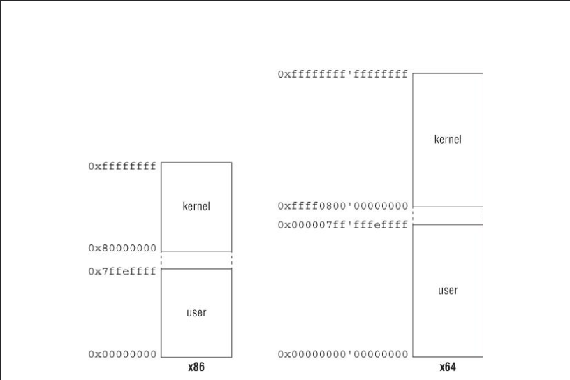
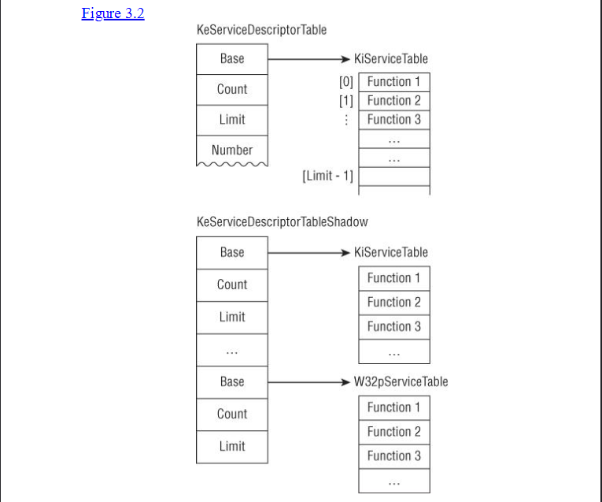
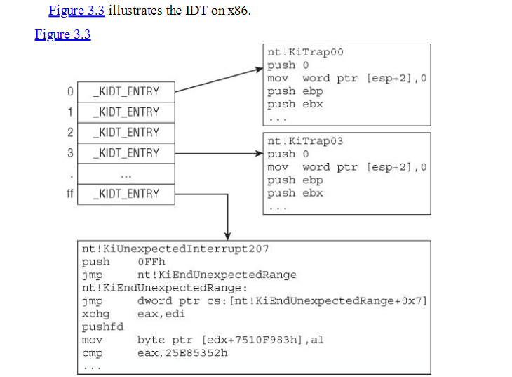

# The Windows Kernel 

phần này thảo luận về các nguyên tắc và kỹ thuật cần thiết để phân tích mã driver kernel-mode , ví dụ như rootkit, trên nền tảng Windows. Bởi vì các driver tương tác với Hệ điều hành (OS) thông qua các giao diện được định nghĩa rõ ràng, công việc phân tích có thể được chia nhỏ thành các mục tiêu tổng quát sau:

* Hiểu cách các thành phần cốt lõi của Hệ điều hành được triển khai.
* Hiểu cấu trúc của một driver.
* Hiểu các giao diện người dùng-driver và driver-OS, cũng như cách Windows triển khai chúng.
* Hiểu cách một số cấu trúc phần mềm nhất định của driver được thể hiện dưới dạng mã nhị phân.
* Áp dụng một cách có hệ thống kiến thức từ các bước trên vào quy trình dịch ngược mã (reverse engineering) tổng quát.

Nếu quy trình dịch ngược driver Windows có thể được mô hình hóa như một công việc riêng biệt, thì 90% công việc là hiểu cách Windows hoạt động và 10% là hiểu mã assembly. Do đó, phần này được viết như một phần giới thiệu về nhân Windows (Windows kernel) dành cho những người làm công việc dịch ngược mã. phần bắt đầu bằng việc thảo luận về các giao diện người dùng-nhân (user-kernel) và cách chúng được triển khai. Tiếp theo, phần thảo luận về LIST liên kết (linked lists) và cách chúng được sử dụng trong Windows. Sau đó, phần giải thích các khái niệm như luồng (threads), tiến trình (processes), bộ nhớ (memory), ngắt (interrupts), và cách chúng được sử dụng trong kernel và driver. Kế đến, phần đi sâu vào kiến trúc của một driver kernel mode và driver-kernel programming interface . phần kết thúc bằng việc áp dụng các khái niệm này vào việc dịch ngược mã của một rootkit.

Trừ khi được chỉ định khác, mọi ví dụ trong phần này đều được lấy từ Windows 8 RTM.

## Windows Fundamentals
 Chúng ta sẽ bắt đầu với khái niêm windows kernel , bao gồm các cấu trúc dữ liệu cơ bản and kernel objects liến quan đến lập trình driver and reverse engeneering. 

### Memory Layout

Giống như các hệ điều hành khác , Windows chia Virtual address thành 2 phần : 
- Kernel space 
- User space

Trên kiến trúc x86 và ARM: 2GB vùng địa chỉ cao (upper 2GB) được dành riêng cho kernel và 2GB vùng địa chỉ thấp (bottom 2GB) dành cho các tiến trình người dùng. Do đó, các địa chỉ ảo từ 0 đến 0x7fffffff thuộc về User space , còn từ 0x80000000 trở lên thuộc về Kernel space.

Trên kiến trúc x64: Khái niệm tương tự cũng được áp dụng, ngoại trừ việc User space là từ 0 đến 0x000007ffffffffff và không gian nhân là từ 0xffff080000000000 trở lên.

Hình 3.1 minh họa bố cục tổng quát này trên x86 và x64.




Không gian bộ nhớ nhân phần lớn là giống nhau giữa tất cả các tiến trình. Tuy nhiên, các tiến trình đang chạy chỉ có quyền truy cập vào không gian địa chỉ người dùng của chính chúng; trong khi mã chạy ở kernel-mode có thể truy cập cả hai - Kernel space và  User space . (Lưu ý: Một số dải địa chỉ trong Kernel space , ví dụ như các vùng thuộc session space và hyper space, có thể khác nhau giữa các tiến trình.)

Đây là một sự thật quan trọng cần ghi nhớ vì chúng ta sẽ quay lại vấn đề này sau khi thảo luận về ngữ cảnh thực thi (execution context). Các trang bộ nhớ (pages) thuộc kernel mode và user mode được phân biệt bởi một bit đặc biệt trong mục nhập của bảng trang (page table entry) tương ứng với trang đó.


Khi một luồng (thread) trong một tiến trình (process) được lập lịch để thực thi, Hệ điều hành (OS) sẽ thay đổi một thanh ghi đặc thù của bộ xử lý để trỏ đến thư mục trang (page directory) của chính tiến trình đó. Điều này là để đảm bảo tất cả các phép dịch địa chỉ ảo-sang-vật lý là dành riêng cho tiến trình đó, chứ không phải cho các tiến trình khác. Đây chính là cách Hệ điều hành có thể chạy nhiều tiến trình đồng thời và mỗi tiến trình lại có "ảo giác" rằng nó sở hữu toàn bộ không gian địa chỉ chế độ người dùng.

Trên các kiến trúc x86 và x64, thanh ghi cơ sở của page directory là CR3.
Trên kiến trúc ARM, đó là thanh ghi cơ sở của bảng dịch (translation table base register - TTBR).

Ghi chú:

Có thể thay đổi hành vi phân chia bộ nhớ mặc định (2GB/2GB trên hệ 32-bit) bằng cách chỉ định tùy chọn /3GB trong các tùy chọn khởi động (boot options). Với tùy chọn /3GB, không gian địa chỉ người dùng sẽ tăng lên 3GB và 1GB còn lại được dành cho nhân.
Các dải địa chỉ của người dùng/nhân được lưu trữ trong hai biểu tượng (symbols) trong nhân: MmSystemRangeStart (địa chỉ bắt đầu của không gian nhân) và MmHighestUserAddress (địa chỉ cao nhất của không gian người dùng). Các biểu tượng này có thể được xem bằng một trình gỡ lỗi nhân (kernel debugger).
Bạn có thể nhận thấy rằng có một khoảng trống 64KB giữa không gian người dùng và không gian nhân trên x86/ARM. Vùng này, thường được gọi là vùng không truy cập (no-access region), tồn tại để đảm bảo nhân không vô tình vượt qua ranh giới địa chỉ và làm hỏng bộ nhớ ở chế độ người dùng.

Trên x64, người đọc tinh ý có thể nhận thấy rằng địa chỉ 0xffff0800‘00000000 (được đề cập ở phần trước là điểm bắt đầu của Kernel space) là một địa chỉ không chuẩn tắc (non-canonical address) và do đó hệ điều hành không thể sử dụng được. Địa chỉ này thực sự chỉ được sử dụng như một dấu phân tách giữa không gian người dùng và không gian nhân. Địa chỉ thực sự có thể sử dụng đầu tiên trong không gian nhân bắt đầu từ 0xffff8000‘00000000.

## Processor Initialization 

Khi nhân (kernel) khởi động, nó thực hiện một số khởi tạo cơ bản cho mỗi bộ xử lý (processor/CPU). Hầu hết các chi tiết khởi tạo không quá quan trọng đối với công việc dịch ngược mã (reverse engineering) hàng ngày, nhưng việc biết một vài cấu trúc cốt lõi là cần thiết.

Vùng Kiểm soát Bộ xử lý (Processor Control Region - PCR) là một cấu trúc dành riêng cho mỗi bộ xử lý, lưu trữ thông tin và trạng thái CPU quan trọng. Ví dụ, trên x86, nó chứa địa chỉ cơ sở của Bảng Mô tả Ngắt (Interrupt Descriptor Table - IDT) và mức yêu cầu ngắt hiện tại (Interrupt Request Level - IRQL). Bên trong PCR là một cấu trúc dữ liệu khác gọi là Khối Kiểm soát Vùng Bộ xử lý (Processor Region Control Block - PRCB).

PRCB cũng là một cấu trúc cho mỗi bộ xử lý, chứa thông tin chi tiết về bộ xử lý đó—ví dụ: loại CPU, model, tốc độ, luồng (thread) hiện tại đang chạy, luồng kế tiếp sẽ chạy, hàng đợi các Lời gọi Thủ tục Trì hoãn (Deferred Procedure Calls - DPCs) cần chạy, vân vân. 

Giống như PCR, cấu trúc PRCB không được Microsoft tài liệu hóa chính thức (undocumented), nhưng bạn vẫn có thể xem định nghĩa của nó bằng trình gỡ lỗi nhân (kernel debugger) thông qua các lệnh như dt nt!_KPCR và dt nt!_KPRCB.

__PCR x86/64__

```asm

    kd> dt nt!_KPCR
   +0x000 NtTib            : _NT_TIB
   +0x000 GdtBase          : Ptr64 _KGDTENTRY64
   +0x008 TssBase          : Ptr64 _KTSS64
   +0x010 UserRsp          : Uint8B
   +0x018 Self             : Ptr64 _KPCR
   +0x020 CurrentPrcb      : Ptr64 _KPRCB
...
   +0x180 Prcb             : _KPRCB
``` 

__PRCB x86/64__

```
   kd> dt nt!_KPRCB
   +0x000 MxCsr            : Uint4B
   +0x004 LegacyNumber     : UChar
   +0x005 ReservedMustBeZero : UChar
   +0x006 InterruptRequest : UChar
   +0x007 IdleHalt         : UChar
   +0x008 CurrentThread    : Ptr64 _KTHREAD
   +0x010 NextThread       : Ptr64 _KTHREAD
   +0x018 IdleThread       : Ptr64 _KTHREAD
...
   +0x040 ProcessorState   : _KPROCESSOR_STATE
   +0x5f0 CpuType          : Char
   +0x5f1 CpuID            : Char
   +0x5f2 CpuStep          : Uint2B
   +0x5f2 CpuStepping      : UChar
   +0x5f3 CpuModel         : UChar
   +0x5f4 MHz              : Uint4B
...
   +0x2d80 DpcData          : [2] _KDPC_DATA
   +0x2dc0 DpcStack         : Ptr64 Void
   +0x2dc8 MaximumDpcQueueDepth : Int4B
...
```

__PCR ARM__

```
    kd> dt nt!_KPCR
   +0x000 NtTib            : _NT_TIB
   +0x000 TibPad0          : [2] Uint4B
   +0x008 Spare1           : Ptr32 Void
   +0x00c Self             : Ptr32 _KPCR
   +0x010 CurrentPrcb      : Ptr32 _KPRCB
...
```

__PRCB ARM__
```
    kd> dt nt!_KPCR
   +0x000 NtTib            : _NT_TIB
   +0x000 TibPad0          : [2] Uint4B
   +0x008 Spare1           : Ptr32 Void
   +0x00c Self             : Ptr32 _KPCR
   +0x010 CurrentPrcb      : Ptr32 _KPRCB
...
   kd> dt nt!_KPRCB
   +0x000 LegacyNumber     : UChar
   +0x001 ReservedMustBeZero : UChar
   +0x002 IdleHalt         : UChar
   +0x004 CurrentThread    : Ptr32 _KTHREAD
   +0x008 NextThread       : Ptr32 _KTHREAD
   +0x00c IdleThread       : Ptr32 _KTHREAD
...
   +0x020 ProcessorState   : _KPROCESSOR_STATE
   +0x3c0 ProcessorModel   : Uint2B
   +0x3c2 ProcessorRevision : Uint2B
   +0x3c4 MHz              : Uint4B
...
   +0x690 DpcData          : [2] _KDPC_DATA
   +0x6b8 DpcStack         : Ptr32 Void
...
   +0x900 InterruptCount   : Uint4B
   +0x904 KernelTime       : Uint4B
   +0x908 UserTime         : Uint4B
   +0x90c DpcTime          : Uint4B
   +0x910 InterruptTime    : Uint4B

```


Truy cập PCR/PRCB:

PCR của bộ xử lý hiện tại luôn có thể được truy cập từ chế độ nhân thông qua các thanh ghi đặc biệt. Nó được lưu trữ trong:

- Thanh ghi đoạn FS (trên x86)
- Thanh ghi đoạn GS (trên x64)
- Một trong các thanh ghi của bộ đồng xử lý hệ thống (system coprocessor registers) (trên ARM)


Ví dụ, nhân Windows cung cấp hai hàm để lấy con trỏ đến cấu trúc EPROCESS (đại diện cho tiến trình) và ETHREAD (đại diện cho luồng) hiện tại: PsGetCurrentProcess và PsGetCurrentThread. Các hàm này hoạt động bằng cách truy vấn thông tin từ PCR/PRCB.


```asm 

    PsGetCurrentThread proc near      ; Bắt đầu định nghĩa hàm PsGetCurrentThread
        mov     rax, gs:188h          ; Di chuyển dữ liệu từ địa chỉ gs:188h vào thanh ghi rax
                                    ; Chú thích:
                                    ; gs:[0] là địa chỉ cơ sở của PCR (Processor Control Region)
                                    ; offset 0x180 trong PCR là bắt đầu của PRCB (Processor Region Control Block)
                                    ; offset 0x8 trong PRCB là trường CurrentThread (con trỏ đến ETHREAD hiện tại)
        retn                          ; Trở về từ hàm
    PsGetCurrentThread endp           ; Kết thúc định nghĩa hàm

... 
    PsGetCurrentProcess proc near   ; Bắt đầu định nghĩa hàm PsGetCurrentProcess
        mov     rax, gs:188h        ; Lấy con trỏ ETHREAD của luồng hiện tại (giống hệt PsGetCurrentThread)
        mov     rax, [rax+0B8h]     ; Đọc giá trị tại địa chỉ (rax + 0B8h) và lưu vào rax
                                    ; Chú thích: offset 0xB8 trong ETHREAD trỏ đến tiến trình liên quan
                                    ; (thực tế là ETHREAD.ApcState.Process)
        retn                        ;Trở về từ hàm
    PsGetCurrentProcess endp        ; Kết thúc định nghĩa hàm

```

Điểm cốt lõi: Cả hai hàm đều dựa vào việc thanh ghi GS (trên x64) cung cấp lối vào nhanh chóng đến thông tin về bộ xử lý và luồng hiện tại thông qua các cấu trúc PCR và PRCB, sử dụng các offset cố định (nhưng có thể thay đổi giữa các phiên bản Windows) để truy cập các trường dữ liệu cần thiết.

## System Call 

Một hệ điều hành quản lý các tài nguyên phần cứng và cung cấp các giao diện thông qua đó người dùng có thể yêu cầu chúng. Giao diện được sử dụng phổ biến nhất là **lời gọi hệ thống (system call)**. Một lời gọi hệ thống điển hình là một hàm trong nhân (kernel) phục vụ các yêu cầu Nhập/Xuất (I/O) từ người dùng; nó được triển khai trong nhân vì chỉ có mã với đặc quyền cao mới có thể quản lý các tài nguyên như vậy.

Ví dụ, khi một trình soạn thảo văn bản lưu một tệp tin vào đĩa, trước tiên nó cần yêu cầu một file handle  từ kernel , ghi dữ liệu vào tệp, và sau đó xác nhận (commit) nội dung tệp vào đĩa cứng; Hệ điều hành (OS) cung cấp các lời gọi hệ thống để có được file handle và ghi các byte vào đó. Mặc dù đây có vẻ là các thao tác đơn giản, các lời gọi hệ thống phải thực hiện nhiều tác vụ quan trọng trong nhân để phục vụ yêu cầu. 

Ví dụ, để lấy được file handle, nó phải tương tác với hệ thống tệp (file system) (để xác định đường dẫn có hợp lệ hay không) và sau đó yêu cầu trình quản lý bảo mật (security manager) xác định xem người dùng có đủ quyền để truy cập tệp hay không; để ghi các byte vào tệp, nhân cần phải tìm ra ổ đĩa cứng (volume) nào chứa tệp đó, gửi yêu cầu đến ổ đĩa đó, và đóng gói dữ liệu thành một cấu trúc mà bộ điều khiển đĩa cứng bên dưới có thể hiểu được. Tất cả các thao tác này được thực hiện hoàn toàn minh bạch đối với người dùng.

lưu ý :Handle là một tham chiếu trừu tượng, một token hoặc một mã định danh. Nó không phải là con trỏ trực tiếp đến dữ liệu mà là một giá trị đại diện cho một đối tượng hoặc tài nguyên nào đó.  Handle là một cơ chế nền tảng và mạnh mẽ trong các hệ điều hành hiện đại và lập trình hệ thống. Nó cung cấp một cách thức linh hoạt, an toàn và hiệu quả để các ứng dụng tương tác với các tài nguyên do hệ thống quản lý, đồng thời che giấu đi sự phức tạp của việc quản lý đó. Hiểu rõ về handle là rất quan trọng khi làm việc với các API hệ thống.

Các chi tiết triển khai System Call của Windows chính thức không được tài liệu hóa (undocumented), vì vậy việc khám phá chúng là đáng giá vì lý do trí tuệ và sư phạm. Mặc dù việc triển khai thay đổi giữa các bộ xử lý, các khái niệm vẫn giữ nguyên. Chúng ta sẽ giải thích các khái niệm trước và sau đó thảo luận về các chi tiết triển khai trên x86, x64 và ARM.

Windows mô tả và lưu trữ thông tin lời gọi hệ thống bằng hai cấu trúc dữ liệu: một **bộ mô tả bảng dịch vụ (service table descriptor)** và một **mảng các con trỏ hàm/offset (array of function pointers/offsets)**. Bộ mô tả bảng dịch vụ là một cấu trúc chứa siêu dữ liệu (metadata) về các lời gọi hệ thống được OS hỗ trợ; định nghĩa của nó chính thức không được tài liệu hóa, nhưng nhiều người đã dịch ngược mã các thành viên trường quan trọng của nó như sau. (Bạn cũng có thể tìm ra các trường này bằng cách phân tích các hàm `KiSystemCall64` hoặc `KiSystemService`.)

```c
typedef struct _KSERVICE_TABLE_DESCRIPTOR
{
  PULONG Base;      // Mảng các địa chỉ hoặc offset
  PULONG Count;     // (Không rõ mục đích chính xác)
  ULONG Limit;     // Kích thước của mảng Base
  PUCHAR Number;   
  ...
} KSERVICE_TABLE_DESCRIPTOR, *PKSERVICE_TABLE_DESCRIPTOR;
```

`Base` là một con trỏ đến một mảng các con trỏ hàm hoặc offset (tùy thuộc vào bộ xử lý); một số hiệu lời gọi hệ thống (system call number) là một chỉ số (index) vào mảng này. `Limit` là số lượng mục (entries) trong mảng. Nhân giữ hai mảng toàn cục kiểu `KSERVICE_DESCRIPTOR_DESCRIPTOR`: `KeServiceDescriptorTable` và `KeServiceDescriptorTableShadow`. Bảng cũ chứa bảng syscall gốc (native); bảng sau chứa cùng dữ liệu đó, cộng thêm bảng syscall cho các luồng GUI (Giao diện người dùng đồ họa). Nhân cũng giữ hai con trỏ toàn cục đến các mảng địa chỉ/offset: `KiServiceTable` trỏ đến bảng syscall không phải GUI và `W32pServiceTable` trỏ đến bảng GUI. 

**Hình 3.2**  minh họa mối quan hệ giữa các cấu trúc dữ liệu này trên x86.



**Trên x86**, trường `Base` là một mảng các **con trỏ hàm** cho các syscall:

```
0: kd> dps nt!KeServiceDescriptorTable  // Hiển thị nội dung KeServiceDescriptorTable
81472400  813564d0 nt!KiServiceTable    ; Base (trỏ đến KiServiceTable)
81472404  00000000
81472408  000001ad                     ; Limit (số lượng syscall)
8147240c  81356b88 nt!KiArgumentTable

0: kd> dd nt!KiServiceTable           // Hiển thị các con trỏ hàm trong KiServiceTable
813564d0  81330901 812cf1e2 81581540 816090af
813564e0  815be478 814b048f 8164e434 8164e3cb
...

0: kd> dps nt!KiServiceTable          // Hiển thị các con trỏ hàm với tên tương ứng
813564d0  81330901 nt!NtWorkerFactoryWorkerReady
813564d4  812cf1e2 nt!NtYieldExecution
813564d8  81581540 nt!NtWriteVirtualMemory
813564dc  816090af nt!NtWriteRequestData
...
```

**Tuy nhiên, trên x64 và ARM**, nó là một mảng các số nguyên 32-bit mã hóa **offset của lời gọi hệ thống và số lượng đối số được truyền trên ngăn xếp (stack)**. Offset được chứa trong 20 bit cao, và số lượng đối số trên ngăn xếp được chứa trong 4 bit thấp. Offset này được cộng vào địa chỉ cơ sở của `KiServiceTable` để có được địa chỉ thực của syscall. Ví dụ (trên x64):

```
0: kd> dps nt!KeServiceDescriptorTable // Hiển thị nội dung KeServiceDescriptorTable trên x64
fffff803'955cd900 fffff803'952ed200 nt!KiServiceTable    ; Base (trỏ đến KiServiceTable)
fffff803'955cd908 00000000'00000000
fffff803'955cd910 00000000'000001ad                     ; Limit
fffff803'955cd918 fffff803'952edf6c nt!KiArgumentTable

0: kd> u ntdll!NtCreateFile          // Xem mã assembly của NtCreateFile ở user-mode
ntdll!NtCreateFile:
000007f8'34f23130 mov     r10,rcx
000007f8'34f23133 mov     eax,53h     ; Số hiệu syscall là 53h
000007f8'34f23138 syscall             ; Lệnh thực hiện lời gọi hệ thống
...

0: kd> x nt!KiServiceTable           // Xem địa chỉ của KiServiceTable
fffff803'952ed200 nt!KiServiceTable (<no parameter info>)

0: kd> dd nt!KiServiceTable + (0x53*4) L1 // Đọc giá trị 32-bit tại chỉ số 53h trong KiServiceTable
fffff803'952ed34c  03ea2c07          ; Giá trị mã hóa offset và số đối số

0: kd> u nt!KiServiceTable + (0x03ea2c07 >> 4) ; Lấy offset (dịch phải 4 bit) và cộng vào Base để xem mã hàm xử lý
nt!NtCreateFile:                      ; Đây chính là hàm xử lý NtCreateFile trong kernel
fffff803'956d74c0 sub     rsp,88h
fffff803'956d74c7 xor     eax,eax
...

0: kd> ? 0x03ea2c07 & 0xf             ; Lấy 4 bit thấp để xem số đối số trên stack
Evaluate expression: 7 = 00000000'00000007

; Giải thích: NtCreateFile nhận 11 đối số. 4 đối số đầu tiên được truyền qua thanh ghi (theo quy ước x64)
; và 7 đối số cuối cùng được truyền trên ngăn xếp.
```

Như đã chứng minh, mỗi lời gọi hệ thống được xác định bởi một số hiệu, là chỉ số vào `KiServiceTable` hoặc `W32pServiceTable`. Ở mức thấp nhất, các API chế độ người dùng (user-mode) phân rã thành một hoặc nhiều lời gọi hệ thống.

Về mặt khái niệm, đây là cách lời gọi hệ thống hoạt động trên Windows. Các chi tiết triển khai thay đổi tùy thuộc vào kiến trúc bộ xử lý và nền tảng. Lời gọi hệ thống thường được triển khai thông qua các ngắt mềm (software interrupts) hoặc các lệnh đặc thù của kiến trúc, chi tiết về chúng sẽ được đề cập trong các phần sau.

---


## Faults, Traps, and Interrupts 

Để chuẩn bị cho các phần tiếp theo, chúng ta cần giới thiệu một số thuật ngữ cơ bản để giải thích cách các thiết bị ngoại vi và phần mềm tương tác với bộ xử lý. Trong các hệ thống máy tính đương đại, bộ xử lý thường được kết nối với các thiết bị ngoại vi thông qua một bus dữ liệu như PCI Express, FireWire, hoặc USB. Khi một thiết bị yêu cầu sự chú ý của bộ xử lý, nó gây ra một **ngắt (interrupt)**, buộc bộ xử lý phải tạm dừng bất cứ việc gì nó đang làm và xử lý yêu cầu của thiết bị.

Làm thế nào bộ xử lý biết cách xử lý yêu cầu? Ở mức cao nhất, người ta có thể hình dung một ngắt được liên kết với một số hiệu, số hiệu này sau đó được sử dụng làm chỉ số (index) để truy cập vào một mảng các con trỏ hàm. Khi bộ xử lý nhận được ngắt, nó thực thi hàm tại chỉ số tương ứng với yêu cầu đó và sau đó tiếp tục thực thi tại bất kỳ điểm nào mà nó đã dừng trước khi ngắt xảy ra. Đây được gọi là **ngắt phần cứng (hardware interrupts)** bởi vì chúng được tạo ra bởi các thiết bị phần cứng. Chúng có bản chất là bất đồng bộ (asynchronous).

Khi bộ xử lý đang thực thi một lệnh, nó có thể gặp phải các **ngoại lệ (exceptions)**. Ví dụ, lệnh đó gây ra lỗi chia cho không, tham chiếu đến một địa chỉ không hợp lệ, hoặc kích hoạt việc chuyển đổi mức đặc quyền. Vì mục đích của cuộc thảo luận này, các ngoại lệ có thể được phân thành hai loại: lỗi (faults) và bẫy (traps).

Một **lỗi (fault)** là một ngoại lệ có thể *sửa chữa được*. Ví dụ, khi bộ xử lý thực thi một lệnh tham chiếu đến một địa chỉ bộ nhớ hợp lệ nhưng dữ liệu không có sẵn trong bộ nhớ chính (nó đã bị đưa ra bộ nhớ phụ - paged out), một ngoại lệ **lỗi trang (page fault)** được tạo ra. Bộ xử lý xử lý điều này bằng cách lưu trạng thái thực thi hiện tại, gọi trình xử lý lỗi trang (page fault handler) để sửa chữa ngoại lệ này (bằng cách nạp trang dữ liệu vào), và **thực thi lại chính lệnh đó** (lúc này lẽ ra không còn gây ra lỗi trang nữa).

Một **bẫy (trap)** là một ngoại lệ gây ra bởi việc thực thi các loại lệnh đặc biệt. Ví dụ, trên x64, lệnh `SYSCALL` khiến bộ xử lý bắt đầu thực thi tại một địa chỉ được chỉ định bởi một thanh ghi đặc tả mô hình (MSR - Model-Specific Register); sau khi trình xử lý hoàn tất, việc thực thi được tiếp tục tại lệnh **ngay sau** lệnh `SYSCALL`.

Do đó, sự khác biệt chính giữa một lỗi (fault) và một bẫy (trap) là **nơi việc thực thi được tiếp tục**. Lời gọi hệ thống (System calls) thường được triển khai thông qua các ngoại lệ đặc biệt hoặc các lệnh trap.

---

**Tóm tắt các điểm chính:**

* **Ngắt (Interrupt):** Do phần cứng ngoại vi gây ra, bất đồng bộ, làm bộ xử lý tạm dừng việc hiện tại để chạy một hàm xử lý (ISR), sau đó quay lại việc cũ.
* **Ngoại lệ (Exception):** Xảy ra *đồng bộ* với việc thực thi lệnh (ví dụ: lỗi lệnh, truy cập bộ nhớ sai). Gồm 2 loại chính:
    * **Lỗi (Fault):** Có thể sửa được (như Page Fault). Sau khi trình xử lý sửa lỗi, **lệnh gây lỗi được thực thi lại**.
    * **Bẫy (Trap):** Gây ra bởi lệnh đặc biệt (như `SYSCALL`). Sau khi trình xử lý chạy xong, **lệnh kế tiếp sau lệnh trap được thực thi**.
* **Lời gọi hệ thống (System Call):** Thường được thực hiện bằng cơ chế Trap.


### Interrupts


Kiến trúc Intel định nghĩa một **bảng mô tả ngắt (Interrupt Descriptor Table - IDT)** với 256 mục (entries); mỗi mục là một cấu trúc chứa thông tin định nghĩa **trình xử lý ngắt (interrupt handler)**. Địa chỉ cơ sở (base address) của IDT được lưu trữ trong một thanh ghi đặc biệt gọi là **IDTR**. Một ngắt được liên kết với một **chỉ số (index)** trong bảng này. Có những ngắt được định nghĩa trước, dành riêng bởi kiến trúc. Ví dụ, `0x0` là cho lỗi chia (division exception), `0x3` là cho điểm ngắt phần mềm (software breakpoint), và `0xe` là cho lỗi trang (page faults).

Các ngắt từ 32–255 là do người dùng định nghĩa (user-defined).

Trên x86, mỗi mục trong bảng IDT là một cấu trúc 8-byte được định nghĩa như sau:
```
1: kd> dt nt!_KIDTENTRY
   +0x000 Offset           : Uint2B  // Phần thấp của địa chỉ handler
   +0x002 Selector         : Uint2B  // Bộ chọn đoạn mã (Segment Selector)
   +0x004 Access           : Uint2B  // Quyền truy cập & Loại cổng
   +0x006 ExtendedOffset   : Uint2B  // Phần cao của địa chỉ handler
```
*(Lưu ý: Trên x64, cấu trúc mục IDT (có thể xem bằng `dt nt!_KIDTENTRY64`) phần lớn tương tự ngoại trừ việc địa chỉ của trình xử lý ngắt được chia thành ba thành phần. Cũng lưu ý rằng IDTR trên x64 rộng 48 bit và được chia thành hai phần: địa chỉ cơ sở IDT và giới hạn (limit). WinDBG thường chỉ hiển thị địa chỉ cơ sở.)*

Địa chỉ của trình xử lý ngắt (trên x86) được chia giữa hai trường `Offset` và `ExtendedOffset`. Dưới đây là một ví dụ giải mã (decoding) IDT và dịch ngược mã máy (disassembling) của trình xử lý ngắt chia cho không (chỉ số `0x0`):

1.  **Lấy địa chỉ cơ sở của IDT từ thanh ghi IDTR:**
    ```
    1: kd> r @idtr
    idtr=8b409d50
    ```
    * Lệnh `r @idtr` đọc giá trị thanh ghi IDTR. Kết quả `8b409d50` là địa chỉ bắt đầu của IDT trong bộ nhớ.

2.  **Xem nội dung của mục IDT đầu tiên (tương ứng ngắt 0x0) tại địa chỉ cơ sở:**

    ```
    1: kd> dt nt!_KIDTENTRY 8b409d50
       +0x000 Offset           : 0xa284
       +0x002 Selector         : 8
       +0x004 Access           : 0x8e00
       +0x006 ExtendedOffset   : 0x813c
    ```
    * Lệnh `dt nt!_KIDTENTRY 8b409d50` hiển thị cấu trúc của mục IDT tại địa chỉ đã lấy được.
    * Chúng ta thấy `Offset` là `0xa284` và `ExtendedOffset` là `0x813c`.

3.  **Tính toán địa chỉ đầy đủ của trình xử lý ngắt và dịch ngược mã máy:**
    * Địa chỉ đầy đủ được tạo bằng cách ghép `ExtendedOffset` (phần cao) và `Offset` (phần thấp): `0x813c` ghép với `0xa284` thành `0x813ca284`.
    ```
    1: kd> u 0x813ca284
    nt!KiTrap00:
    813ca284 push    0                ; Đẩy 0 vào stack (mã lỗi)
    813ca286 mov     word ptr [esp+2],0 ; Không rõ mục đích ngay lập tức, có thể liên quan đến cấu trúc stack frame
    813ca28d push    ebp              ; Lưu thanh ghi EBP cũ
    813ca28e push    ebx              ; Lưu thanh ghi EBX cũ
    ... (các lệnh tiếp theo của trình xử lý ngắt)
    ```
    * Lệnh `u 0x813ca284` (unassemble) hiển thị mã assembly tại địa chỉ vừa tính được.
    * Kết quả cho thấy điểm bắt đầu của hàm `nt!KiTrap00`, là trình xử lý ngắt mặc định của Windows cho lỗi chia (Trap 0).

---





---

Trên các bộ xử lý trước `Pentium 2`, Windows sử dụng ngắt `0x2e` để thực thi các lời gọi hệ thống (`system calls`).

* **Giải thích:** Điều này có nghĩa là trên các máy tính cũ, khi một chương trình cần yêu cầu hệ điều hành làm gì đó (như đọc file), nó không gọi trực tiếp vào nhân hệ điều hành mà thay vào đó, nó gây ra một ngắt phần mềm đặc biệt, ngắt số `0x2e`. Hành động này báo cho `CPU` biết cần tạm dừng chương trình hiện tại và chuyển sang chạy mã của hệ điều hành để xử lý yêu cầu. Cơ chế này khác với các lệnh `SYSENTER` hay `SYSCALL` trên các `CPU` hiện đại, nhưng vẫn có thể được dùng để tương thích ngược.

Các chương trình chế độ người dùng (`user-mode`) gọi các `API` trong `kernel32.dll` (hoặc `kernelbase.dll`), cuối cùng sẽ dẫn đến các đoạn mã trung gian ngắn (`stub`) trong `ntdll.dll` để kích hoạt ngắt `0x2e`.

* **Giải thích:** Quá trình diễn ra qua các bước:
    1.  Chương trình của bạn gọi một hàm `API` thông thường (ví dụ: hàm `CreateFileW` để tạo hoặc mở tệp) trong thư viện `kernel32.dll` hoặc `kernelbase.dll`.
    2.  Hàm `API` này trong `kernel32/kernelbase` làm một số việc chuẩn bị rồi gọi một hàm cấp thấp hơn trong thư viện `ntdll.dll` (ví dụ: `NtCreateFile`).
    3.  Hàm trong `ntdll.dll` này (`stub`) là nơi thực sự chuẩn bị cho việc chuyển sang chế độ nhân. Nó sẽ đặt các thông tin cần thiết vào đúng chỗ (như thanh ghi `EAX`) và sau đó thực hiện lệnh gây ra ngắt `0x2e`.

Để minh họa, hãy xem xét đoạn mã trích từ hàm `API` `kernelbase!CreateFileW` trên Windows 7:

* **Giải thích:** Đoạn mã `assembly` dưới đây cho thấy một phần của hàm `CreateFileW` trong `kernelbase.dll`.

```asm 
   [bên trong kernelbase!CreateFileW]
   ...
   .text:0DCE9C87 mov     ecx, [ebp+dwFlagsAndAttributes] ; Lấy cờ và thuộc tính
   .text:0DCE9C8A push    [ebp+lpSecurityAttributes]      ; Đẩy tham số lên stack
   .text:0DCE9C8D mov     eax, [ebp+dwDesiredAccess]      ; Lấy quyền truy cập
   .text:0DCE9C90 push    [ebp+lpFileName]                ; Đẩy tên file
   .text:0DCE9C93 mov     esi, ds:__imp__NtCreateFile@44  ; Lấy địa chỉ hàm NtCreateFile từ ntdll.dll
   .text:0DCE9C99 push    [ebp+var_4]                     ; Đẩy tham số... (lặp lại cho tất cả tham số)
   .text:0DCE9C9C and     ecx, 7FA7h
   .text:0DCE9CA2 push    [ebp+dwShareMode]
   .text:0DCE9CA5 mov     [ebp+dwFlagsAndAttributes], ecx
   .text:0DCE9CA8 push    ecx
   .text:0DCE9CA9 push    ebx
   .text:0DCE9CAA lea     ecx, [ebp+var_20]
   .text:0DCE9CAD push    ecx
   .text:0DCE9CAE or      eax, 100080h
   .text:0DCE9CB3 lea     ecx, [ebp+var_64]
   .text:0DCE9CB6 push    ecx
   .text:0DCE9CB7 push    eax
   .text:0DCE9CB8 mov     [ebp+dwDesiredAccess], eax
   .text:0DCE9CBB lea     eax, [ebp+var_8]
   .text:0DCE9CBE push    eax
   .text:0DCE9CBF call    esi                             ; NtCreateFile(...) ; Gọi hàm NtCreateFile
```
* **Giải thích đoạn mã:** Công việc chính ở đây là dùng lệnh `push` để đặt tất cả các tham số cần thiết cho việc tạo file lên `stack` theo đúng thứ tự. Sau đó, lệnh `mov esi, ds:__imp__NtCreateFile@44` lấy địa chỉ của hàm `NtCreateFile` (nằm trong `ntdll.dll`) và cuối cùng lệnh `call esi` thực hiện lời gọi đến hàm `NtCreateFile` đó.

Hàm (`kernelbase!CreateFileW`) thực hiện một số kiểm tra sơ bộ (không hiển thị ở đây) rồi gọi `ntdll!NtCreateFile`. Phần cài đặt của hàm đó như sau:

* **Giải thích:** Sau khi `CreateFileW` gọi, đây là mã `assembly` của hàm `ntdll!NtCreateFile`.

```asm

   [ntdll!NtCreateFile]
   .text:77F04A10 _NtCreateFile@44 proc near             ; Bắt đầu hàm
   .text:77F04A10 mov     eax, 42h                        ; syscall # ; Đặt số hiệu system call (0x42) vào EAX
   .text:77F04A15 mov     edx, 7FFE0300h                  ; Lấy địa chỉ 0x7FFE0300 vào EDX
   ; the symbol for 0x7ffe0300 is SharedUserData!SystemCallStub ; Ký hiệu cho địa chỉ này
   .text:77F04A1A call    dword ptr [edx]                 ; call handler ; Gọi hàm tại địa chỉ lưu ở [EDX]
   .text:77F04A1C retn    2Ch                             ; return back to caller ; Quay về và dọn stack (0x2C byte)
   .text:77F04A1C _NtCreateFile@44 endp                 ; Kết thúc hàm
```
* **Giải thích đoạn mã:**
    1.  `mov eax, 42h`: Đặt giá trị `0x42` vào thanh ghi `EAX`. Đây là số hiệu mà nhân hệ điều hành dùng để nhận biết yêu cầu là gọi hàm `NtCreateFile`.
    2.  `mov edx, 7FFE0300h`: Lấy địa chỉ `0x7FFE0300` vào thanh ghi `EDX`. Địa chỉ này trỏ tới một vị trí đặc biệt trong `KUSER_SHARED_DATA`.
    3.  `call dword ptr [edx]`: Lệnh này đọc giá trị (là một địa chỉ hàm khác) tại địa chỉ `0x7FFE0300` và gọi hàm đó. Hàm được gọi chính là `stub` thực hiện `int 0x2e`.
    4.  `retn 2Ch`: Sau khi hệ điều hành xử lý xong và trả về, lệnh này quay lại nơi đã gọi `NtCreateFile` và xóa các tham số đã đẩy lên `stack` trước đó.

`NtCreateFile` đặt `EAX` thành `0x42` vì đó là số hiệu `system call` cho `NtCreateFile` trong nhân. Tiếp theo, nó đọc một con trỏ tại `0x7ffe0300` và gọi nó. Địa chỉ `0x7ffe0300` có gì đặc biệt? Trên mọi kiến trúc, có một cấu trúc cho mỗi tiến trình gọi là `KUSER_SHARED_DATA` luôn được ánh xạ tại `0x7ffe0000`. Nó chứa một số thông tin chung về hệ thống và một trường gọi là `SystemCall`:
* **Giải thích:**
    * `EAX` giữ số hiệu để nhân biết cần gọi hàm nào.
    * `0x7FFE0300` là một phần của `KUSER_SHARED_DATA`.
    * `KUSER_SHARED_DATA` là một vùng nhớ đặc biệt mà nhân hệ điều hành chia sẻ với tất cả các tiến trình ở chế độ người dùng. Nó được đặt cố định tại địa chỉ `0x7FFE0000`.
    * Bên trong `KUSER_SHARED_DATA`, tại offset `+0x300` (tức là địa chỉ `0x7FFE0300`), có một trường tên là `SystemCall`. Trường này chứa địa chỉ của đoạn mã `stub` (ví dụ: `ntdll!KiIntSystemCall`) sẽ thực hiện lệnh `int 0x2e`.

```

0:000> dt ntdll!_KUSER_SHARED_DATA
   +0x000 TickCountLowDeprecated : Uint4B
   +0x004 TickCountMultiplier : Uint4B
   +0x008 InterruptTime      : _KSYSTEM_TIME
   +0x014 SystemTime         : _KSYSTEM_TIME
   +0x020 TimeZoneBias       : _KSYSTEM_TIME
   ...
   +0x2f8 TestRetInstruction : Uint8B
   +0x300 SystemCall         : Uint4B ; syscall handler <--- Trường này tại 0x7FFE0300
   +0x304 SystemCallReturn   : Uint4B
   ...
```
* **Giải thích:** Lệnh `dt` trong `WinDBG` cho thấy cấu trúc của `_KUSER_SHARED_DATA`. Trường `SystemCall` ở offset `+0x300` chứa địa chỉ của `stub` mà `NtCreateFile` đã gọi.

Khi dịch ngược mã máy của `stub` lời gọi hệ thống, bạn sẽ thấy:
* **Giải thích:** Đoạn mã `assembly` dưới đây là nội dung của `stub` đó (hàm mà địa chỉ của nó được lưu tại `0x7FFE0300`).

```asm 

0:000> u poi(SharedUserData!SystemCallStub)  ; Lệnh: dịch ngược tại địa chỉ lưu ở SystemCallStub
ntdll!KiIntSystemCall:                       ; Tên của stub
76e46500 lea     edx,[esp+8]                 ; EDX trỏ tới tham số trên stack
76e46504 int     2Eh                         ; *** Gây ngắt 0x2E để vào kernel ***
76e46506 ret                                 ; Lệnh quay về sau khi kernel xử lý xong
76e46507 nop
```
* **Giải thích đoạn mã:**
    1.  `u poi(SharedUserData!SystemCallStub)`: Dùng `WinDBG` để xem mã tại địa chỉ được lưu ở `SharedUserData!SystemCallStub` (chính là `0x7FFE0300`).
    2.  `ntdll!KiIntSystemCall`: Tên của hàm `stub` này.
    3.  `lea edx,[esp+8]`: Chuẩn bị con trỏ `EDX` để nhân hệ điều hành có thể tìm thấy các tham số của `system call` trên `stack`.
    4.  `int 2Eh`: Đây là lệnh quan trọng nhất. Nó chủ động gây ra ngắt phần mềm số `0x2e`. `CPU` sẽ dừng việc thực thi mã người dùng và chuyển sang thực thi mã xử lý ngắt `0x2e` của nhân hệ điều hành.
    5.  `ret`: Sau khi nhân xử lý xong yêu cầu và quay lại, lệnh này sẽ được thực thi để trả quyền điều khiển về cho `ntdll!NtCreateFile`.


Kiểm tra mục nhập trong `IDT` tại chỉ số `0x2e` cho thấy `KiSystemService` là bộ điều phối lời gọi hệ thống (`system call dispatcher`):
* **Giải thích:** Khi ngắt `0x2e` xảy ra, `CPU` sẽ tra cứu trong Bảng Mô tả Ngắt (`IDT`) xem mã nào cần được chạy. Lệnh `!idt` trong `WinDBG` cho thấy:

```
0: kd> !idt 0x2e                     ; Lệnh: hiển thị thông tin IDT cho ngắt 0x2e
Dumping IDT: ...
2e: 8284b22e nt!KiSystemService      <--- Địa chỉ hàm xử lý ngắt 0x2e là nt!KiSystemService
```
* **Giải thích:** Kết quả chỉ ra rằng hàm `nt!KiSystemService` (một hàm trong nhân, `nt!`) được đăng ký để xử lý ngắt `0x2e`.

```asm 
0: kd> u nt!KiSystemService           ; Lệnh: dịch ngược mã máy của hàm xử lý ngắt
nt!KiSystemService:
8284b22e push    0                     ; Đẩy mã lỗi (0)
8284b230 push    ebp                   ; Lưu trạng thái các thanh ghi...
8284b231 push    ebx
8284b232 push    esi
8284b233 push    edi
8284b234 push    fs                    ; ...của chế độ người dùng lên stack
8284b236 mov     ebx,30h               ; Chuẩn bị môi trường kernel
...                                    ; (Mã tiếp theo...)
```
* **Giải thích đoạn mã:**
    1.  Khi ngắt `0x2e` được kích hoạt, `CPU` nhảy đến địa chỉ của `nt!KiSystemService`.
    2.  Hàm này bắt đầu bằng việc lưu lại trạng thái của chương trình người dùng (các thanh ghi `EBP`, `EBX`,...) lên `stack`.
    3.  Sau đó, nó sẽ đọc giá trị trong thanh ghi `EAX` (số hiệu `0x42` đã được đặt trước đó) để biết `system call` nào được yêu cầu.
    4.  Dựa vào số hiệu này, `KiSystemService` sẽ tìm và gọi hàm thực sự trong nhân để xử lý yêu cầu (ví dụ, hàm `NtCreateFile` phiên bản kernel). Nó đóng vai trò như một "trung tâm điều phối" cho các `system call` đến qua `int 0x2e`.

Chi tiết về bộ điều phối lời gọi hệ thống sẽ được đề cập trong phần tiếp theo.
---


Ok, đây là giải thích dựa trên yêu cầu của bạn: giữ nguyên cấu trúc, thuật ngữ gốc, và làm rõ các điểm có thể khó hiểu trong văn bản gốc.

---

Okay, tôi sẽ trình bày lại nội dung bạn cung cấp bằng tiếng Việt, giữ nguyên thuật ngữ, cấu trúc gốc, đồng thời làm rõ các điểm và mối quan hệ giữa các phần.

---

### **Mức Yêu Cầu Ngắt (Interrupt Request Level - IRQL)**

Nhân (kernel) của Windows sử dụng một khái niệm trừu tượng gọi là **Mức Yêu Cầu Ngắt (Interrupt Request Level - IRQL)** để quản lý khả năng bị ngắt (interruptability) của hệ thống. Ngắt (interrupts) có thể được chia thành hai loại chung: **ngắt phần mềm (software)** và **ngắt phần cứng (hardware)**.

* **Ngắt phần mềm (Software interrupts)** là các sự kiện **đồng bộ (synchronous)** được kích hoạt bởi các điều kiện trong mã đang chạy (ví dụ: lỗi chia cho 0, thực thi một lệnh `INT`, lỗi trang - page fault, v.v.). Chúng xảy ra như một phần của luồng thực thi mã.
* **Ngắt phần cứng (Hardware interrupts)** là các sự kiện **bất đồng bộ (asynchronous)** được kích hoạt bởi các thiết bị được kết nối với CPU. Ngắt phần cứng là bất đồng bộ vì chúng có thể xảy ra vào bất kỳ lúc nào, không phụ thuộc vào mã đang chạy; chúng thường được sử dụng để báo hiệu các hoạt động I/O cho bộ xử lý (processor).

Chi tiết về cách hoạt động của ngắt phần cứng phụ thuộc vào phần cứng cụ thể (hardware-specific) và do đó được trừu tượng hóa bởi thành phần **Lớp Trừu Tượng Phần Cứng (Hardware Abstraction Layer - HAL)** của Windows. HAL cung cấp một giao diện nhất quán cho kernel, che giấu sự khác biệt giữa các nền tảng phần cứng.

**Định nghĩa cụ thể của IRQL:**

Cụ thể hơn, một **IRQL** đơn giản là một con số (được định nghĩa bởi kiểu `KIRQL`, thực chất là một `UCHAR` - một số nguyên không dấu 8-bit) được gán cho một **bộ xử lý (processor)**. Windows liên kết một IRQL với mỗi nguồn ngắt (cả phần mềm và phần cứng) và định nghĩa thứ tự ưu tiên xử lý dựa trên giá trị IRQL này. Con số chính xác liên kết với mỗi IRQL có thể thay đổi tùy theo nền tảng (platform) phần cứng (ví dụ: x86, x64, ARM), vì vậy chúng ta sẽ chỉ tham chiếu chúng bằng tên định danh.

**Quy tắc cốt lõi của IRQL:** Quy tắc chung là các ngắt tại **IRQL `X`** sẽ **che khuất (mask)** tất cả các ngắt có mức thấp hơn `X`. Điều này có nghĩa là khi bộ xử lý đang hoạt động ở IRQL `X`, nó sẽ không xử lý bất kỳ ngắt nào có IRQL nhỏ hơn `X` cho đến khi IRQL hiện tại được hạ xuống thấp hơn.

Khi một ngắt được xử lý xong, kernel sẽ hạ thấp IRQL của bộ xử lý trở lại mức trước đó, cho phép các ngắt có độ ưu tiên thấp hơn hoặc các tác vụ khác được thực thi.

**Tính chất Per-Processor của IRQL:** Vì IRQL là một giá trị **cho mỗi bộ xử lý (per-processor)**, trong một hệ thống đa bộ xử lý, nhiều bộ xử lý có thể hoạt động đồng thời ở các IRQL khác nhau.

**Các mức IRQL quan trọng:**

Có một số mức IRQL khác nhau, nhưng những mức quan trọng nhất (đặc biệt đối với lập trình driver) cần nhớ là:

* **`PASSIVE_LEVEL` (0):** Đây là IRQL thấp nhất trong hệ thống. Hầu hết các hoạt động bình thường diễn ra ở mức này. Tất cả mã chế độ người dùng (user-mode code) và phần lớn mã kernel (kernel code) thực thi ở IRQL này. Ở mức này, mã có thể truy cập bộ nhớ ảo phân trang (paged memory) và đợi các đối tượng đồng bộ hóa (waitable objects).
* **`APC_LEVEL` (1):** Đây là IRQL mà tại đó các **Lời Gọi Thủ Tục Bất Đồng Bộ (Asynchronous Procedure Calls - APCs)** được thực thi. APCs là các hàm được xếp hàng để thực thi trong ngữ cảnh của một luồng cụ thể. (Xem phần "Asynchronous Procedure Calls" để biết thêm chi tiết). Ngắt APC sẽ ngắt ngang mã đang chạy ở `PASSIVE_LEVEL`.
* **`DISPATCH_LEVEL` (2):** Đây là IRQL phần mềm cao nhất trong hệ thống. **Bộ điều phối luồng (Thread Dispatcher)** của kernel và các **Lời Gọi Thủ Tục Trì Hoãn (Deferred Procedure Calls - DPCs)** chạy ở IRQL này. (Xem phần "Deferred Procedure Calls" để biết thêm chi tiết). Mã chạy ở `DISPATCH_LEVEL` hoặc cao hơn có các hạn chế nghiêm ngặt: nó **không thể chờ (cannot wait)** các đối tượng đồng bộ hóa (vì điều này có thể gây deadlock cho bộ điều phối) và chỉ có thể truy cập bộ nhớ không phân trang (non-paged memory). Ngắt DPC và việc lập lịch lại luồng sẽ ngắt ngang mã đang chạy ở `PASSIVE_LEVEL` hoặc `APC_LEVEL`.

> **Lưu ý (Note):**
> Các IRQL cao hơn `DISPATCH_LEVEL` (tức là > 2) thường được liên kết với các **ngắt phần cứng thực sự (real hardware interrupts)** hoặc các cơ chế đồng bộ hóa cấp cực thấp (extremely low-level synchronization mechanisms). Ví dụ, `IPI_LEVEL` (Inter-Processor Interrupt Level) được sử dụng để giao tiếp và đồng bộ hóa giữa các bộ xử lý trong hệ thống đa lõi. Các mức này thường được quản lý bởi HAL và kernel, ít khi được lập trình viên driver tương tác trực tiếp.

**Phân biệt IRQL và Độ Ưu Tiên Luồng (Thread Priority):**

Mặc dù IRQL có vẻ giống như một thuộc tính lập lịch luồng (thread-scheduling property), nhưng **không phải vậy**. Đây là một điểm quan trọng cần làm rõ:

* **IRQL:** Là một thuộc tính **cho mỗi bộ xử lý (per-processor)**, xác định *ngắt nào* có thể làm gián đoạn bộ xử lý *hiện tại*. Nó liên quan đến việc ưu tiên xử lý ngắt.
* **Độ ưu tiên luồng (Thread Priority):** Là một thuộc tính **cho mỗi luồng (per-thread)**, được bộ điều phối luồng sử dụng để xác định *luồng nào* sẽ được chạy trên một bộ xử lý khi bộ xử lý đó đang ở `PASSIVE_LEVEL` hoặc `APC_LEVEL` và có nhiều luồng sẵn sàng chạy.

**Mối tương quan giữa IRQL (Phần mềm) và Phần cứng:**

Bởi vì IRQL là một sự trừu tượng hóa phần mềm của độ ưu tiên ngắt phần cứng, việc triển khai bên dưới (underlying implementation) có mối tương quan trực tiếp với phần cứng.

Ví dụ, trên kiến trúc **x86/x64**:
* **Bộ Điều Khiển Ngắt Cục Bộ (Local Interrupt Controller - LAPIC)** trong mỗi bộ xử lý có các thanh ghi quan trọng:
    * **Thanh ghi Độ Ưu Tiên Tác Vụ (Task Priority Register - TPR):** Có thể lập trình được. Nó xác định mức ưu tiên ngắt thấp nhất mà bộ xử lý sẽ chấp nhận.
    * **Thanh ghi Độ Ưu Tiên Bộ Xử Lý (Processor Priority Register - PPR):** Chỉ đọc. Nó đại diện cho độ ưu tiên ngắt *cao nhất* đang được xử lý *hiện tại* trên bộ xử lý đó (bao gồm cả TPR và các ngắt đang active).
* Bộ xử lý sẽ **chỉ chuyển giao (deliver)** các ngắt đến lõi xử lý nếu độ ưu tiên của ngắt đó **cao hơn giá trị trong PPR**.

Về mặt thực tế, khi Windows cần thay đổi IRQL của một bộ xử lý, nó gọi các hàm kernel như `KeRaiseIrql` (để tăng IRQL) và `KeLowerIrql` (để giảm IRQL). Các hàm này, thông qua HAL, sẽ **lập trình thanh ghi TPR** trên LAPIC cục bộ của bộ xử lý đó.

* **Ví dụ trên x64:** Thanh ghi `CR8` là một thanh ghi đặc biệt cho phép truy cập (đọc/ghi) nhanh vào thanh ghi TPR của LAPIC (cụ thể là trường TTPR - Task Priority). Mã assembly của `KeRaiseIrql` và `KeLowerIrql` trên x64 minh họa điều này:

```assembly
; Hàm tăng IRQL
KeRaiseIrql
01: KzRaiseIrql proc near
02:   mov     rax, cr8      ; Đọc giá trị CR8 hiện tại (tương đương TPR) vào rax (để có thể trả về IRQL cũ)
03:   movzx   ecx, cl       ; Lấy giá trị IRQL mới (truyền vào qua byte thấp của rcx) vào ecx (zero-extend)
04:   mov     cr8, rcx      ; Ghi giá trị IRQL mới vào CR8 -> thay đổi TPR của LAPIC
05:   retn                  ; Trả về (rax chứa IRQL cũ)
06: KzRaiseIrql endp

; Hàm giảm IRQL
KeLowerIrql
01: KzLowerIrql proc near
02:   movzx   eax, cl       ; Lấy giá trị IRQL mới (truyền vào qua byte thấp của rcx) vào eax (zero-extend)
03:   mov     cr8, rax      ; Ghi giá trị IRQL mới vào CR8 -> thay đổi TPR của LAPIC
04:   retn
05: KzLowerIrql endp
```

**Kết luận về Preemption:**

Các khái niệm trên (đặc biệt là quy tắc masking và mối liên hệ với phần cứng như TPR/PPR) giải thích **tại sao mã đang chạy ở IRQL cao không thể bị chiếm quyền ưu tiên (preempted) bởi mã ở IRQL thấp hơn** trên cùng một bộ xử lý. Khi bộ xử lý đang ở IRQL cao, nó sẽ không chấp nhận các ngắt (bao gồm cả ngắt timer dùng cho lập lịch) có độ ưu tiên thấp hơn, do đó, không có mã nào ở IRQL thấp hơn có thể chạy trên bộ xử lý đó cho đến khi IRQL được hạ xuống.

---


### **Bộ nhớ Pool (Pool Memory)**

Tương tự như các ứng dụng user-mode, mã kernel-mode có thể cấp phát bộ nhớ trong lúc chạy (run-time). Tên gọi chung cho nó là **bộ nhớ pool (pool memory)**; bạn có thể coi nó giống như heap trong user-mode.

Bộ nhớ Pool thường được chia thành hai loại: **paged pool** và **non-paged pool**.

* **Paged pool memory** là bộ nhớ có thể bị *đẩy ra đĩa* (paged out) bất kỳ lúc nào bởi trình quản lý bộ nhớ. Khi mã kernel-mode chạm vào (truy cập) một buffer đã bị đẩy ra đĩa, nó sẽ kích hoạt một ngoại lệ **lỗi trang (page-fault)** khiến trình quản lý bộ nhớ phải *nạp trang đó vào* (page in) từ đĩa.
* **Non-paged pool memory** là bộ nhớ *không bao giờ* bị đẩy ra đĩa; nói cách khác, việc truy cập bộ nhớ như vậy không bao giờ kích hoạt **lỗi trang**. Nó luôn đảm bảo nằm trong RAM vật lý.

Sự phân biệt này rất quan trọng vì nó có hệ quả đối với mã chạy ở **IRQL** cao.

Giả sử một luồng kernel hiện đang chạy ở `DISPATCH_LEVEL` và nó tham chiếu đến bộ nhớ đã bị đẩy ra đĩa (paged out) và cần được xử lý bởi trình xử lý lỗi trang (page-fault handler); bởi vì trình xử lý lỗi trang (ví dụ, hàm `MmAccessFault`) cần phải đưa ra một yêu cầu để mang trang từ đĩa vào, và bản thân **bộ điều phối luồng (thread dispatcher)** chạy ở `DISPATCH_LEVEL`, hệ thống không thể giải quyết ngoại lệ này một cách chính xác. Việc xử lý lỗi trang đòi hỏi các hoạt động (như chờ I/O, lập lịch lại) vốn bị cấm ở `DISPATCH_LEVEL`. Điều này dẫn đến một **lỗi hệ thống nghiêm trọng (bugcheck)** (thường được biết đến là màn hình xanh).

Đây là một trong những lý do tại sao mã chạy ở `DISPATCH_LEVEL` (hoặc cao hơn) **chỉ được phép** nằm trong và truy cập **Non-paged Pool memory**.

Bộ nhớ **Pool** được cấp phát và giải phóng bởi họ hàm `ExAllocatePool*` và `ExFreePool*`.

* Mặc định, **Non-paged Pool memory** (loại `NonPagedPool`) được ánh xạ (mapped) với quyền đọc, ghi, và thực thi (read, write, and execute permission - RWE) trên x86/x64, nhưng không thực thi (non-executable - NX) trên ARM.
* Trên Windows 8 trở đi, người ta có thể yêu cầu bộ nhớ **Non-paged Pool** không thực thi bằng cách chỉ định loại **Pool** là `NonPagedPoolNX`.
* **Paged Pool memory** được ánh xạ đọc, ghi, thực thi (RWE) trên x86, nhưng không thực thi (NX) trên x64/ARM.

---


### **LIST Mô Tả Bộ Nhớ (Memory Descriptor Lists - MDL)**

Một **LIST Mô tả Bộ nhớ (Memory Descriptor List - MDL)** là một cấu trúc dữ liệu hệ thống (do Windows định nghĩa) được sử dụng để mô tả một tập hợp các **trang vật lý (physical pages)** cụ thể đang được ánh xạ (mapped) bởi một **địa chỉ ảo (virtual address)**.

*[Giải thích rõ hơn về cấu trúc và mục đích]*: Về bản chất, một cấu trúc `MDL` mô tả một vùng đệm (buffer) liên tục trong không gian địa chỉ ảo. Bên trong cấu trúc `MDL` này chứa một LIST (mảng) các số hiệu của các trang bộ nhớ vật lý (Physical Page Numbers - PFNs) thực sự chứa dữ liệu của vùng đệm ảo đó. Điều quan trọng là các trang vật lý này **có thể không liên tục** trong bộ nhớ RAM vật lý, nhưng `MDL` giúp hệ thống quản lý chúng như một khối thống nhất tương ứng với vùng địa chỉ ảo liên tục ban đầu. Nhiều cấu trúc `MDL` có thể được liên kết với nhau (chained together), cho phép mô tả các vùng đệm lớn hoặc phân mảnh phức tạp hơn.

Một khi một `MDL` được xây dựng cho một vùng đệm hiện có (ví dụ, một buffer trong user-mode hoặc kernel-mode), các **trang vật lý (physical pages)** được mô tả bởi `MDL` đó có thể được **khóa trong bộ nhớ (locked in memory)**. "Khóa" ở đây có nghĩa là các trang vật lý này được đánh dấu để hệ điều hành không đưa chúng ra bộ nhớ ảo (page file/swap) hoặc tái sử dụng cho mục đích khác; chúng được giữ cố định trong RAM vật lý. Sau khi khóa, các trang vật lý này có thể được **ánh xạ (mapped)** vào một **địa chỉ ảo (virtual address)** *khác* (có thể là trong không gian địa chỉ của một tiến trình khác, hoặc trong không gian địa chỉ hệ thống của kernel).

Để một `MDL` trở nên hữu ích và có thể sử dụng cho các thao tác I/O hoặc chia sẻ bộ nhớ, nó phải trải qua một quy trình gồm các bước:

1.  **Khởi tạo (initialized):** Tạo cấu trúc `MDL` và liên kết nó với vùng đệm ảo ban đầu (ví dụ, bằng `IoAllocateMdl`).
2.  **Thăm dò (probed) và Khóa (locked):** Kiểm tra quyền truy cập đối với vùng đệm ảo gốc (đảm bảo tiến trình/luồng hiện tại có quyền đọc/ghi cần thiết - đây là bước "probe") và sau đó khóa các trang vật lý tương ứng vào RAM (bước "lock"). Thao tác này thường được thực hiện bởi hàm `MmProbeAndLockPages`.

3.  **Ánh xạ (mapped):** Tạo một ánh xạ địa chỉ ảo mới tới các trang vật lý đã khóa (ví dụ, bằng `MmMapLockedPagesSpecifyCache`). Địa chỉ ảo mới này thường nằm trong không gian địa chỉ hệ thống (system address space) để kernel có thể truy cập an toàn, hoặc trong không gian địa chỉ của một tiến trình khác (đối với việc chia sẻ dữ liệu).

Để hiểu rõ hơn về khái niệm này, hãy xem xét một số ứng dụng thực tế của `MDL`.

**Kịch bản 1: Ánh xạ bộ nhớ giữa Kernel và User-mode**

Giả sử một **driver** (trình điều khiển thiết bị) cần ánh xạ một vùng nhớ trong **không gian kernel (kernel space)** vào **không gian địa chỉ chế độ người dùng (user-mode address space)** của một **process** (tiến trình) cụ thể, hoặc ngược lại (ánh xạ bộ nhớ từ user-mode vào kernel-mode để kernel truy cập trực tiếp, ví dụ như trong các hoạt động I/O). Để thực hiện điều này, driver đó thường sẽ:

1.  **Khởi tạo (initialize)** một `MDL` để mô tả vùng đệm bộ nhớ cần chia sẻ (sử dụng hàm `IoAllocateMdl`, cung cấp địa chỉ ảo bắt đầu và kích thước của vùng đệm).
2.  Đảm bảo rằng luồng (thread) hiện tại có quyền truy cập hợp lệ vào các trang đó (bước "probe") và **khóa chúng (lock them)** vào bộ nhớ vật lý (bước "lock"). Cả hai việc này được thực hiện bởi hàm `MmProbeAndLockPages`. Việc "probe" rất quan trọng khi xử lý bộ nhớ từ user-mode để đảm bảo tính hợp lệ và quyền truy cập trước khi kernel thao tác trên đó.
3.  Sau đó, **ánh xạ (map)** các trang đã được khóa đó vào một vùng địa chỉ ảo mới (sử dụng hàm `MmMapLockedPagesSpecifyCache`). Hàm này sẽ trả về một địa chỉ ảo mới (thường là một địa chỉ trong kernel space) mà driver có thể sử dụng để truy cập *cùng một dữ liệu* trên các trang vật lý đã được khóa. Nếu mục tiêu là chia sẻ với user-mode, địa chỉ ảo mới này (hoặc thông tin về nó) có thể được cung cấp cho tiến trình user-mode đó.

**Kịch bản 2: Ghi vào các trang bộ nhớ chỉ đọc (Read-Only Pages)**

Một kịch bản khác là khi một **driver** cần ghi dữ liệu vào một số **trang chỉ đọc (read-only pages)**, ví dụ như các trang chứa mã lệnh thực thi trong **phần mã (code section)** của một module kernel hoặc user (một kỹ thuật đôi khi dùng trong hooking hoặc patching). Thông thường, việc ghi trực tiếp vào địa chỉ ảo chỉ đọc sẽ gây ra lỗi truy cập bộ nhớ (access violation).

Một cách để vượt qua hạn chế này là sử dụng `MDL`:
1.  Driver **khởi tạo (initialize)** `MDL` cho vùng địa chỉ ảo chứa các trang chỉ đọc đó.
2.  **Khóa (lock)** các trang vật lý tương ứng vào bộ nhớ. (Trong trường hợp này, nếu địa chỉ nằm trong kernel space và đã biết là hợp lệ, có thể bỏ qua bước "probe" nhưng "lock" vẫn cần thiết).
3.  Sau đó, **ánh xạ (map)** các trang vật lý đã khóa này vào một **địa chỉ ảo (virtual address)** *khác*, nhưng lần này yêu cầu **quyền ghi (write permission)** khi thực hiện ánh xạ (ví dụ, thông qua các tùy chọn của `MmMapLockedPagesSpecifyCache`).
Kết quả là driver có được một địa chỉ ảo *mới* có quyền ghi, nhưng địa chỉ này lại trỏ đến *cùng các trang vật lý* với địa chỉ ảo chỉ đọc ban đầu. Driver bây giờ có thể ghi vào dữ liệu thông qua địa chỉ ảo mới này, thay đổi nội dung của các trang vốn là chỉ đọc.

Trong kịch bản này, driver có thể sử dụng `MDL` để triển khai một chức năng tương tự như hàm `VirtualProtect` ở chế độ người dùng. Hàm `VirtualProtect` (API của Windows) cho phép một tiến trình thay đổi quyền bảo vệ (protection - ví dụ: read-only, read-write, execute) của các trang bộ nhớ ảo trong không gian địa chỉ của chính nó. Việc sử dụng `MDL` như mô tả ở trên cho phép driver thực hiện một hành động tương tự về mặt chức năng nhưng ở **chế độ kernel (kernel mode)**.

---


**Bối cảnh:**

* Máy tính của bạn có **RAM vật lý** (ví dụ: 8GB). Đây là phần cứng thực tế.
* Bạn chạy một chương trình, ví dụ như **Notepad (Tiến trình A)**.
* Hệ điều hành (Windows Kernel) đang chạy.

**Bước 1: Notepad (Tiến trình A) yêu cầu bộ nhớ**

1.  Bạn gõ chữ vào Notepad. Notepad cần một vùng nhớ để lưu trữ văn bản này.
2.  Notepad yêu cầu hệ điều hành cấp cho nó một vùng nhớ, ví dụ 4KB.
3.  Hệ điều hành tìm một **Trang Vật Lý (Physical Page)** còn trống trong RAM, giả sử trang này có **Địa chỉ Vật Lý** là `0x78900000`.
4.  Hệ điều hành cập nhật **Bảng Trang (Page Table)** của riêng **Tiến trình A (Notepad)**. Nó tạo một mục ánh xạ, nói rằng:
    * **Địa chỉ Ảo `0x12340000`** (trong không gian ảo của Notepad) sẽ tương ứng với **Địa chỉ Vật Lý `0x78900000`**.
5.  Hệ điều hành trả về **Địa chỉ Ảo `0x12340000`** cho Notepad.
6.  **Quan trọng:** Notepad chỉ biết và làm việc với **Địa chỉ Ảo `0x12340000`**. Nó không hề biết dữ liệu thực sự nằm ở địa chỉ vật lý `0x78900000` trên thanh RAM nào. Khi Notepad đọc/ghi vào `0x12340000`, CPU (MMU) sẽ tự động tra bảng trang của Notepad và truy cập vào `0x78900000` trên RAM.

**Bước 2: Một Driver cần truy cập dữ liệu của Notepad (Ví dụ: Driver Antivirus)**

Bây giờ, giả sử có một Driver Antivirus (chạy trong Kernel) cần quét nội dung mà bạn vừa gõ vào Notepad để kiểm tra virus.

1.  Driver này biết rằng Notepad đang dùng vùng đệm tại **Địa chỉ Ảo `0x12340000`** (có thể thông qua các cơ chế khác của HĐH).
2.  Driver không thể truy cập trực tiếp vào `0x12340000` của Notepad một cách an toàn vì đó là không gian địa chỉ của tiến trình khác. Driver cần một cách để "nhìn thấy" dữ liệu đó từ không gian Kernel.
3.  Driver sử dụng `MDL`:
    * Gọi `IoAllocateMdl` với **Địa chỉ Ảo `0x12340000`** của Notepad và kích thước 4KB.
    * Gọi `MmProbeAndLockPages` với `MDL` vừa tạo.
        * Hệ thống kiểm tra xem Notepad có quyền truy cập `0x12340000` không.
        * Hệ thống tra cứu Bảng Trang của Notepad, thấy rằng `0x12340000` ánh xạ tới **Địa chỉ Vật Lý `0x78900000`**.
        * Hệ thống ghi thông tin về trang vật lý `0x78900000` này vào cấu trúc `MDL`.
        * Hệ thống **khóa (lock)** trang vật lý `0x78900000` lại, đảm bảo nó không bị đẩy ra đĩa (swap) hoặc bị dùng cho việc khác trong lúc driver đang xử lý.
4.  Bây giờ, `MDL` chứa thông tin quan trọng: "Vùng nhớ ảo `0x12340000` của Notepad hiện đang nằm tại trang vật lý `0x78900000` và trang này đã bị khóa."
5.  Driver gọi `MmMapLockedPagesSpecifyCache` với `MDL`.
    * Hệ điều hành tìm một **Địa chỉ Ảo** còn trống trong **không gian Kernel**, ví dụ: `0xFFFFAB0011220000`.
    * Hệ điều hành cập nhật **Bảng Trang của Kernel**. Nó tạo một mục ánh xạ mới, nói rằng:
        * **Địa chỉ Ảo Kernel `0xFFFFAB0011220000`** sẽ tương ứng với **Địa chỉ Vật Lý `0x78900000`**.
    * Hàm này trả về **Địa chỉ Ảo Kernel `0xFFFFAB0011220000`** cho driver.
6.  **Kết quả:** Bây giờ Driver Antivirus có thể đọc (hoặc ghi, nếu yêu cầu quyền ghi) dữ liệu tại **Địa chỉ Ảo Kernel `0xFFFFAB0011220000`**. Khi driver làm vậy, CPU (MMU) sẽ tra bảng trang của Kernel, dịch ra **Địa chỉ Vật Lý `0x78900000`** và truy cập vào đúng vùng RAM chứa dữ liệu của Notepad.

**Tóm tắt ví dụ:**

* Notepad thấy dữ liệu tại **Địa chỉ Ảo `0x12340000`** (không gian User).
* Driver Antivirus thấy *cùng* dữ liệu đó tại **Địa chỉ Ảo `0xFFFFAB0011220000`** (không gian Kernel).
* Cả hai địa chỉ ảo này, dù khác nhau và thuộc các không gian khác nhau, cuối cùng đều được MMU dịch thành cùng một **Địa chỉ Vật Lý `0x78900000`** trên RAM.
* `MDL` chính là cấu trúc dữ liệu trung gian giúp driver tìm ra địa chỉ vật lý (`0x78900000`) từ địa chỉ ảo của Notepad (`0x12340000`), khóa trang vật lý đó lại, và tạo ra một địa chỉ ảo mới (`0xFFFFAB0011220000`) trong Kernel để truy cập an toàn vào trang vật lý đó.


---

### **Tiến Trình (Processes) và Luồng (Threads)**

**Luồng (Thread)**

Một **luồng (thread)** được định nghĩa bởi hai cấu trúc dữ liệu kernel chính: `ETHREAD` và `KTHREAD`.

* Cấu trúc `ETHREAD` (Executive Thread - Luồng tầng Executive): Chứa thông tin quản lý chung (housekeeping information) về luồng. Đây là những thông tin ở tầng cao hơn, ví dụ:
    * **ID luồng (thread id):** Mã định danh duy nhất cho luồng.
    * **Tiến trình liên quan (associated process):** Con trỏ tới cấu trúc `EPROCESS` của tiến trình sở hữu luồng này.
    * Trạng thái gỡ lỗi (debugging enabled/disabled): Cho biết luồng có đang được gỡ lỗi hay không.
    * Và các thông tin quản lý khác.
* Cấu trúc `KTHREAD` (Kernel Thread - Luồng tầng Kernel): Lưu trữ thông tin cốt lõi phục vụ cho việc lập lịch (scheduling information) của **bộ điều phối luồng (thread dispatcher)**. Đây là những thông tin cấp thấp hơn, trực tiếp liên quan đến việc chạy luồng, ví dụ:
    * **Thông tin ngăn xếp luồng (thread stack information):** Con trỏ tới đỉnh và đáy của ngăn xếp kernel của luồng.
    * **Bộ xử lý (processor)** dự kiến chạy trên đó (affinity): Chỉ định CPU nào luồng nên hoặc phải chạy trên đó.
    * **Trạng thái có thể báo hiệu (alertable state):** Cho biết luồng có đang ở trạng thái chờ có thể bị ngắt bởi APC (Asynchronous Procedure Call) hay không.
    * Độ ưu tiên (priority), trạng thái chờ (wait state), v.v.

Mối quan hệ: Một cấu trúc `ETHREAD` **chứa (contains)** một cấu trúc `KTHREAD` bên trong nó như một thành phần cốt lõi. Bạn có thể hình dung `ETHREAD` là lớp vỏ ngoài cung cấp thông tin quản lý và ngữ cảnh, còn `KTHREAD` là phần lõi bên trong chứa dữ liệu lập lịch và trạng thái thực thi.

**Bộ lập lịch Windows (Windows scheduler)** hoạt động dựa trên các **luồng (threads)**. Chính các luồng mới là đơn vị được lập lịch để chạy trên CPU, không phải tiến trình.

**Tiến trình (Process)**

Một **tiến trình (process)** chứa ít nhất một luồng và được định nghĩa bởi hai cấu trúc dữ liệu kernel: `EPROCESS` và `KPROCESS`.

* Cấu trúc `EPROCESS` (Executive Process - Tiến trình tầng Executive): Lưu trữ thông tin cơ bản, mang tính quản lý về tiến trình, ví dụ:
    * **ID tiến trình (process id):** Mã định danh duy nhất cho tiến trình.
    * **Mã thông báo bảo mật (security token):** Xác định quyền hạn và danh tính bảo mật của tiến trình.
    * **LIST các luồng (list of threads):** Con trỏ hoặc LIST liên kết trỏ tới các cấu trúc `ETHREAD` thuộc tiến trình này.
    * Thông tin không gian địa chỉ ảo, handle table, thời gian tạo, tiến trình cha, v.v.
* Cấu trúc `KPROCESS` (Kernel Process - Tiến trình tầng Kernel): Lưu trữ thông tin liên quan đến lập lịch và quản lý tài nguyên cấp thấp cho tiến trình, ví dụ:
    * **Bảng thư mục trang (page directory table):** Con trỏ tới cấu trúc dữ liệu cấp cao nhất quản lý bộ nhớ ảo của tiến trình này (ví dụ: địa chỉ vật lý của PML4 trên x64).
    * **Bộ xử lý lý tưởng (ideal processor):** Gợi ý cho bộ lập lịch về CPU ưu tiên cho các luồng của tiến trình này.
    * **Thời gian hệ thống/người dùng (system/user time)** đã tiêu thụ: Thống kê thời gian CPU mà tiến trình đã sử dụng.
    * Base priority, processor affinity, v.v.

Mối quan hệ: Tương tự như luồng, một `EPROCESS` **chứa (contains)** một `KPROCESS` bên trong. `EPROCESS` là đối tượng quản lý tổng thể, `KPROCESS` chứa các thành phần cốt lõi liên quan đến thực thi và tài nguyên cấp thấp.

**Tính "Mờ Đục" (Opaque) và Gỡ Lỗi (Debugging)**

Giống như `ETHREAD` và `KTHREAD`, các cấu trúc dữ liệu `EPROCESS` và `KPROCESS` cũng là **mờ đục (opaque)**. Điều này có nghĩa là cấu trúc nội bộ chi tiết của chúng không được Microsoft công bố chính thức và *không nên* được truy cập trực tiếp từ mã nguồn (ví dụ: driver của bạn). Thay vào đó, bạn nên sử dụng các **hàm kernel được tài liệu hóa (documented kernel routines)** (ví dụ: `PsGetCurrentProcessId`, `PsGetProcessImageFileName`, etc.) để lấy thông tin cần thiết. Lý do chúng được giữ "opaque" là để Microsoft có thể thay đổi cấu trúc bên trong giữa các phiên bản Windows mà không làm hỏng các driver đã viết đúng theo API công khai, đảm bảo tính ổn định và bảo mật.

Tuy nhiên, bạn có thể xem các trường thành viên (field members) của chúng thông qua **trình gỡ lỗi kernel (kernel debugger)** như WinDbg. Lệnh `dt` (display type) cho phép kiểm tra định nghĩa cấu trúc:

**Tiến trình (Processes)**

```text
kd> dt nt!_EPROCESS
   +0x000 Pcb              : _KPROCESS         // Con trỏ tới KPROCESS bên trong
   +0x2c8 ProcessLock      : _EX_PUSH_LOCK     // Khóa để đồng bộ truy cập cấu trúc
   +0x2d0 CreateTime       : _LARGE_INTEGER    // Thời điểm tiến trình được tạo
   +0x2d8 RundownProtect   : _EX_RUNDOWN_REF   // Cơ chế bảo vệ khi tiến trình kết thúc
   +0x2e0 UniqueProcessId  : Ptr64 Void        // ID tiến trình (PID)
   +0x2e8 ActiveProcessLinks : _LIST_ENTRY     // Liên kết trong LIST các tiến trình đang hoạt động
   +0x2f8 Flags2           : Uint4B
   +0x2f8 JobNotReallyActive : Pos 0, 1 Bit      // Cờ liên quan đến Job Objects
   +0x2f8 AccountingFolded : Pos 1, 1 Bit      // Cờ liên quan đến thống kê tài nguyên
   +0x2f8 NewProcessReported : Pos 2, 1 Bit      // Cờ báo cáo tiến trình mới
...
   +0x3d0 InheritedFromUniqueProcessId : Ptr64 Void // PID của tiến trình cha đã tạo ra tiến trình này
   +0x3d8 LdtInformation   : Ptr64 Void        // Thông tin Local Descriptor Table (ít dùng trên x64)
   +0x3e0 CreatorProcess   : Ptr64 _EPROCESS     // Con trỏ EPROCESS của tiến trình cha (có thể NULL)
   +0x3e0 ConsoleHostProcess : Uint8B
   +0x3e8 Peb              : Ptr64 _PEB        // Con trỏ tới Process Environment Block (ở user-mode)
   +0x3f0 Session          : Ptr64 Void        // Thông tin về Session mà tiến trình thuộc về
...

0: kd> dt nt!_KPROCESS
   +0x000 Header           : _DISPATCHER_HEADER // Header chuẩn cho các đối tượng kernel
   +0x018 ProfileListHead  : _LIST_ENTRY     // LIST liên kết cho profiling
   +0x028 DirectoryTableBase : Uint8B        // Địa chỉ vật lý của bảng trang cấp cao nhất (PML4/PDPT)
   +0x030 ThreadListHead   : _LIST_ENTRY     // LIST liên kết các KTHREAD thuộc tiến trình này
   +0x040 ProcessLock      : Uint4B          // Spinlock cấp thấp cho KPROCESS
...
   +0x0f0 ReadyListHead    : _LIST_ENTRY     // LIST các luồng sẵn sàng chạy (nếu quản lý theo tiến trình)
   +0x100 SwapListEntry    : _SINGLE_LIST_ENTRY // Liên kết trong LIST swap (ít dùng)
   +0x108 ActiveProcessors : _KAFFINITY_EX   // Mặt nạ (bitmask) các CPU mà tiến trình đang chạy trên đó
...
```

**Luồng (Threads)**

```text
0: kd> dt nt!_ETHREAD
   +0x000 Tcb              : _KTHREAD          // Con trỏ tới KTHREAD bên trong (Tcb = Thread Control Block)
   +0x348 CreateTime       : _LARGE_INTEGER    // Thời điểm luồng được tạo
   +0x350 ExitTime         : _LARGE_INTEGER    // Thời điểm luồng kết thúc (nếu đã kết thúc)
...
   +0x380 ActiveTimerListLock : Uint8B          // Khóa cho LIST timer của luồng
   +0x388 ActiveTimerListHead : _LIST_ENTRY     // LIST các timer đang hoạt động của luồng
   +0x398 Cid              : _CLIENT_ID      // Client ID (bao gồm Process ID và Thread ID duy nhất)
...

0: kd> dt nt!_KTHREAD
   +0x000 Header           : _DISPATCHER_HEADER // Header chuẩn
   +0x018 SListFaultAddress : Ptr64 Void        // Địa chỉ lỗi khi dùng SList (ít quan tâm)
   +0x020 QuantumTarget    : Uint8B          // Thời gian chạy (quantum) còn lại
   +0x028 InitialStack     : Ptr64 Void        // Địa chỉ ban đầu của ngăn xếp kernel
   +0x030 StackLimit       : Ptr64 Void        // Giới hạn dưới của ngăn xếp kernel (phát hiện stack overflow)
   +0x038 StackBase        : Ptr64 Void        // Giới hạn trên (địa chỉ cao nhất) của ngăn xếp kernel
   +0x040 ThreadLock       : Uint8B          // Spinlock cấp thấp cho KTHREAD
...
   +0x0d8 WaitListEntry    : _LIST_ENTRY     // Liên kết trong LIST chờ của đối tượng đang đợi
   +0x0d8 SwapListEntry    : _SINGLE_LIST_ENTRY // Liên kết trong LIST swap
   +0x0e8 Queue            : Ptr64 _KQUEUE     // Con trỏ tới hàng đợi (queue) mà luồng có thể liên kết tới (cho I/O ports...)
   +0x0f0 Teb              : Ptr64 Void        // Con trỏ tới Thread Environment Block (TEB) ở user-mode
```

> **Lưu ý (Note)**
>
> Mặc dù chúng ta nói rằng chỉ nên truy cập các cấu trúc này bằng các hàm kernel được tài liệu hóa, các **rootkit** (phần mềm độc hại cấp thấp) trong thực tế lại sửa đổi các trường bán-tài liệu hóa (semi-documented) hoặc hoàn toàn **không được tài liệu hóa (undocumented fields)** trong các cấu trúc này để đạt được mục tiêu của chúng.
>
> *Ví dụ cụ thể:* Một kỹ thuật phổ biến để **ẩn một tiến trình (hide a process)** là thao tác trực tiếp trên LIST liên kết `ActiveProcessLinks` trong cấu trúc `EPROCESS`. Trường này (`+0x2e8` trong ví dụ trên) là một nút trong LIST liên kết vòng chứa tất cả các tiến trình đang hoạt động. Bằng cách sửa đổi con trỏ `Flink` (Forward Link) và `Blink` (Backward Link) của nút trước và nút sau để chúng trỏ qua nút của tiến trình cần ẩn, tiến trình đó sẽ bị "gỡ" khỏi LIST. Khi các công cụ như Task Manager liệt kê tiến trình bằng cách duyệt LIST này, chúng sẽ bỏ qua tiến trình đã bị ẩn.
>
> Tuy nhiên, bởi vì chúng là opaque và không được tài liệu hóa, **vị trí bù (field offsets)** của các trường (ví dụ: `+0x2e8` cho `ActiveProcessLinks`) **có thể thay đổi (và thực sự có thay đổi)** giữa các bản phát hành, thậm chí giữa các bản cập nhật của Windows. Mã độc hoặc driver dựa vào các offset cố định này rất dễ bị lỗi hoặc gây crash hệ thống khi chạy trên phiên bản Windows khác với phiên bản mà nó được viết cho. Đây là lý do chính tại sao việc truy cập trực tiếp là cực kỳ rủi ro.

**Các Cấu Trúc Tương Tự ở User-Mode**

Cũng có các cấu trúc dữ liệu tương tự ở **chế độ người dùng (user-mode)** lưu trữ thông tin về tiến trình và luồng. Chúng được thiết kế để mã ứng dụng có thể truy cập một cách hợp lệ.

* Đối với tiến trình, có **khối môi trường tiến trình (Process Environment Block - PEB)**. Con trỏ tới PEB thường nằm trong cấu trúc `EPROCESS` (`+0x3e8` trong ví dụ). `PEB` (có thể xem kiểu `ntdll!_PEB` trong debugger) lưu trữ thông tin cơ bản mà tiến trình user-mode có thể cần, như:
    * **Địa chỉ tải cơ sở (base load address)** của file thực thi (.exe).
    * LIST **các module (DLL) đã tải (loaded modules)**.
    * Thông tin về **các heap của tiến trình (process heaps)**.
    * Tham số dòng lệnh, biến môi trường, v.v.
* Đối với luồng, có **khối môi trường luồng (Thread Environment Block - TEB)**. Con trỏ tới TEB thường nằm trong cấu trúc `KTHREAD` (`+0x0f0` trong ví dụ). `TEB` (kiểu `ntdll!_TEB`) lưu trữ dữ liệu dành riêng cho từng luồng ở user-mode, như:
    * Con trỏ tới đỉnh và đáy ngăn xếp user-mode của luồng.
    * ID luồng (Thread ID).
    * Mã lỗi cuối cùng (Last Error code).
    * Con trỏ tới PEB của tiến trình chứa nó.
    * Thread-Local Storage (TLS) slots.

Mã user-mode luôn có thể truy cập `TEB` của luồng hiện tại một cách rất hiệu quả thông qua thanh ghi đoạn **`FS`** (trên kiến trúc x86), **`GS`** (trên x64), hoặc **coprocessor 15** (trên ARM), vì các thanh ghi này được HĐH thiết lập để trỏ tới hoặc giúp định vị TEB.

Bạn sẽ thường xuyên thấy mã hệ thống (cả kernel và user-mode) truy cập các đối tượng này, vì vậy chúng được liệt kê cách truy cập nhanh ở đây:

**Truy cập Luồng Hiện Tại (`KTHREAD`*) (Chế độ Kernel - Kernel Mode)**

* *Mục đích:* Lấy con trỏ tới cấu trúc `KTHREAD` (hoặc cấu trúc `KPCR` chứa con trỏ tới `KTHREAD`) của luồng đang thực thi trên CPU hiện tại.

```assembly
; x86: Đọc con trỏ KPCR từ FS:[124h]. KPCR chứa con trỏ tới KTHREAD tại một offset khác.
mov     eax, large fs:124h

; x64: Đọc con trỏ KPCR từ GS:[188h]. KPCR chứa con trỏ tới KTHREAD tại offset 8.
mov     rax, gs:188h

; ARM: Đọc con trỏ KTHREAD trực tiếp từ thanh ghi coprocessor 15, thanh ghi c13, mã 3.
MRC             p15, 0, R3,c13,c0, 3
; (Thao tác bit này có thể để xóa các cờ trạng thái và lấy con trỏ thuần)
BICS.W          R0, R3, #0x3F
```
*Lưu ý: Các đoạn mã này thực chất thường lấy con trỏ tới cấu trúc `KPCR` (Kernel Processor Control Region), là cấu trúc dữ liệu cho mỗi CPU, và `KPCR` chứa con trỏ tới `KTHREAD` đang chạy trên CPU đó.*

**Truy cập TEB (Chế độ Người dùng - User Mode)**

* *Mục đích:* Lấy con trỏ tới cấu trúc `TEB` của luồng hiện tại từ mã user-mode.

```assembly
; x86: Thanh ghi FS trỏ tới TEB. Đọc con trỏ TEB từ FS:[18h] (Self pointer).
mov     edx, large fs:18h

; x64: Thanh ghi GS trỏ tới TEB. Đọc con trỏ TEB từ GS:[30h] (Self pointer).
mov     rax, gs:30h

; ARM: Đọc con trỏ TEB trực tiếp từ thanh ghi coprocessor 15, thanh ghi c13, mã 2.
MRC             p15, 0, R4,c13,c0, 2
```


---

### **Ngữ cảnh Thực thi (Execution Context)**

Mỗi `thread` đang chạy đều có một ngữ cảnh thực thi. Một ngữ cảnh thực thi chứa:

`address space` (không gian địa chỉ), `security token` (mã thông báo bảo mật), và các thuộc tính quan trọng khác của `thread` đang chạy. Tại bất kỳ thời điểm nào, Windows có hàng trăm `thread` đang chạy trong các ngữ cảnh thực thi khác nhau. Từ góc độ `kernel` (nhân hệ điều hành), ba loại ngữ cảnh thực thi chung có thể được định nghĩa:

* **`Thread context`** — Ngữ cảnh của một `thread` cụ thể (hoặc thường là `thread` yêu cầu trong trường hợp một `thread` `user-mode`¹ yêu cầu dịch vụ từ `kernel`).
* **`System context`** — Ngữ cảnh của một `thread` đang thực thi trong `System process`².
* **`Arbitrary context`** (Ngữ cảnh bất kỳ) — Ngữ cảnh của bất kỳ `thread` nào đang chạy trước khi `scheduler`³ nắm quyền kiểm soát.

Hãy nhớ lại rằng mỗi `process` có `address space` riêng. Khi ở `kernel mode` (chế độ nhân), điều quan trọng là phải biết mã của bạn đang chạy trong ngữ cảnh nào vì điều đó xác định `address space` bạn đang ở và các đặc quyền bảo mật (security privileges) bạn sở hữu. Không có LIST quy tắc nào để xác định chính xác ngữ cảnh thực thi trong một tình huống cụ thể, nhưng các gợi ý chung sau đây có thể hữu ích:

* Khi một driver được tải, điểm nhập của nó (`DriverEntry`⁴) thực thi trong `System context`.
* Khi một ứng dụng `user-mode` gửi một yêu cầu (`IOCTL`⁵) đến một driver, trình xử lý `IOCTL` của driver chạy trong `thread context` (tức là, ngữ cảnh của `thread` `user-mode` đã khởi tạo yêu cầu).
* `APC`s⁶ (Asynchronous Procedure Calls - Gọi Thủ tục Bất đồng bộ) chạy trong `thread context` (tức là, ngữ cảnh của `thread` mà `APC` được đưa vào hàng đợi).
* `DPC`s⁷ (Deferred Procedure Calls - Gọi Thủ tục Trì hoãn) và timers (bộ định thời) chạy trong `arbitrary context`.
* `Work item`s⁸ (Mục công việc) chạy trong `System context`.
* `System thread`s (Các `thread` hệ thống) chạy trong `System context` nếu tham số `ProcessHandle` là `NULL` (trường hợp phổ biến).

Ví dụ, điểm nhập của một driver (`DriverEntry`) chỉ có quyền truy cập vào `address space` của `System process` và do đó không thể truy cập vào không gian của bất kỳ `process` nào khác mà không gây ra lỗi vi phạm truy cập (access violation). Nếu một `thread` `kernel-mode` muốn thay đổi ngữ cảnh thực thi của nó sang một `process` khác, nó có thể sử dụng API được tài liệu hóa là `KeStackAttachProcess`. Điều này hữu ích khi một driver cần đọc/ghi bộ nhớ của một `process` cụ thể.

---


---

### **`Kernel Synchronization Primitives`**

`kernel` cung cấp các `synchronization primitives`¹ phổ biến để được sử dụng bởi các thành phần khác. Những cái phổ biến nhất là `event`s, `spin lock`s, `mutex`es, `resource lock`s, và `timer`s. Phần này giải thích giao diện của chúng và thảo luận về cách sử dụng chúng.

***
¹**[Giải thích bổ sung]** **`Synchronization Primitives` (Nguyên tắc Đồng bộ hóa):**
* **Khái niệm:** Là các cơ chế do hệ điều hành hoặc môi trường lập trình cung cấp để điều phối hoạt động của nhiều `thread` hoặc `process` khi chúng truy cập vào các tài nguyên dùng chung (`shared resource`).
* **Tại sao cần thiết:** Khi nhiều `thread` cùng lúc đọc và ghi vào cùng một vùng dữ liệu (ví dụ: một biến đếm, một LIST), hoạt động của chúng có thể xen kẽ một cách không lường trước, dẫn đến tình trạng gọi là "race condition" (cuộc đua điều kiện), gây hỏng dữ liệu hoặc kết quả sai lệch. `Synchronization primitives` giúp đảm bảo rằng chỉ một `thread` được phép truy cập tài nguyên tại một thời điểm (mutual exclusion - loại trừ lẫn nhau) hoặc các `thread` có thể đợi cho đến khi một điều kiện nào đó được thỏa mãn.
* **Ví dụ thực tế:** Hãy tưởng tượng một tài khoản ngân hàng dùng chung. Nếu hai người cùng lúc rút tiền từ hai máy ATM khác nhau mà không có cơ chế đồng bộ hóa, cả hai giao dịch có thể cùng đọc số dư ban đầu, cùng trừ tiền, và cùng ghi lại số dư mới. Kết quả là số dư cuối cùng sẽ bị sai (chỉ trừ tiền một lần thay vì hai). `Mutex` hoặc `spin lock` có thể được dùng để khóa tài khoản trong khi một giao dịch đang diễn ra, đảm bảo giao dịch kia phải đợi cho đến khi giao dịch đầu tiên hoàn tất.
***

Các đối tượng `event` được sử dụng để chỉ báo trạng thái của một hoạt động. Ví dụ, khi hệ thống sắp hết bộ nhớ `non-paged pool`², `kernel` có thể thông báo cho một driver thông qua `event`s. Một `event` có thể ở một trong hai trạng thái: `signaled`³ hoặc `non-signaled`³. Ý nghĩa của `signaled` và `non-signaled` phụ thuộc vào kịch bản sử dụng. Bên trong, một `event` là một đối tượng được định nghĩa bởi cấu trúc `KEVENT` và được khởi tạo bởi API `KeInitializeEvent`. Sau khi khởi tạo `event`, một `thread` có thể đợi nó bằng `KeWaitForSingleObject`⁴ hoặc `KeWaitForMultipleObjects`⁴. `Event`s thường được sử dụng trong các driver để thông báo cho các `thread` khác rằng một cái gì đó đã xử lý xong hoặc một điều kiện cụ thể đã được thỏa mãn.

***
²**[Giải thích bổ sung]** **`Non-paged pool`:** Là một vùng bộ nhớ vật lý (RAM) được quản lý bởi `kernel` và **không bao giờ** được chuyển sang tệp trang (page file) trên đĩa cứng. Điều này đảm bảo rằng dữ liệu và mã lệnh quan trọng của `kernel` hoặc driver lưu trữ trong vùng nhớ này luôn có sẵn ngay lập tức, ngay cả trong các ngữ cảnh thực thi có độ ưu tiên cao như xử lý ngắt (interrupt handler) hoặc `DPC`, nơi mà việc chờ đợi để nạp dữ liệu từ đĩa (page fault) là không được phép và có thể gây treo hệ thống.

³**[Giải thích bổ sung]** **`Signaled` / `Non-signaled`:**
* **Khái niệm:** Đây là hai trạng thái cơ bản của các đối tượng đồng bộ hóa như `event`s hoặc `mutex`es.
    * `Non-signaled`: Trạng thái "chưa báo hiệu" hoặc "chưa sẵn sàng". Thường có nghĩa là điều kiện mà `event` đại diện chưa xảy ra, hoặc tài nguyên mà `mutex` bảo vệ đang bị chiếm giữ. Một `thread` cố gắng "đợi" (wait) trên một đối tượng ở trạng thái này sẽ bị chặn (block) lại.
    * `Signaled`: Trạng thái "đã báo hiệu" hoặc "sẵn sàng". Thường có nghĩa là điều kiện đã xảy ra, hoặc tài nguyên đã được giải phóng. Một `thread` đang đợi đối tượng này sẽ được đánh thức và tiếp tục thực thi (hoặc trong trường hợp `mutex`, `thread` có thể chiếm giữ nó).
* **Ví dụ tương tự:** Hãy tưởng tượng `event` như một đèn giao thông. `Non-signaled` giống như đèn đỏ (phải dừng lại, chờ đợi). `Signaled` giống như đèn xanh (được phép đi tiếp). Một `thread` gọi `KeSetEvent` để chuyển `event` sang `signaled` giống như việc bật đèn xanh. Một `thread` gọi `KeWaitForSingleObject` giống như một chiếc xe đang đợi ở đèn đỏ; nó sẽ bị chặn cho đến khi đèn chuyển sang xanh.

⁴**[Giải thích bổ sung]** **`KeWaitForSingleObject` / `KeWaitForMultipleObjects`:**
* **Chức năng:** Đây là các API của `kernel` cho phép một `thread` tạm dừng thực thi (bị **block** hoặc **chặn**) để đợi cho một hoặc nhiều đối tượng đồng bộ hóa (như `event`, `mutex`, `timer`, `thread`, `process`) chuyển sang trạng thái `signaled`.
* **`KeWaitForSingleObject`**: Đợi một đối tượng duy nhất.
* **`KeWaitForMultipleObjects`**: Có thể đợi nhiều đối tượng cùng lúc và được đánh thức khi một hoặc tất cả các đối tượng đó trở thành `signaled` (tùy thuộc vào tham số).
* **Quan trọng:** Việc "đợi" này đưa `thread` vào trạng thái chờ (Waiting state), không tiêu tốn tài nguyên CPU cho đến khi nó được đánh thức. Tuy nhiên, hành động đợi này chỉ được phép thực hiện ở các mức `IRQL` thấp (chủ yếu là `PASSIVE_LEVEL`), không được phép ở `DISPATCH_LEVEL` trở lên.
***

`Timer`s được sử dụng để chỉ báo rằng một khoảng thời gian nhất định đã trôi qua. Ví dụ, bất cứ khi nào chúng ta bước sang một thế kỷ mới, `kernel` thực thi một số mã để cập nhật thời gian; cơ chế cơ bản cho việc này là `timer`s. Bên trong, các đối tượng `timer` được định nghĩa bởi cấu trúc `KTIMER` và được khởi tạo bởi routine `KeInitializeTimer` hoặc `KeInitializeTimerEx`. Khi khởi tạo `timer`s, người ta có thể chỉ định một `DPC`⁵ routine tùy chọn để được thực thi khi chúng hết hạn. Theo định nghĩa, mỗi `processor` có hàng đợi `timer` riêng; cụ thể, trường `TimerTable` trong `PRCB`⁶ là một LIST các `timer` cho `processor` cụ thể đó. `Timer`s thường được sử dụng để làm điều gì đó một cách định kỳ hoặc theo thời gian cụ thể. Cả `timer`s và `DPC`s đều được đề cập chi tiết hơn ở phần sau của chương này.

***
⁵**[Giải thích bổ sung]** **`DPC` (Deferred Procedure Call):** Như đã đề cập trước đó (hoặc nếu chưa, đây là giải thích ngắn gọn), `DPC` là một cơ chế cho phép một phần công việc (thường là phần ít khẩn cấp hơn của một trình xử lý ngắt) được trì hoãn và thực thi ở một mức `IRQL` thấp hơn một chút so với mức ngắt ban đầu, nhưng vẫn cao hơn mã thông thường (`DISPATCH_LEVEL`). Việc thực thi một `DPC` khi `timer` hết hạn cho phép thực hiện các hành động liên quan đến thời gian ở một ngữ cảnh có độ ưu tiên cao nhưng không chặn các ngắt phần cứng quá lâu.


⁶**[Giải thích bổ sung]** **`PRCB` (Processor Control Block):**
* **Khái niệm:** Là một cấu trúc dữ liệu quan trọng trong `Windows kernel`, tồn tại một bản sao cho mỗi `processor` (CPU core) trong hệ thống. Nó chứa thông tin trạng thái cụ thể của từng `processor`, bao gồm `thread` hiện đang chạy trên `processor` đó, hàng đợi `DPC` của `processor`, thông tin về `timer` (`TimerTable`), và nhiều dữ liệu quản lý cấp thấp khác.
* **`TimerTable` trong `PRCB`:** Việc mỗi `processor` có `TimerTable` riêng giúp tăng hiệu năng và giảm tranh chấp (contention). Thay vì tất cả các `processor` phải tranh nhau khóa một hàng đợi `timer` toàn cục duy nhất, mỗi `processor` quản lý các `timer` của riêng mình, cho phép xử lý `timer` song song trên các hệ thống đa `processor`.
***

`Mutex`es⁷ được sử dụng để truy cập độc quyền vào một `shared resource`. Ví dụ, nếu hai `thread` đồng thời sửa đổi một `shared linked list` mà không có `mutex`, chúng có thể làm hỏng LIST; giải pháp là chỉ truy cập `linked list` trong khi giữ một `mutex`. Mặc dù ngữ nghĩa cốt lõi của một `mutex` không thay đổi, `Windows kernel` cung cấp hai loại `mutex` khác nhau: `guarded mutex` và `fast mutex`. `Guarded mutex`es nhanh hơn `fast mutex`es nhưng chỉ có sẵn trên Windows 2003 trở lên. Bên trong, một `mutex` được định nghĩa bởi cấu trúc `FAST_MUTEX` hoặc `GUARDED_MUTEX` và được khởi tạo bởi `ExInitializeFastMutex` hoặc `ExInitializeGuardedMutex`. Sau khi khởi tạo, chúng có thể được chiếm giữ (acquired) và giải phóng (released) thông qua các API khác nhau; xem tài liệu `Windows Driver Kit` (`WDK`) để biết thêm thông tin.

`Spin lock`s⁷ cũng được sử dụng để truy cập độc quyền vào một `shared resource`. Mặc dù chúng tương tự về mặt khái niệm với `mutex`es, chúng được sử dụng để bảo vệ các `shared resource`s được truy cập ở `DISPATCH_LEVEL`⁸ hoặc `IRQL`⁸ cao hơn. Ví dụ, `kernel` chiếm giữ một `spin lock` trước khi sửa đổi các cấu trúc dữ liệu toàn cục quan trọng như LIST `process` đang hoạt động; nó phải làm điều này bởi vì trên một hệ thống đa `processor`, nhiều `thread` có thể đang truy cập và sửa đổi LIST cùng một lúc. Bên trong, `spin lock`s được định nghĩa bởi cấu trúc `KSPIN_LOCK` và được khởi tạo bằng `KeInitializeSpinLock`. Sau khi khởi tạo, chúng có thể được chiếm giữ/giải phóng thông qua các API được tài liệu hóa khác nhau; xem tài liệu `WDK` để biết thêm thông tin. Lưu ý rằng mã đang giữ một `spin lock` đang thực thi ở `DISPATCH_LEVEL` trở lên; do đó, mã đang thực thi và bộ nhớ mà nó chạm vào phải luôn là `resident`⁹.

***
⁷**[Giải thích bổ sung]** **Sự khác biệt cốt lõi giữa `Mutex` và `Spin lock`:**
* **Mục đích chung:** Cả hai đều dùng để đảm bảo quyền truy cập độc quyền vào `shared resource` (ngăn chặn nhiều `thread` truy cập cùng lúc).
* **Cách hoạt động khi tài nguyên bị khóa:** Đây là điểm khác biệt chính.
    * **`Mutex`:** Nếu một `thread` cố gắng chiếm giữ (`acquire`) một `mutex` đang bị giữ bởi `thread` khác, `thread` yêu cầu sẽ bị **chặn (block)**. Hệ điều hành sẽ đưa `thread` này vào trạng thái chờ (Waiting) và chuyển sang thực thi một `thread` khác. `Thread` bị chặn sẽ không tiêu tốn CPU cho đến khi `mutex` được giải phóng và `scheduler` đánh thức nó dậy. `Mutex`es thường được sử dụng ở `IRQL` = `PASSIVE_LEVEL`.
    * **`Spin lock`:** Nếu một `thread` cố gắng chiếm giữ một `spin lock` đang bị giữ, `thread` yêu cầu sẽ **không bị chặn**. Thay vào đó, nó sẽ thực hiện một vòng lặp tích cực (busy-waiting hoặc **spinning**), liên tục kiểm tra xem `lock` đã được giải phóng chưa. Việc này **tiêu tốn 100% CPU** của `processor` đó trong suốt thời gian chờ. Do đó, `spin lock` chỉ phù hợp khi thời gian giữ `lock` được đảm bảo là **cực kỳ ngắn**.
* **`IRQL` sử dụng:**
    * **`Mutex`:** Chỉ có thể được sử dụng ở `IRQL` = `PASSIVE_LEVEL` vì hành động chặn `thread` là không hợp lệ ở các `IRQL` cao hơn.
    * **`Spin lock`:** Có thể và **phải** được sử dụng ở `IRQL` = `DISPATCH_LEVEL` hoặc cao hơn. Ở các mức `IRQL` này, việc chặn `thread` (như `mutex` làm) là không được phép, nên `spin lock` là cơ chế duy nhất để bảo vệ tài nguyên dùng chung. Khi một `spin lock` được chiếm giữ, `IRQL` thường được nâng lên `DISPATCH_LEVEL` (hoặc cao hơn nếu đã ở mức cao hơn) để ngăn chặn việc chuyển đổi `thread` (context switching) trên `processor` hiện tại.
* **Ví dụ:**
    * Bảo vệ một file đang được ghi bởi nhiều `thread` (thao tác có thể tốn thời gian): Dùng `Mutex`.
    * Bảo vệ việc truy cập một biến đếm toàn cục hoặc một con trỏ trong cấu trúc dữ liệu `kernel` từ bên trong một `DPC` routine (phải thực thi rất nhanh): Dùng `Spin lock`.

⁸**[Giải thích bổ sung]** **`IRQL` (Interrupt Request Level) và `DISPATCH_LEVEL`:**
* **`IRQL`:** Là một cơ chế trong Windows kernel để ưu tiên xử lý ngắt và đồng bộ hóa truy cập dữ liệu trên các hệ thống đa `processor`. `IRQL` cao hơn có nghĩa là độ ưu tiên cao hơn. Các mức `IRQL` chính (từ thấp đến cao): `PASSIVE_LEVEL` (mã thông thường của `thread`), `APC_LEVEL` (xử lý `APC`), `DISPATCH_LEVEL` (xử lý `DPC` và `scheduler`), và các mức cao hơn nữa cho ngắt thiết bị (DIRQL).
* **`DISPATCH_LEVEL`:** Là một `IRQL` quan trọng. Khi CPU đang chạy ở `DISPATCH_LEVEL` trở lên:
    * Việc chuyển đổi `thread` (context switching) do `scheduler` thực hiện bị vô hiệu hóa trên `processor` đó. `Thread` hiện tại sẽ tiếp tục chạy cho đến khi nó tự hạ `IRQL` xuống dưới `DISPATCH_LEVEL`.
    * Mã không được phép thực hiện bất kỳ thao tác nào có thể gây ra **page fault** (truy cập bộ nhớ đã bị đưa ra đĩa). Điều này là do trình xử lý page fault chỉ có thể chạy ở `PASSIVE_LEVEL` hoặc `APC_LEVEL`.
    * Mã không được phép gọi các hàm có thể **block** (chặn), ví dụ như `KeWaitForSingleObject` với thời gian chờ khác 0.
* **Tại sao `Spin lock` dùng ở `DISPATCH_LEVEL`+:** Vì ở các mức `IRQL` này, bạn không thể dùng `mutex` (do nó gây block), nên `spin lock` là lựa chọn để bảo vệ dữ liệu. Việc `spin lock` nâng `IRQL` lên ít nhất `DISPATCH_LEVEL` cũng giúp ngăn `scheduler` chuyển đổi `thread` đang giữ `lock` ra giữa chừng, tránh tình trạng deadlock tiềm ẩn.

⁹**[Giải thích bổ sung]** **`Resident` (Thường trú):**
* **Khái niệm:** Có nghĩa là mã lệnh (code) và dữ liệu (data) phải luôn luôn nằm trong bộ nhớ vật lý (RAM) và không bao giờ được phép chuyển sang tệp trang ảo trên đĩa (paged out).
* **Tại sao bắt buộc khi giữ `Spin lock`:** Vì mã giữ `spin lock` chạy ở `IRQL` >= `DISPATCH_LEVEL`. Như đã giải thích ở trên, ở các mức `IRQL` này, hệ thống không thể xử lý **page fault** (lỗi xảy ra khi truy cập một trang bộ nhớ không có trong RAM mà đang nằm trên đĩa). Nếu mã lệnh đang giữ `spin lock` hoặc dữ liệu mà nó truy cập bị paged out, việc cố gắng truy cập chúng sẽ gây ra page fault, và vì page fault không thể được xử lý ở `DISPATCH_LEVEL`+, hệ thống sẽ ngay lập tức bị crash (thường là lỗi `IRQL_NOT_LESS_OR_EQUAL` - Blue Screen of Death). Do đó, mọi thứ liên quan đến mã đang giữ `spin lock` phải được đảm bảo là `resident`. Các lập trình viên driver phải sử dụng các vùng nhớ đặc biệt như `Non-paged pool` hoặc đánh dấu mã lệnh của họ là không thể phân trang (non-pageable).
***

---


### **1. LIST liên kết là gì và tại sao chúng quan trọng?**

**LIST liên kết (linked lists)** là một cấu trúc dữ liệu cơ bản trong lập trình, đặc biệt trong kernel Windows và các driver. Chúng được dùng để tổ chức dữ liệu động, tức là dữ liệu có thể thay đổi kích thước trong quá trình chạy chương trình. Trong kernel Windows, nhiều cấu trúc dữ liệu quan trọng (như LIST các tiến trình đang chạy, các thread đang chờ, hoặc LIST module đã tải) đều được xây dựng dựa trên LIST liên kết.

**Windows Driver Kit (WDK)** cung cấp một bộ hàm (functions) để tạo và thao tác với LIST liên kết một cách chung chung, giúp lập trình viên dễ dàng sử dụng chúng mà không cần tự viết từ đầu.

**Tại sao cần hiểu LIST liên kết?**
- **Lý do 1**: Chúng xuất hiện ở khắp mọi nơi trong kernel Windows. Hiểu cách chúng hoạt động giúp bạn nắm được cách kernel xử lý dữ liệu.
- **Lý do 2**: Khi bạn đọc mã assembly (hợp ngữ) trong quá trình phân tích hoặc reverse engineering, các hàm thao tác LIST như `InsertHeadList`, `RemoveHeadList` không xuất hiện dưới dạng lời gọi hàm (function call) vì chúng được compiler "inline" (nhúng trực tiếp vào mã). Do đó, bạn cần nhận ra chúng qua cách chúng được triển khai trong assembly.

---

### **2. Các loại LIST liên kết trong WDK**

WDK hỗ trợ 3 loại LIST liên kết:

1. **LIST liên kết đơn (Singly-linked list)**:
   - Mỗi phần tử chỉ có một con trỏ (`Next`) trỏ tới phần tử tiếp theo.
   - Đơn giản, nhưng chỉ đi được một chiều (từ đầu tới cuối).

2. **LIST liên kết đơn có thứ tự (Sequenced singly-linked list)**:
   - Giống LIST liên kết đơn, nhưng hỗ trợ các thao tác "atomic" (nguyên tử), nghĩa là bạn có thể xóa hoặc thêm phần tử mà không cần lo xung đột khi nhiều thread cùng truy cập.

3. **LIST liên kết đôi vòng (Circular doubly-linked list)**:
   - Mỗi phần tử có hai con trỏ: `Flink` (trỏ tới phần tử tiếp theo) và `Blink` (trỏ tới phần tử trước đó).
   - LIST này là vòng (circular), nghĩa là phần tử cuối nối với phần tử đầu qua `ListHead`.
   - Đây là loại phổ biến nhất trong kernel Windows, nên bài viết tập trung vào nó.

**Lưu ý**: Cả 3 loại đều giống nhau về cách sử dụng trong mã nguồn (source code), nhưng bài này chỉ giải thích chi tiết LIST liên kết đôi vòng.

---

### **3. Cấu trúc `LIST_ENTRY` - Nền tảng của LIST liên kết**

LIST liên kết trong WDK dựa trên một cấu trúc gọi là `LIST_ENTRY`:

```c
typedef struct _LIST_ENTRY {
   struct _LIST_ENTRY *Flink; // Con trỏ tới phần tử tiếp theo
   struct _LIST_ENTRY *Blink; // Con trỏ tới phần tử trước đó
} LIST_ENTRY, *PLIST_ENTRY;
```

- **`LIST_ENTRY` có hai vai trò**:
  1. **List Head (Đầu LIST)**: Là điểm bắt đầu của LIST, không chứa dữ liệu thực tế, chỉ có `Flink` và `Blink` để quản lý LIST.
  2. **List Entry (Phần tử LIST)**: Là các phần tử thực sự trong LIST, thường được nhúng trong một cấu trúc lớn hơn chứa dữ liệu.

- **Ví dụ**: Trong cấu trúc `KDPC` (Kernel Deferred Procedure Call), có một trường `DpcListEntry` kiểu `LIST_ENTRY` để liên kết các `KDPC` vào LIST.

```c
typedef struct _KDPC {
    UCHAR Type;
    UCHAR Importance;
    volatile USHORT Number;
    LIST_ENTRY DpcListEntry; // Trường này là LIST_ENTRY
    PKDEFERRED_ROUTINE DeferredRoutine;
    PVOID DeferredContext;
    PVOID SystemArgument1;
    PVOID SystemArgument2;
    __volatile PVOID DpcData;
} KDPC, *PKDPC;
```

---

### **4. Khởi tạo LIST với `InitializeListHead`**

Trước khi sử dụng, LIST phải được khởi tạo bằng hàm `InitializeListHead`:

```c
VOID InitializeListHead(PLIST_ENTRY ListHead) {
    ListHead->Flink = ListHead->Blink = ListHead;
    return;
}
```

- **Ý nghĩa**: Khi LIST rỗng, `Flink` và `Blink` của `ListHead` trỏ về chính nó, tạo thành một vòng tròn nhỏ.
- **Trong assembly** (ví dụ x86):
  ```assembly
  lea     eax, [esi+2Ch]   ; Lấy địa chỉ của ListHead
  mov     [eax+4], eax     ; Gán Blink = ListHead
  mov     [eax], eax       ; Gán Flink = ListHead
  ```
  - Đây là mô hình bạn sẽ thấy trong mã assembly: hai lệnh ghi cùng một giá trị vào hai vị trí liên tiếp (`Flink` và `Blink`).

---

 

Có hai hàm để thêm phần tử:
- **`InsertHeadList`**: Thêm vào đầu LIST.
- **`InsertTailList`**: Thêm vào cuối LIST.

#### **Ví dụ `InsertHeadList`**:
```c
VOID InsertHeadList(PLIST_ENTRY ListHead, PLIST_ENTRY Entry) {
    PLIST_ENTRY Flink;
    Flink = ListHead->Flink;     // Lấy phần tử đầu tiên hiện tại
    Entry->Flink = Flink;        // Entry trỏ tới phần tử đầu tiên
    Entry->Blink = ListHead;     // Entry trỏ ngược về ListHead
    Flink->Blink = Entry;        // Phần tử đầu tiên trỏ ngược về Entry
    ListHead->Flink = Entry;     // ListHead trỏ tới Entry (Entry thành đầu mới)
    return;
}
```

- **Ý nghĩa**: Thêm `Entry` vào trước phần tử đầu tiên hiện tại.
- **Assembly (x86)**:
  ```assembly
  mov     edx, [ebx]       ; Lấy Flink của ListHead
  mov     [ecx], edx       ; Entry->Flink = Flink
  mov     [ecx+4], ebx     ; Entry->Blink = ListHead
  mov     [edx+4], ecx     ; Flink->Blink = Entry
  mov     [ebx], ecx       ; ListHead->Flink = Entry
  ```

#### **Ví dụ `InsertTailList`**:
```c
VOID InsertTailList(PLIST_ENTRY ListHead, PLIST_ENTRY Entry) {
    PLIST_ENTRY Blink;
    Blink = ListHead->Blink;     // Lấy phần tử cuối hiện tại
    Entry->Flink = ListHead;     // Entry trỏ tới ListHead
    Entry->Blink = Blink;        // Entry trỏ ngược về phần tử cuối
    Blink->Flink = Entry;        // Phần tử cuối trỏ tới Entry
    ListHead->Blink = Entry;     // ListHead trỏ ngược về Entry (Entry thành cuối mới)
    return;
}
```

- **Ý nghĩa**: Thêm `Entry` vào sau phần tử cuối hiện tại.

---

### **6. Xóa phần tử khỏi LIST**

Có ba hàm để xóa:
- **`RemoveHeadList`**: Xóa phần tử đầu.
- **`RemoveTailList`**: Xóa phần tử cuối.
- **`RemoveEntryList`**: Xóa một phần tử bất kỳ.

#### **Kiểm tra LIST rỗng với `IsListEmpty`**:
```c
BOOLEAN IsListEmpty(PLIST_ENTRY ListHead) {
    return (BOOLEAN)(ListHead->Flink == ListHead);
}
```
- Nếu `Flink` trỏ về chính `ListHead`, LIST rỗng.

#### **Ví dụ `RemoveHeadList`**:
```c
PLIST_ENTRY RemoveHeadList(PLIST_ENTRY ListHead) {
    PLIST_ENTRY Flink;
    PLIST_ENTRY Entry;
    Entry = ListHead->Flink;     // Lấy phần tử đầu
    Flink = Entry->Flink;        // Lấy phần tử tiếp theo
    ListHead->Flink = Flink;     // ListHead trỏ tới phần tử tiếp theo
    Flink->Blink = ListHead;     // Phần tử tiếp theo trỏ ngược về ListHead
    return Entry;                // Trả về phần tử vừa xóa
}
```

- **Ý nghĩa**: Xóa phần tử đầu và cập nhật liên kết.

---

### **7. Truy cập dữ liệu thực tế với `CONTAINING_RECORD`**

Các hàm trên chỉ thao tác với `LIST_ENTRY`, nhưng dữ liệu thực tế nằm trong cấu trúc lớn hơn (như `KDPC`). Để lấy dữ liệu, dùng macro `CONTAINING_RECORD`:

```c
#define CONTAINING_RECORD(address, type, field) ((type *)( \
    (PCHAR)(address) - (ULONG_PTR)(&((type *)0)->field)))
```

- **Cách hoạt động**: Tính địa chỉ gốc của cấu trúc bằng cách lấy địa chỉ của `LIST_ENTRY` trừ đi offset của nó trong cấu trúc.
- **Ví dụ**:
  ```c
  PKDEFERRED_ROUTINE ReadEntryDeferredRoutine(PLIST_ENTRY entry) {
      PKDPC p;
      p = CONTAINING_RECORD(entry, KDPC, DpcListEntry); // Lấy con trỏ tới KDPC
      return p->DeferredRoutine;                        // Truy cập trường DeferredRoutine
  }
  ```

---

### **Tóm lại**
- LIST liên kết đôi vòng là công cụ quan trọng trong kernel Windows.
- `LIST_ENTRY` là cấu trúc cốt lõi, được dùng cho cả đầu LIST và phần tử.
- Các hàm như `InitializeListHead`, `InsertHeadList`, `RemoveHeadList` quản lý LIST, nhưng trong assembly, chúng xuất hiện dưới dạng mã nhúng.
- `CONTAINING_RECORD` giúp truy cập dữ liệu thực tế từ `LIST_ENTRY`.


---

**Hướng dẫn chi tiết (Walk-Through)**

Sau khi đã thảo luận về các khái niệm và chi tiết triển khai của các hàm thao tác LIST (list manipulation functions) trong chế độ kernel (kernel mode), chúng ta sẽ áp dụng chúng vào việc phân tích Mẫu C (Sample C). Phần hướng dẫn này có ba mục tiêu:

1.  Hiển thị một cách sử dụng phổ biến của LIST trong một driver/rootkit thực tế.
2.  Chứng minh những điều không chắc chắn mà một kỹ sư dịch ngược (reverse engineer) phải đối mặt trong thực tế.
3.  Thảo luận về các vấn đề của các cấu trúc không được tài liệu hóa (undocumented structures) và các độ lệch được mã hóa cứng (hardcoded offsets).

Driver này thực hiện nhiều việc, nhưng chúng ta chỉ quan tâm đến hai hàm: `sub_11553` và `sub_115DA`. Hãy xem xét đoạn mã sau từ `sub_115DA`:

```asm
01: .text:000115FF   mov     eax, dword_1436C        ; Đọc địa chỉ của biến toàn cục dword_1436C vào eax
02: .text:00011604   mov     edi, ds:wcsncpy         ; Lưu địa chỉ hàm wcsncpy vào edi
03: .text:0001160A   mov     ebx, [eax]              ; Đọc con trỏ từ địa chỉ trong eax (đầu LIST) vào ebx
04: .text:0001160C   mov     esi, ebx                ; Sao chép con trỏ đầu LIST vào esi (con trỏ hiện tại)
05: .text:0001160E loop_begin:                       ; Bắt đầu vòng lặp

06: .text:0001160E   cmp     dword ptr [esi+20h], 0  ; So sánh giá trị tại offset 0x20 của cấu trúc esi trỏ tới với 0 (Có thể là kiểm tra tính hợp lệ?)
07: .text:00011612   jz      short failed            ; Nếu bằng 0, nhảy đến failed
08: .text:00011614   push    dword ptr [esi+28h]     ; Đẩy giá trị tại offset 0x28 (Con trỏ tới chuỗi?) lên stack
09: .text:00011617   call    ds:MmIsAddressValid     ; Gọi hàm kiểm tra xem địa chỉ vừa đẩy có hợp lệ không
10: .text:0001161D   test    al, al                  ; Kiểm tra kết quả trả về trong al (0 nếu không hợp lệ, khác 0 nếu hợp lệ)
11: .text:0001161F   jz      short failed            ; Nếu không hợp lệ (al=0), nhảy đến failed
12: .text:00011621   mov     eax, [esi+28h]          ; Đọc lại con trỏ tại offset 0x28 vào eax (Con trỏ tới bộ đệm chuỗi - Buffer)
13: .text:00011624   test    eax, eax                ; Kiểm tra xem con trỏ có NULL không
14: .text:00011626   jz      short failed            ; Nếu NULL, nhảy đến failed
15: .text:00011628   movzx   ecx, word ptr [esi+24h] ; Đọc giá trị WORD (2 byte) tại offset 0x24 (Độ dài chuỗi - Length) vào ecx
16: .text:0001162C   shr     ecx, 1                  ; Dịch phải ecx 1 bit (chia cho 2) -> chuyển độ dài từ byte sang số ký tự (wchar_t = 2 bytes)
17: .text:0001162E   push    ecx                     ; Đẩy số lượng ký tự (tham số size_t cho wcsncpy)
18: .text:0001162F   push    eax                     ; Đẩy con trỏ tới chuỗi nguồn (tham số wchar_t * src cho wcsncpy)
19: .text:00011630   lea     eax, [ebp+var_208]      ; Lấy địa chỉ của biến cục bộ var_208 vào eax (bộ đệm đích)
20: .text:00011636   push    eax                     ; Đẩy con trỏ tới bộ đệm đích (tham số wchar_t * dest cho wcsncpy)
21: .text:00011637   call    edi ; wcsncpy           ; Gọi hàm wcsncpy để sao chép chuỗi
22: .text:00011639   lea     eax, [ebp+var_208]      ; Lấy lại địa chỉ của bộ đệm đích vào eax
23: .text:0001163F   push    eax                     ; Đẩy con trỏ tới chuỗi (tham số wchar_t * cho _wcslwr)
24: .text:00011640   call    ds:_wcslwr              ; Gọi hàm chuyển chuỗi thành chữ thường
25: .text:00011646   lea     eax, [ebp+var_208]      ; Lấy lại địa chỉ của bộ đệm đích vào eax
26: .text:0001164C   push    offset aKrnl            ; Đẩy địa chỉ chuỗi "krnl" (tham số wchar_t * str2 cho wcsstr)
27: .text:00011651   push    eax                     ; Đẩy con trỏ tới chuỗi đã chuyển thành chữ thường (tham số wchar_t * str1 cho wcsstr)
28: .text:00011652   call    ds:wcsstr               ; Gọi hàm tìm chuỗi con "krnl"
29: .text:00011658   add     esp, 18h                ; Dọn dẹp stack (3 tham số * 4 byte/tham số = 12 byte, nhưng ở đây là 18h = 24 byte? Có thể do hàm gọi hoặc alignment)
30: .text:0001165B   test    eax, eax                ; Kiểm tra kết quả của wcsstr (NULL nếu không tìm thấy, khác NULL nếu tìm thấy)
31: .text:0001165D   jnz     short matched_krnl      ; Nếu tìm thấy (eax != NULL), nhảy đến matched_krnl
32: .text:0001165F   mov     esi, [esi]              ; Nếu không tìm thấy, di chuyển đến phần tử tiếp theo trong LIST (đọc con trỏ "next" tại offset 0)
33: .text:00011661   cmp     esi, ebx                ; So sánh con trỏ hiện tại (esi) với con trỏ đầu LIST (ebx)
34: .text:00011663   jz      short loop_end          ; Nếu bằng nhau, đã duyệt hết LIST, nhảy đến loop_end
35: .text:00011665   jmp     short loop_begin        ; Nếu chưa hết, quay lại đầu vòng lặp
36: .text:00011667 matched_krnl:                     ; Nhãn khi tìm thấy chuỗi "krnl"
37: .text:00011667   lea     eax, [ebp+var_208]      ; Lấy lại địa chỉ chuỗi đã tìm thấy vào eax
38: .text:0001166D   push    '\'                     ; Đẩy ký tự '\' (tham số wchar_t ch cho wcsrchr)
39: .text:0001166F   push    eax                     ; Đẩy con trỏ tới chuỗi (tham số wchar_t * str cho wcsrchr)
40: .text:00011670   call    ds:wcsrchr              ; Gọi hàm tìm ký tự '\' cuối cùng trong chuỗi (để lấy tên file?)
41: .text:00011676   pop     ecx                     ; ??? Lấy giá trị từ stack vào ecx (không rõ mục đích) - Có thể là dọn stack cho 2 tham số push ở trên (8 bytes)
42: .text:00011677   test    eax, eax                ; Kiểm tra kết quả của wcsrchr
```

**Giải thích đoạn mã `sub_115DA`:**

* **Dòng 1–4:** Đọc một con trỏ từ biến toàn cục tại `dword_1436C` và lưu nó vào cả `EBX` và `ESI`. `EBX` giữ con trỏ đến phần tử đầu tiên (hoặc header) của LIST, còn `ESI` được dùng làm con trỏ lặp qua các phần tử.
* **Thân vòng lặp (Bắt đầu từ `loop_begin`):**
    * Tham chiếu đến con trỏ `ESI` tại các độ lệch (offset) `0x20` và `0x28`. Điều này cho thấy `ESI` đang trỏ đến một cấu trúc có kích thước ít nhất là `0x28 + 4 = 0x2c` byte.
    * **Offset 0x28:** Được sử dụng làm con trỏ tới một chuỗi (sau khi kiểm tra tính hợp lệ bằng `MmIsAddressValid`).
    * **Offset 0x24:** Được sử dụng để lấy độ dài (dưới dạng WORD - 2 byte) của chuỗi đó.
    * Đoạn mã sao chép chuỗi này vào một bộ đệm cục bộ (`var_208`), chuyển nó thành chữ thường (`_wcslwr`), và tìm kiếm chuỗi con `"krnl"` bên trong (`wcsstr`).
    * **Nếu không tìm thấy "krnl":**
        * **Dòng 32:** Đọc một con trỏ khác từ cấu trúc hiện tại tại **độ lệch 0** (`[esi]`) và gán vào `ESI`. Đây là thao tác di chuyển đến phần tử tiếp theo trong LIST.
        * **Dòng 33-34:** So sánh con trỏ `ESI` (vừa được cập nhật) với con trỏ ban đầu được lưu trong `EBX`. Nếu chúng bằng nhau, nghĩa là đã quay lại điểm bắt đầu, vòng lặp kết thúc.
    * **Nếu tìm thấy "krnl":** Nhảy đến `matched_krnl` và thực hiện thêm xử lý với chuỗi (tìm ký tự `\` cuối cùng bằng `wcsrchr`, có thể để trích xuất tên tệp).

* **Suy luận:** Dựa vào việc đọc con trỏ tại độ lệch `0` để di chuyển (`mov esi, [esi]`) và so sánh với con trỏ đầu (`cmp esi, ebx`), bạn có thể suy luận rằng vòng lặp này đang duyệt qua một LIST liên kết vòng (circular linked list), trong đó con trỏ "tiếp theo" (next pointer) nằm ở độ lệch `0`.
* **Câu hỏi đặt ra:** Liệu bạn có thể khẳng định rằng cấu trúc này chứa một trường `LIST_ENTRY` tại độ lệch `0` không? **Câu trả lời là Chưa.** Mặc dù `LIST_ENTRY` có trường `Flink` (Forward Link - con trỏ tới phần tử tiếp theo) ở độ lệch 0, nhưng tại thời điểm này, chưa có đủ dữ liệu cụ thể để khẳng định chắc chắn điều đó. Chúng ta cần biết biến toàn cục `dword_1436C` đến từ đâu.

**Phân tích hàm `sub_11553`:**

Hàm `sub_11553` sử dụng quy ước gọi hàm `STDCALL` (callee cleans stack) và nhận hai tham số: một con trỏ tới `DRIVER_OBJECT`, và một con trỏ tới biến toàn cục `dword_1436C`. Nó có đoạn mã thú vị sau:

```assembly
01: .text:00011578   mov     eax, 0FFDFF034h         ; Địa chỉ được mã hóa cứng
02: .text:0001157D   mov     eax, [eax]              ; Đọc giá trị (con trỏ) tại địa chỉ 0xFFDFF034 vào eax
03: .text:0001157F   mov     eax, [eax+70h]          ; Đọc giá trị tại offset 0x70 từ địa chỉ mà eax vừa đọc được
04: ...                                           ; Các lệnh khác
05: .text:0001159E   mov     ecx, [ebp+arg_4]        ; Lấy tham số thứ hai (con trỏ tới biến toàn cục dword_1436C) vào ecx
06: .text:000115A1   mov     [ecx], eax              ; Ghi giá trị trong eax (con trỏ đọc ở dòng 3) vào biến toàn cục
```

**Giải thích đoạn mã `sub_11553`:**

* **Dòng 1-2:** Đọc một con trỏ từ một địa chỉ được mã hóa cứng, `0xFFDFF034`.
* **Thông tin bổ sung (Quan trọng):** Trên Windows XP, có một cấu trúc điều khiển bộ xử lý (Processor Control Region - PCR, đôi khi gọi là Processor Control Block) tại địa chỉ `0xFFDFF000`. Tại **độ lệch `0x34`** trong cấu trúc PCR này là con trỏ đến `KdVersionBlock`. Do đó, `0xFFDFF000 + 0x34 = 0xFFDFF034`. Dòng 2 đang đọc con trỏ `KdVersionBlock`.
* **Dòng 3-6:** Đọc một giá trị con trỏ tại **độ lệch `0x70`** bên trong cấu trúc `KdVersionBlock` (mà con trỏ tới nó vừa được đọc vào `eax` ở dòng 2), sau đó ghi con trỏ này vào biến toàn cục (`dword_1436C`) thông qua con trỏ `ecx` (là tham số thứ hai của hàm). Bạn biết đây là một con trỏ vì nó được sử dụng trong `sub_115DA` để duyệt qua các mục trong LIST.
* **Vấn đề:** Để tìm ra kiểu chính xác của mục LIST (list entry), bạn cần xác định xem cái gì nằm ở độ lệch `0x70` của cấu trúc `KdVersionBlock`. Vì đây là một cấu trúc không được tài liệu hóa và phụ thuộc vào hệ điều hành cụ thể (OS-specific), bạn phải tự dịch ngược kernel Windows XP hoặc tìm kiếm trên Internet xem có ai khác đã tìm ra chưa.
* **Kết quả tìm kiếm:** Kết quả cho thấy rằng trên Windows XP, độ lệch `0x70` của cấu trúc `KdVersionBlock` là một con trỏ tới một **biến head của LIST toàn cục (global list head)** có tên là `PsLoadedModuleList`.
* **`PsLoadedModuleList`:** Mỗi mục (entry) trong LIST này có kiểu là `KLDR_DATA_TABLE_ENTRY`. Cấu trúc này lưu trữ thông tin về các mô-đun kernel hiện đang được tải (tên, địa chỉ cơ sở, kích thước, v.v.).
* **Xác nhận suy luận:** Thành viên **đầu tiên** trong cấu trúc `KLDR_DATA_TABLE_ENTRY` (tức là ở độ lệch `0`) có kiểu là `LIST_ENTRY`. Điều này hoàn toàn hợp lý với suy luận trước đó của chúng ta rằng tại độ lệch `0` là con trỏ "tiếp theo" (chính xác là trường `Flink` của `LIST_ENTRY`).

**Lưu ý:**

> Cấu trúc `KLDR_DATA_TABLE_ENTRY` không được tài liệu hóa, nhưng nó rất giống với `LDR_DATA_TABLE_ENTRY`, có trong các symbol công khai (public symbols).
>
> Trên Windows XP, các trường `FullDllName` và `BaseDllName` nằm ở cùng độ lệch (`0x24` và `0x2c`). *(Giải thích: Văn bản gốc ghi 0x2c nhưng trong assembly là 0x28 cho Buffer và 0x24 cho Length của UNICODE_STRING. Cấu trúc UNICODE_STRING có dạng { Length (WORD at 0x0), MaximumLength (WORD at 0x2), Buffer (PWSTR at 0x4) }. Nếu `FullDllName` là kiểu `UNICODE_STRING` và nằm ở offset `0x24`, thì `FullDllName.Length` sẽ ở `0x24` và `FullDllName.Buffer` sẽ ở `0x24 + 0x4 = 0x28`. Điều này khớp với mã assembly.)*

**Tóm tắt chức năng (Giả sử thông tin từ Internet là chính xác):**

1.  **`sub_11553`:** Đọc con trỏ `KdVersionBlock` từ PCR, sau đó lấy con trỏ tới `PsLoadedModuleList` từ đó; nó lưu con trỏ này vào biến toàn cục. `PsLoadedModuleList` là *head* của một LIST mà các mục trong đó có kiểu `KLDR_DATA_TABLE_ENTRY`. Hàm này sẽ được đặt tên thân thiện là `GetLoadedModuleList`.
2.  **`sub_115DA`:** Sử dụng con trỏ head của LIST (được lấy bởi `GetLoadedModuleList`) để duyệt qua tất cả các mục, tìm kiếm một tên mô-đun có chứa chuỗi con `"krnl"`. Mã tìm kiếm chuỗi con `"krnl"` vì tác giả đang tìm kiếm tên ảnh của kernel NT (thường là "ntoskrnl.exe"). Hàm này sẽ được đặt tên thân thiện là `GetKernelName`.

**Chuyển đổi sơ bộ sang mã C:**

```c
// Cấu trúc không được tài liệu hóa, dựa trên suy luận và thông tin công khai
typedef struct _KLDR_DATA_TABLE_ENTRY {
    LIST_ENTRY ListEntry; // Offset 0x0, chứa Flink và Blink
    // ... các trường khác không xác định ở giữa ...
    UNKNOWN_DATA Unknown1[...]; // Dữ liệu không xác định để điền vào khoảng trống
    // ...
    UNICODE_STRING FullDllName; // Offset 0x24 (giả định dựa trên mã assembly)
                                // FullDllName.Length ở 0x24, FullDllName.Buffer ở 0x28
    UNICODE_STRING BaseDllName; // Offset 0x2c (thông tin từ Note, không dùng trong đoạn mã này)
                                // BaseDllName.Length ở 0x2c, BaseDllName.Buffer ở 0x30
    // ... các trường khác ...
} KLDR_DATA_TABLE_ENTRY, *PKLDR_DATA_TABLE_ENTRY;

// Biến toàn cục lưu con trỏ head của LIST
PLIST_ENTRY g_modlist = NULL; // Tương ứng với dword_1436C

// Hàm lấy con trỏ head của LIST module đã tải
BOOL GetLoadedModuleList(PDRIVER_OBJECT drvobj, PLIST_ENTRY* p_g_modlist) // Thay đổi tham số để ghi vào biến toàn cục
{
    // Giả lập việc đọc từ PCR và KdVersionBlock trên XP
    // Chú ý: Mã này chỉ mang tính minh họa, không hoạt động trên các HĐH khác XP
    // và việc truy cập trực tiếp địa chỉ cứng là cực kỳ nguy hiểm.
    PKPCR pcr = (PKPCR)0xFFDFF000; // Địa chỉ PCR giả định trên XP
    PVOID kdVersionBlock = (PVOID)(*(PULONG_PTR)((PUCHAR)pcr + 0x34)); // Đọc con trỏ KdVersionBlock tại offset 0x34
    *p_g_modlist = (PLIST_ENTRY)(*((PULONG_PTR)((PUCHAR)kdVersionBlock + 0x70))); // Đọc con trỏ PsLoadedModuleList tại offset 0x70

    // ... kiểm tra lỗi nếu cần ...
    return (*p_g_modlist != NULL);
}

// Hàm tìm tên Kernel
BOOL GetKernelName(PWCHAR kernelNameBuffer, ULONG bufferSize) // Thêm tham số để trả về tên kernel
{
    WCHAR fname[260]; // Bộ đệm cục bộ để sao chép và xử lý tên module (giống var_208)
    PKLDR_DATA_TABLE_ENTRY entry;
    PLIST_ENTRY p = g_modlist->Flink; // Bắt đầu từ phần tử đầu tiên sau head

    // Kiểm tra xem g_modlist đã được khởi tạo chưa
    if (!g_modlist) return FALSE;

    while (p != g_modlist) // Lặp cho đến khi quay lại head
    {
        // Lấy con trỏ tới cấu trúc KLDR_DATA_TABLE_ENTRY từ con trỏ LIST_ENTRY p
        // ListEntry là thành viên đầu tiên (offset 0)
        entry = CONTAINING_RECORD(p, KLDR_DATA_TABLE_ENTRY, ListEntry);

        // Kiểm tra các con trỏ và độ dài trước khi sử dụng (an toàn hơn mã assembly gốc)
        if (MmIsAddressValid(entry) && // Kiểm tra con trỏ entry
            entry->FullDllName.Length > 0 && // Kiểm tra độ dài > 0
            entry->FullDllName.Buffer != NULL && // Kiểm tra Buffer không NULL
            MmIsAddressValid(entry->FullDllName.Buffer)) // Kiểm tra Buffer hợp lệ
        {
            // Tính toán số lượng ký tự cần sao chép (tối đa là kích thước bộ đệm fname - 1 để dành cho NULL terminator)
            size_t charsToCopy = entry->FullDllName.Length / sizeof(WCHAR);
            if (charsToCopy >= sizeof(fname) / sizeof(WCHAR)) {
                charsToCopy = (sizeof(fname) / sizeof(WCHAR)) - 1;
            }

            // Sao chép tên module vào bộ đệm cục bộ fname
            // Sử dụng wcsncpy_s hoặc RtlCopyMemory để an toàn hơn
            wcsncpy(fname, entry->FullDllName.Buffer, charsToCopy);
            fname[charsToCopy] = L'\0'; // Đảm bảo kết thúc bằng NULL

            // Chuyển thành chữ thường
            _wcslwr(fname);

            // Tìm chuỗi con "krnl"
            if (wcsstr(fname, L"krnl") != NULL) {
                // Tìm thấy!
                // Có thể thực hiện thêm xử lý như trích xuất tên file bằng wcsrchr
                // Ví dụ: tìm ký tự '\' cuối cùng
                PWCHAR lastNamePart = wcsrchr(fname, L'\\');
                if (lastNamePart != NULL) {
                    lastNamePart++; // Bỏ qua dấu '\'
                } else {
                    lastNamePart = fname; // Nếu không có '\', lấy toàn bộ chuỗi
                }

                // Sao chép kết quả vào buffer đầu ra nếu đủ chỗ
                if (kernelNameBuffer && bufferSize > wcslen(lastNamePart)) {
                   wcscpy(kernelNameBuffer, lastNamePart);
                }

                return TRUE; // Tìm thấy, thoát hàm
            }
        } else {
             // Có thể log lỗi hoặc bỏ qua entry không hợp lệ
        }

        // Di chuyển đến phần tử tiếp theo
        p = p->Flink;
    }

    // Không tìm thấy sau khi duyệt hết LIST
    return FALSE;
}

```

**Các vấn đề với Driver này:**

Mặc dù driver này có vẻ hoạt động trên một phiên bản Windows cụ thể (XP), nó có một số vấn đề nghiêm trọng:

1.  **Phụ thuộc phiên bản HĐH:** Nó giả định rằng PCR luôn nằm ở `0xFFDFF000` và `KdVersionBlock` luôn ở độ lệch `0x34`. Những giả định này **không còn đúng** đối với Windows Vista trở lên.
2.  **Vấn đề đa xử lý:** Driver giả định rằng `KdVersionBlock` luôn chứa một giá trị hợp lệ. Điều này **không đúng**, vì giá trị này chỉ hợp lệ đối với PCR của bộ xử lý đầu tiên (processor 0). Do đó, nếu mã này được thực thi trên một hệ thống đa bộ xử lý và luồng (thread) tình cờ được lên lịch chạy trên một bộ xử lý khác, mã này **sẽ bị crash (sập)**.
3.  **Phụ thuộc cấu trúc không tài liệu hóa:** Nó giả định rằng có một `UNICODE_STRING` tại độ lệch `0x24` trong cấu trúc `KLDR_DATA_TABLE_ENTRY` (bản thân cấu trúc này đã không được tài liệu hóa). Điều này có thể không phải lúc nào cũng đúng vì Microsoft có thể thêm hoặc bớt các trường khỏi định nghĩa cấu trúc, làm thay đổi độ lệch.
4.  **Không tương thích x64:** Mã này chắc chắn sẽ thất bại trên kernel x64 vì các độ lệch (offsets) và kích thước con trỏ đều khác hoàn toàn.
5.  **Vấn đề tương tranh (Concurrency):** LIST các mô-đun đã tải (`PsLoadedModuleList`) có thể thay đổi (ví dụ: driver bị dỡ bỏ - unloaded) trong khi driver này đang duyệt LIST. Do đó, nó có thể nhận được kết quả cũ (stale results) hoặc dẫn đến lỗi vi phạm truy cập (access violation) do cố gắng truy cập một mô-đun không còn tồn tại. Đáng chú ý là driver **không sử dụng bất kỳ cơ chế khóa nào** (locking mechanism, ví dụ: spin lock) trong khi duyệt một LIST toàn cục, điều này là rất nguy hiểm trong môi trường đa nhiệm, đa xử lý của kernel.

**Nhận xét:** Khi bạn phân tích nhiều rootkit chế độ kernel hoặc driver của bên thứ ba, bạn sẽ thường xuyên gặp phải mã được viết với những giả định thiếu sót như vậy.

**Giải pháp thay thế:** Đối với mẫu cụ thể này, bạn có thể thấy rằng nhà phát triển chỉ muốn lấy tên và địa chỉ cơ sở của ảnh kernel. Điều này có thể dễ dàng đạt được bằng cách sử dụng API kernel **được tài liệu hóa** là `AuxKlibQueryModuleInformation`. (Xem thêm bài tập về `AuxKlibQueryModuleInformation`.)

**Tổng kết về quy trình tư duy phân tích:**

Để kết thúc, chúng tôi muốn thảo luận ngắn gọn về quy trình tư duy trong việc phân tích hai hàm này. Làm thế nào chúng tôi có thể đi từ những giá trị có vẻ ngẫu nhiên như `0xFFDF034` (đáng lẽ là `0xFFDFF034`), `0x70`, và `0x28` đến `PCR`, `KdVersionBlock`, `PsLoadedModuleList`, `KLDR_DATA_TABLE_ENTRY`, v.v.?

**Sự thật là:** Chúng tôi đã có kiến thức nền tảng về kernel và kinh nghiệm phân tích các driver chế độ kernel trước đó, vì vậy chúng tôi đã nghĩ đến các cấu trúc này một cách bản năng.

* **Ví dụ:** Chúng tôi bắt đầu với vòng lặp xử lý từng mục LIST tìm kiếm chuỗi con `"krnl"`. Chúng tôi **ngay lập tức đoán** rằng họ đang tìm kiếm tên ảnh kernel.
* Các độ lệch của chuỗi và độ dài (`0x24` và `0x28`) đã cảnh báo chúng tôi về một `UNICODE_STRING`. Với kiến thức về kernel, chúng tôi **đoán** rằng đây là cấu trúc `KLDR_DATA_TABLE_ENTRY` và đã **xác minh** điều đó bằng cách sử dụng các symbol công khai (cho cấu trúc tương tự `LDR_DATA_TABLE_ENTRY`).
* Tiếp theo, chúng tôi biết rằng `PsLoadedModuleList` là biến head của LIST toàn cục cho LIST các mô-đun đã tải. Bởi vì `PsLoadedModuleList` không phải là một symbol được xuất (exported symbol), chúng tôi biết rằng driver phải lấy con trỏ này từ một cấu trúc khác.
* **Đi ngược lại:** Chúng tôi thấy địa chỉ bộ nhớ được mã hóa cứng `0xFFDFF034` và **ngay lập tức nghĩ đến PCR**. Chúng tôi xác minh điều này trong trình gỡ lỗi (debugger):

```
0: kd> dt nt!_KPCR 0xffdff000
   +0x000 NtTib            : _NT_TIB         // Thread Information Block
   +0x01c SelfPcr          : 0xffdff000 _KPCR // Con trỏ tự trỏ đến PCR
   +0x020 Prcb             : 0xffdff120 _KPRCB // Con trỏ đến Processor Control Block
   +0x024 Irql             : 0 ''            // Mức IRQL hiện tại
   +0x028 IRR              : 0               // Interrupt Request Register
   +0x02c IrrActive        : 0
   +0x030 IDR              : 0xffffffff      // Interrupt Dispatch Register
   +0x034 KdVersionBlock   : 0x8054d2b8 Void // Con trỏ KdVersionBlock (tại offset 0x34)
...
```

* Từ kinh nghiệm, chúng tôi biết rằng `KdVersionBlock` là một con trỏ tới một cấu trúc lớn lưu trữ thông tin thú vị như địa chỉ cơ sở của kernel và các biến head của LIST. Tại thời điểm đó, chúng tôi có tất cả thông tin và cấu trúc dữ liệu cần thiết để hiểu mã.

**Kết luận:**

Như bạn có thể thấy, có một quy trình tư duy hệ thống đằng sau việc phân tích; tuy nhiên, nó đòi hỏi một lượng lớn kiến thức nền tảng về hệ điều hành và kinh nghiệm. Khi bạn mới bắt đầu, bạn có thể không có đủ kiến thức và trực giác cần thiết để nhanh chóng hiểu các driver chế độ kernel. Đừng sợ! Cuốn sách này cố gắng cung cấp một nền tảng vững chắc bằng cách giải thích tất cả các khái niệm và cấu trúc dữ liệu chính của kernel. Với một nền tảng vững chắc và nhiều thực hành (xem các bài tập), cuối cùng bạn sẽ có thể làm điều đó một cách dễ dàng. Hãy nhớ:

**Kiến thức nền tảng + Trực giác + Kinh nghiệm + Kiên nhẫn = Kỹ năng**

---
